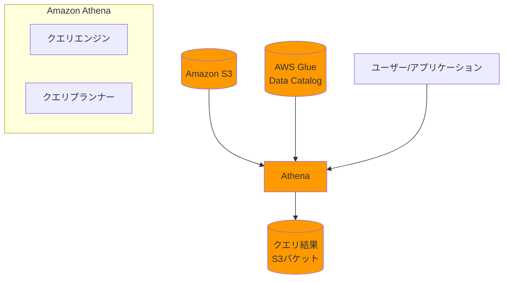

# Amazon Athena

## 概要
Amazon Athenaは、標準SQLを使用してS3に保存されたデータを直接分析できるサーバーレスのクエリサービスです。データベースやデータウェアハウスをセットアップする必要がなく、S3上のデータに対してアドホックなクエリを実行できます。

## 主な特徴と利点

### サーバーレス
- インフラストラクチャの管理が不要
- 使用したクエリ実行量に対してのみ料金が発生
- 自動的にスケーリング

### 簡単な使用
- 標準SQLを使用（ANSI SQL）
- AWS Glueと統合してデータカタログを管理
- クエリエディタを通じて対話的な分析が可能

### 高性能
- 分散クエリエンジンによる並列処理
- 圧縮とカラムナー形式のサポート
- パーティショニングによる効率的なクエリ実行

### セキュリティ
- AWS IAMによるきめ細かなアクセス制御
- 暗号化されたデータのクエリをサポート
- VPCエンドポイントを介したセキュアなアクセス

## ユースケース
- ログ分析
- ビジネスインテリジェンス
- アドホッククエリ
- データレイクの分析
- ETL処理の簡素化

## アーキテクチャ

## 料金体系
- スキャンしたデータ量に基づく従量課金
- 圧縮やパーティショニングによるコスト最適化が可能
- 保存されたクエリ結果の再利用でコスト削減

## ベストプラクティス

### パフォーマンス最適化
1. データのパーティショニング
   - 日付、地域、カテゴリなどでパーティション化
   - クエリ対象データの絞り込みが可能

2. ファイル形式の最適化
   - Parquet or ORCフォーマットの使用
   - 列指向フォーマットによる効率的なクエリ実行

3. ファイルサイズの最適化
   - 推奨：128MB以上のファイルサイズ
   - 小さすぎるファイルの結合を検討

### コスト最適化
1. データ圧縮の活用
   - Snappy, ZLIB等の圧縮形式の使用
   - スキャンデータ量の削減

2. クエリの最適化
   - 必要なカラムのみを選択
   - WHERE句による適切なフィルタリング

3. パーティショニングの活用
   - 効率的なデータスキャン
   - 不要なデータの読み取り回避

### セキュリティのベストプラクティス
1. 暗号化の使用
   - S3のサーバーサイド暗号化
   - クエリ結果の暗号化

2. きめ細かなアクセス制御
   - IAMポリシーによる制御
   - データベース/テーブルレベルの権限設定

3. ネットワークセキュリティ
   - VPCエンドポイントの使用
   - プライベートサブネットからのアクセス制御
