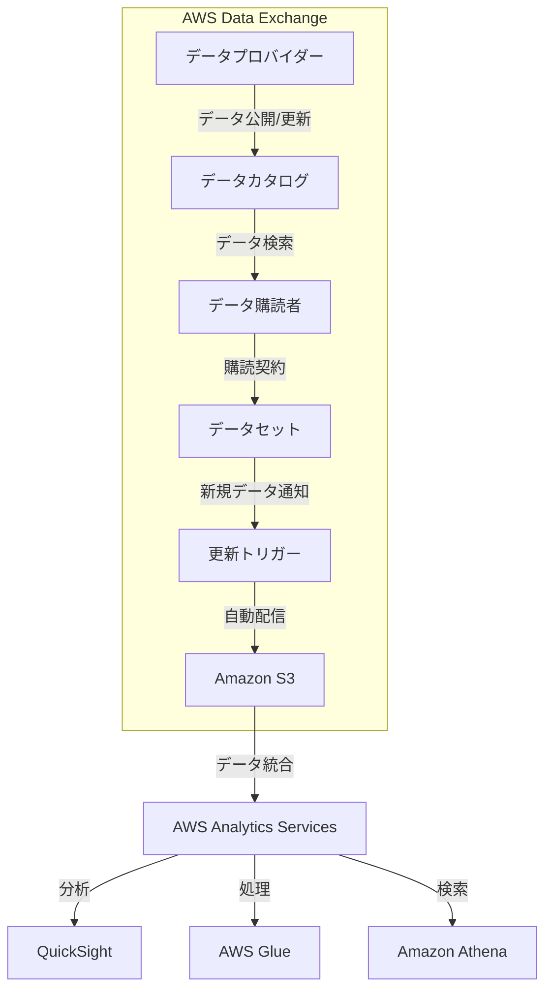

# AWS Data Exchange

AWS Data Exchangeは、クラウド上でサードパーティのデータを安全かつ簡単に検索、購読、使用するためのサービスです。

## 概要

- データプロバイダーは、AWS Data Exchangeを通じてデータ製品を公開・販売できます
- データ購読者は、必要なデータセットを検索し、購読することができます
- データは自動的にAmazon S3に配信され、AWS内の他のサービスと統合して利用可能です

## データ取得の仕組み

1. **購読プロセス**
   - データの自動取得は、購読契約を結んだ後に開始されます
   - 購読者は必要なデータセットを選択し、契約条件に同意する必要があります

2. **データ更新方法**
   - 新しいデータの取得は、データプロバイダーがデータを更新した時点で行われます
   - 更新頻度はデータ製品ごとに異なり、リアルタイム、日次、週次、月次など様々です
   - 自動更新は購読契約の条件に基づいて行われます

3. **データアクセス**
   - 購読したデータは指定したS3バケットに自動的に配信されます
   - APIを使用して、プログラム的にデータにアクセスすることも可能です
   - データの形式や更新スケジュールはプロバイダーによって定義されます

## 主な特徴

### データプロバイダー向け機能
- データ製品の公開と管理
- 柔軟な価格設定
- 安全なデータ配信
- 使用状況の追跡

### データ購読者向け機能
- 豊富なデータカタログからの検索
- シームレスなデータ統合
- 自動更新
- データ形式の標準化

## ユースケース

1. 市場分析
   - 業界動向データの取得
   - 競合分析
   - 市場予測

2. 機械学習モデルの改善
   - トレーニングデータの入手
   - モデルの精度向上
   - データの品質向上

3. ビジネスインテリジェンス
   - 顧客行動分析
   - トレンド分析
   - リスク評価

## アーキテクチャ

## セキュリティと準拠性

- 暗号化されたデータ転送
- きめ細かなアクセス制御
- AWS IAMとの統合
- コンプライアンス基準への準拠

## 料金体系

- データ購読料金（プロバイダーが設定）
- データ転送料金
- ストレージ料金（S3）

## ベストプラクティス

1. データ管理
   - 定期的なデータ更新
   - メタデータの適切な管理
   - データ品質の維持

2. セキュリティ
   - 適切なIAMポリシーの設定
   - 暗号化の有効化
   - アクセスログの監視

3. コスト最適化
   - 必要なデータのみの購読
   - ストレージ使用量の監視
   - 不要なデータの削除
