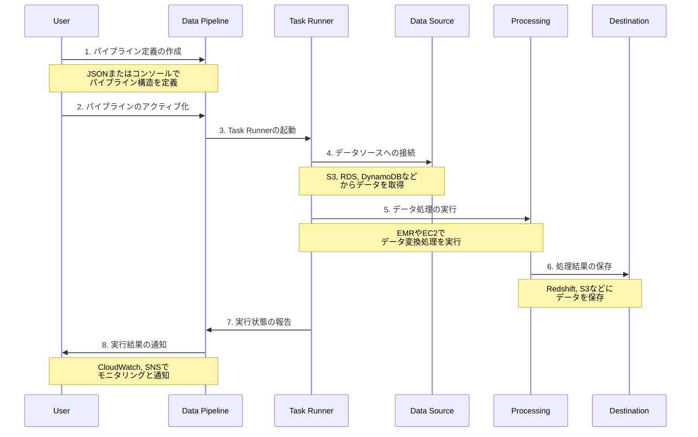
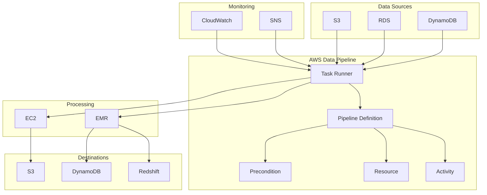

# AWS Data Pipeline

## 概要
AWS Data Pipelineは、データの移動と変換を自動化するためのWebサービスです。異なるAWSコンピューティングサービスやストレージサービス間でのデータの信頼性の高い処理とデータの移動を可能にします。

## 主な特徴

### 1. スケジュール管理
- 定期的なデータ処理ジョブのスケジューリング
- 依存関係に基づいたジョブの実行順序の制御
- 再試行とエラーハンドリングの自動化

### 2. データ変換
- EMRクラスターでのHadoopジョブの実行
- EC2インスタンスでのカスタムスクリプトの実行
- SQLクエリによるデータ変換

### 3. データ移動
- S3、RDS、DynamoDB、Redshiftなど、異なるAWSサービス間でのデータ移動
- オンプレミスデータソースとの統合
- クロスリージョンデータ転送

### 4. モニタリングと通知
- パイプラインの実行状況の監視
- エラー通知のSNS統合
- CloudWatchとの統合によるメトリクス監視

## ユースケース

1. **データウェアハウスのETL処理**
   - S3からRedshiftへのデータロード
   - データクレンジングと変換
   - 定期的なデータ更新

2. **バックアップと復元**
   - RDSデータベースの定期バックアップ
   - クロスリージョンバックアップ
   - アーカイブデータの管理

3. **ログ処理**
   - ログファイルの収集と集約
   - EMRを使用したログ分析
   - 処理済みデータの保存

## サービス利用フロー

## アーキテクチャ

## コンポーネント説明

1. **Pipeline Definition**
   - パイプラインの構造とロジックを定義
   - データソース、変換、出力先を指定
   - スケジュールと依存関係を設定

2. **Task Runner**
   - パイプラインタスクの実行を管理
   - リソースの割り当てと解放
   - タスクの進行状況の追跡

3. **Activity**
   - 実行する具体的な処理を定義
   - データの移動、変換、分析など
   - EMRジョブ、シェルコマンド、SQLクエリなど

4. **Resource**
   - タスク実行に必要なコンピューティングリソース
   - EC2インスタンス、EMRクラスターなど
   - リソースの自動プロビジョニング

## 料金

AWS Data Pipelineの料金は以下の要素に基づいて計算されます：

1. **パイプラインの実行**
   - アクティブなパイプラインあたりの月額料金
   - 低頻度実行と高頻度実行で異なる料金設定

2. **使用リソース**
   - EC2インスタンス使用料
   - EMRクラスター使用料
   - データ転送料金

3. **データストレージ**
   - S3ストレージ料金
   - その他のAWSサービスのストレージ料金

## まとめ

AWS Data Pipelineは、複雑なデータ処理ワークフローを自動化するための強力なサービスです。主な利点は：

- 複雑なデータ処理の自動化
- 堅牢なエラーハンドリングとリトライメカニズム
- 柔軟なスケジューリングオプション
- 豊富なAWSサービス統合
- 包括的なモニタリングと通知機能

これらの機能により、データ処理とETLワークフローの管理が大幅に簡素化され、運用効率が向上します。
