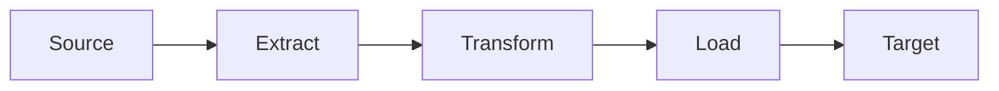
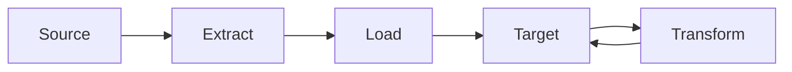
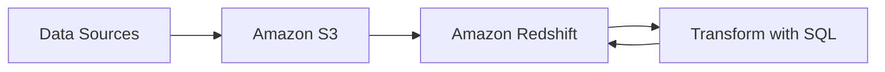

# ELT (Extract, Load, Transform)

## 概要

ELTは、データ統合プロセスの一つで、以下の3つのステップで構成されます：

1. **Extract（抽出）**: ソースシステムからデータを抽出
2. **Load（ロード）**: 抽出したデータをターゲットシステムに直接ロード
3. **Transform（変換）**: ロードされたデータをターゲットシステム内で変換・加工

## ETLとの違い

### ETL (Extract, Transform, Load)

### ELT (Extract, Load, Transform)

主な違いは以下の通りです：

1. **データ変換のタイミング**
   - ETL: データをロードする前に変換
   - ELT: データをロードした後に変換

2. **処理場所**
   - ETL: 中間サーバーやETLツールで変換
   - ELT: ターゲットデータベース内で変換

3. **リソース利用**
   - ETL: 中間サーバーのリソースを使用
   - ELT: ターゲットデータベースのリソースを使用

## メリット

1. **柔軟性の向上**
   - 生データを保持することで、後から新しい分析要件に対応可能
   - 変換ロジックの修正が容易

2. **処理の効率化**
   - 大規模なデータウェアハウスの処理能力を活用
   - 並列処理による高速な変換が可能

3. **保守性の向上**
   - データパイプラインがシンプル
   - 変換ロジックの一元管理が可能

## デメリット

1. **ストレージコストの増加**
   - 未変換の生データも保存するため、ストレージ使用量が増加

2. **セキュリティリスク**
   - 生データに機密情報が含まれる場合、追加のセキュリティ対策が必要

3. **ターゲットシステムへの負荷**
   - 変換処理がターゲットシステムのリソースを消費

## AWSでのELT実装例

### 使用するAWSサービス

1. **データ抽出・ロード**
   - Amazon S3: データレイク
   - AWS Glue: ETL/ELTサービス
   - AWS DMS: データ移行サービス

2. **データ変換・保存**
   - Amazon Redshift: データウェアハウス
   - Amazon Athena: S3データの分析

## ユースケース

1. **ビッグデータ分析**
   - 大量の生データを収集し、必要に応じて変換・分析

2. **データレイク構築**
   - 様々なフォーマットのデータを統合・保存

3. **リアルタイム分析**
   - ストリーミングデータの収集と分析

4. **機械学習の前処理**
   - 生データを保持し、モデルに応じた前処理を実施

## ベストプラクティス

1. **データカタログの整備**
   - メタデータ管理による生データの把握
   - AWS Glue Data Catalogの活用

2. **パーティショニングの最適化**
   - 効率的なデータアクセスのための設計
   - クエリパフォーマンスの向上

3. **セキュリティ対策**
   - 暗号化の適用
   - アクセス制御の実装
   - 監査ログの取得

4. **コスト最適化**
   - 適切なストレージ階層の選択
   - 不要データの定期的なクリーンアップ
