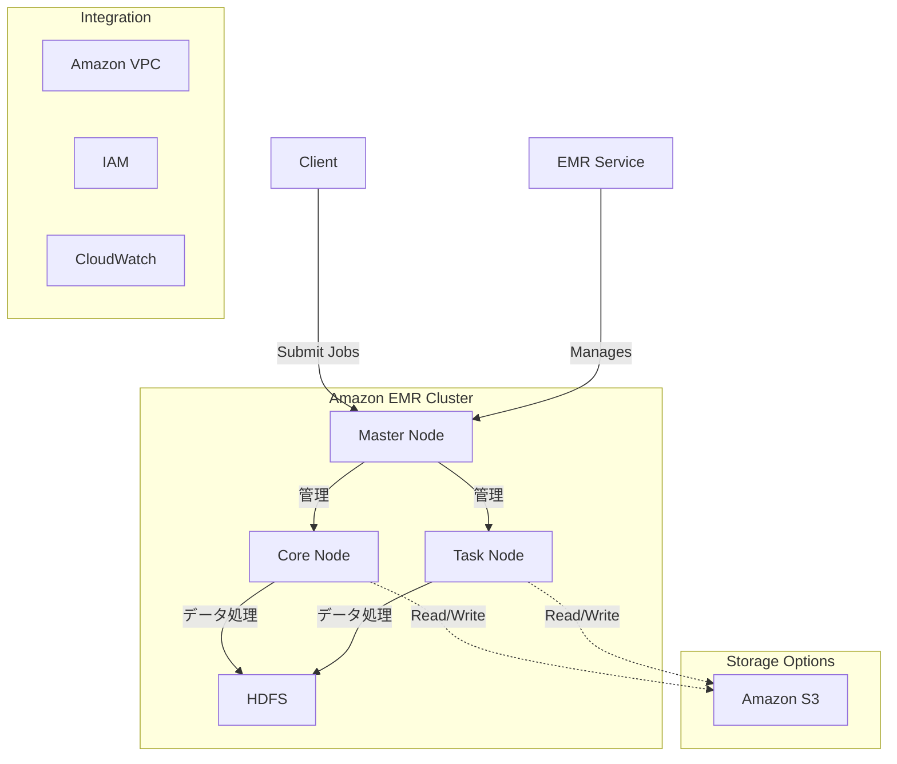

# Amazon EMR (Elastic MapReduce)

## 概要
Amazon EMRは、Apache Hadoop、Apache Spark、HBase、Presto、Hiveなどのビッグデータフレームワークを実行するためのクラウドネイティブなビッグデータプラットフォームです。EMRを使用することで、大規模なデータ処理、対話型分析、機械学習を実行できます。

## 主要コンポーネント

### クラスター構成
- **マスターノード**: クラスターの管理、ジョブのスケジューリング、リソース割り当てを担当
- **コアノード**: データの保存とタスクの実行を担当
- **タスクノード**: タスクの実行のみを担当（オプション）

### サポートされるアプリケーション

| フレームワーク | 説明 | 主なユースケース |
|--------------|------|----------------|
| Apache Hadoop | 分散処理フレームワークの基盤。HDFS（分散ファイルシステム）とMapReduceを提供。大規模データの分散処理を実現。 | - 大規模バッチ処理 - ログ分析 - ETL処理 - データウェアハウジング |
| Apache Spark | インメモリ処理を活用した高速な分散処理フレームワーク。バッチ処理、ストリーム処理、機械学習、グラフ処理をサポート。 | - リアルタイムデータ処理 - 機械学習 - 対話的データ分析 - ストリーム処理 |
| Apache Hive | SQLライクな言語（HiveQL）を使用してHadoop上のデータを分析するデータウェアハウス。 | - データウェアハウス - アドホッククエリ - レポート生成 - データマート構築 |
| HBase | Hadoopベースの分散NoSQLデータベース。カラム指向で大規模データの高速読み書きに最適。 | - リアルタイムデータアクセス - 大規模KVストア - 時系列データ管理 - ランダムアクセス |
| Presto | 分散SQLクエリエンジン。複数のデータソース（S3、Hive、RDB等）に対して高速なクエリを実行可能。 | - アドホッククエリ - BI分析 - データレイク分析 - クロスプラットフォーム分析 |

その他のサポートされるアプリケーション：
- Jupyter Notebook
- TensorFlow

## アーキテクチャ

## ユースケース

1. **ビッグデータ処理**
   - ログ分析
   - ETLジョブ
   - データ変換

2. **機械学習**
   - モデルトレーニング
   - 予測分析
   - パターン認識

3. **リアルタイム分析**
   - ストリームデータ処理
   - リアルタイムダッシュボード
   - イベント検出

## 料金モデル

EMRの料金は以下の要素で構成されます：

1. **インスタンス料金**
   - オンデマンドインスタンス
   - スポットインスタンス（最大90%割引）
   - リザーブドインスタンス

2. **EMRサービス料金**
   - 時間単位の料金
   - インスタンスタイプによって異なる

## セキュリティ

### アクセス制御
- IAMロールとポリシーによるきめ細かなアクセス制御
- セキュリティグループによるネットワークアクセス制御
- Kerberos認証のサポート

### データセキュリティ
- 保存データの暗号化（S3、EBS）
- 転送中のデータの暗号化（TLS）
- AWS KMSとの統合

### ネットワークセキュリティ
- VPC内でのクラスター実行
- プライベートサブネットでの実行
- セキュリティグループによるポート制御

## ベストプラクティス

1. **コスト最適化**
   - スポットインスタンスの活用
   - 適切なインスタンスサイズの選択
   - 自動スケーリングの設定

2. **パフォーマンス**
   - データの場所とEMRクラスターの場所を近づける
   - 適切なインスタンスタイプの選択
   - 効率的なデータ形式の使用（Parquet、ORC）

3. **可用性**
   - マルチAZでのクラスター構成
   - 定期的なバックアップ
   - 自動フェイルオーバーの設定
