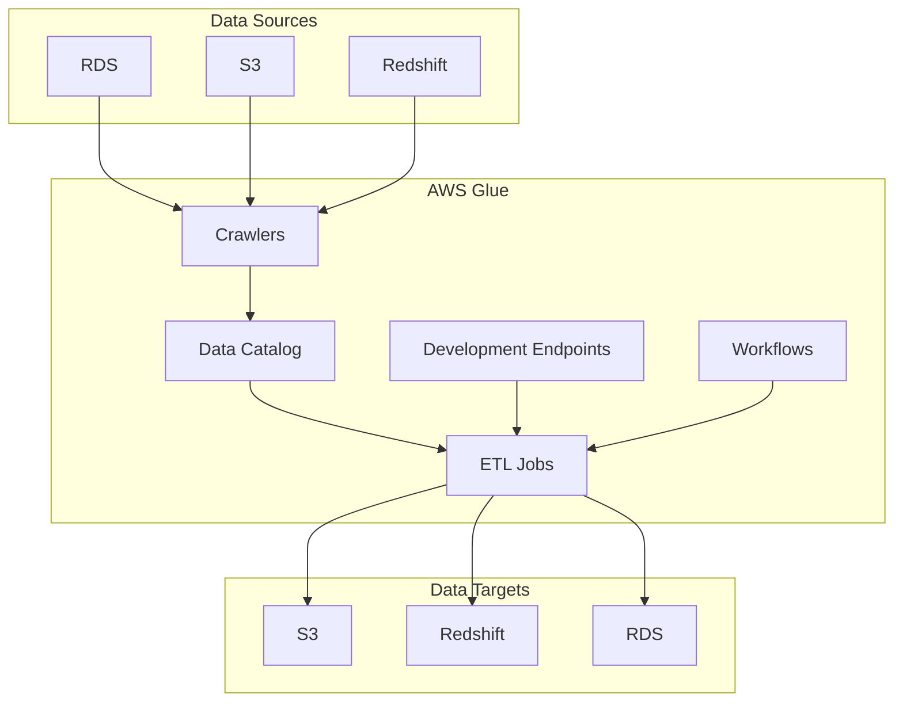
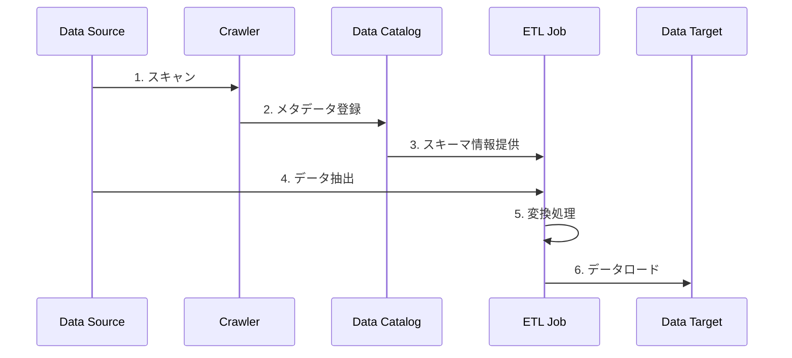
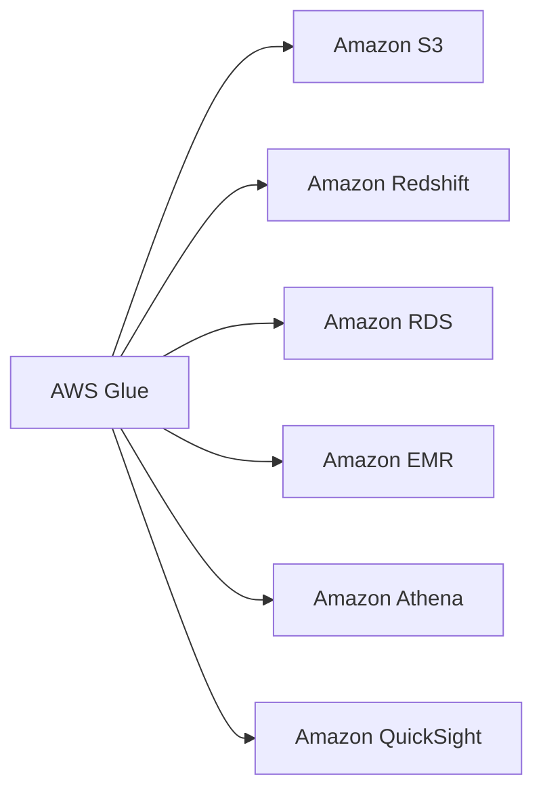

# AWS Glue

## 概要

AWS Glueは、フルマネージド型のETL（Extract, Transform, Load）サービスです。データの検出、準備、結合、移行を効率的に行うことができます。

### 主要機能

1. **データカタログ**
   - メタデータリポジトリ
   - スキーマ管理
   - データディスカバリー

2. **ETLエンジン**
   - Apache Sparkベース
   - Python、Scala対応
   - 自動コード生成

3. **ジョブスケジューラー**
   - トリガーベースの実行
   - イベント駆動型処理
   - 依存関係管理

## アーキテクチャ

## 主要コンポーネント

1. **Glueクローラー**
   - データソースの自動スキャン
   - メタデータの自動検出
   - スキーマの変更検知

2. **Glueデータカタログ**
   - テーブル定義の管理
   - パーティション情報の追跡
   - セキュリティ設定

3. **ETLジョブ**
   - データ変換処理の実行
   - エラーハンドリング
   - モニタリング機能

## データ処理フロー

## ユースケース

1. **データレイク構築**
   - 様々なソースからのデータ統合
   - メタデータの一元管理
   - 検索可能なデータカタログ

2. **データウェアハウス構築**
   - ETL処理の自動化
   - スキーマ変更の追跡
   - データ品質の確保

3. **リアルタイムETL**
   - ストリーミングデータの処理
   - イベント駆動型アーキテクチャ
   - 準リアルタイム分析

4. **データ移行**
   - レガシーシステムからの移行
   - クラウドネイティブ化
   - スキーマ変換

## 料金モデル

1. **クローラー実行**
   - 実行時間による課金
   - スキャンしたデータ量

2. **ETLジョブ**
   - DPU（Data Processing Unit）時間
   - 開発エンドポイント使用時間

3. **データカタログ**
   - ストレージ使用量
   - リクエスト数

## セキュリティ機能

1. **アクセス制御**
   - IAMロールとポリシー
   - リソースレベルの権限
   - タグベースのアクセス制御

2. **データ保護**
   - 保管時の暗号化
   - 転送時の暗号化
   - キー管理（KMS統合）

3. **監査**
   - CloudTrail統合
   - ログ記録
   - コンプライアンス管理

## ベストプラクティス

1. **パフォーマンス最適化**
   - ブックマーク機能の活用
   - パーティショニングの適切な設計
   - ジョブのチューニング

2. **コスト最適化**
   - ワーカータイプの適切な選択
   - 並列処理の最適化
   - リソースの自動スケーリング

3. **運用管理**
   - モニタリングの設定
   - エラーハンドリングの実装
   - バックアップ戦略の策定

4. **開発プラクティス**
   - テスト環境の活用
   - バージョン管理の実施
   - CI/CDパイプラインの構築

## 統合サービス

## トラブルシューティング

1. **一般的な問題**
   - メモリ不足
   - タイムアウト
   - 権限エラー

2. **解決アプローチ**
   - CloudWatchログの確認
   - メトリクスの監視
   - エラーメッセージの分析

3. **予防措置**
   - 適切なリソース割り当て
   - タイムアウト設定の調整
   - 定期的なメンテナンス
