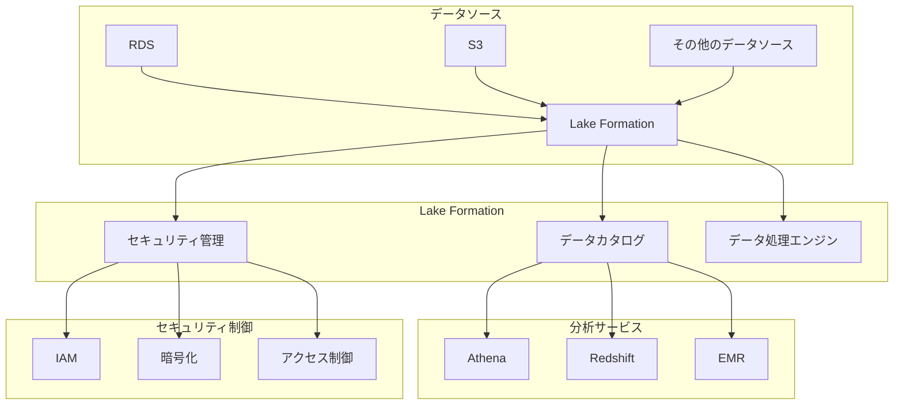

# AWS Lake Formation

## 概要
AWS Lake Formationは、数日で安全なデータレイクを設定できるサービスです。データレイクとは、構造化・半構造化データを保存、検出、共有、分析するための集中型リポジトリです。Lake Formationは、複雑なマニュアルプロセスを自動化し、データの取り込み、カタログ化、クリーニング、変換、セキュリティ、ガバナンスを簡素化します。

## 主な機能と特徴

### 1. データの取り込みと準備
- ブループリントを使用した自動データ取り込み
- データクロール機能によるメタデータの自動検出
- データの品質管理と変換機能
- 増分データ処理のサポート

### 2. セキュリティとガバナンス
- きめ細かなアクセス制御
- 列レベル、行レベルのセキュリティ
- タグベースのアクセス制御
- 暗号化の自動管理

### 3. データカタログ管理
- 中央集中型のメタデータリポジトリ
- データの検出と分類
- スキーマバージョン管理
- データリネージの追跡

## アーキテクチャ

## ユースケース

### 1. セルフサービス分析
- 部門間でのデータ共有
- アドホッククエリの実行
- ビジネスインテリジェンス分析

### 2. 機械学習
- トレーニングデータの準備
- モデル開発のためのデータアクセス
- 予測分析

### 3. コンプライアンスと監査
- データガバナンスの実装
- 規制要件への対応
- 監査証跡の維持

## セキュリティと権限管理

### アクセス制御
- データベース、テーブル、列レベルの権限
- タグベースのアクセス制御ポリシー
- 時間ベースの一時的なアクセス許可

### データ保護
- 保存データの暗号化
- 転送中のデータの暗号化
- キー管理の統合

## 他のAWSサービスとの統合

### 分析サービス
- Amazon Athena
- Amazon Redshift
- Amazon EMR
- Amazon QuickSight

### データ処理サービス
- AWS Glue
- Amazon Kinesis
- AWS Lambda

### セキュリティサービス
- AWS IAM
- AWS KMS
- AWS CloudTrail

## ベストプラクティス

1. データ整理
   - 明確なデータ分類スキーマの確立
   - 効率的なパーティション戦略の実装
   - メタデータの一貫した管理

2. セキュリティ
   - 最小権限の原則の適用
   - 定期的な権限の監査
   - 暗号化の一貫した使用

3. パフォーマンス
   - 適切なファイル形式の選択
   - パーティショニングの最適化
   - クエリパフォーマンスの監視

4. コスト最適化
   - データライフサイクル管理の実装
   - 適切なストレージクラスの選択
   - 不要なデータの定期的なクリーンアップ
