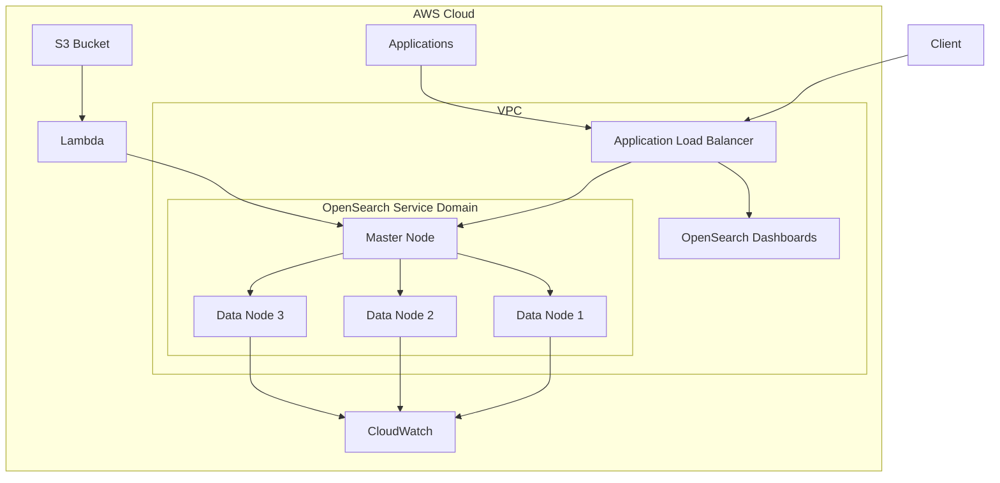
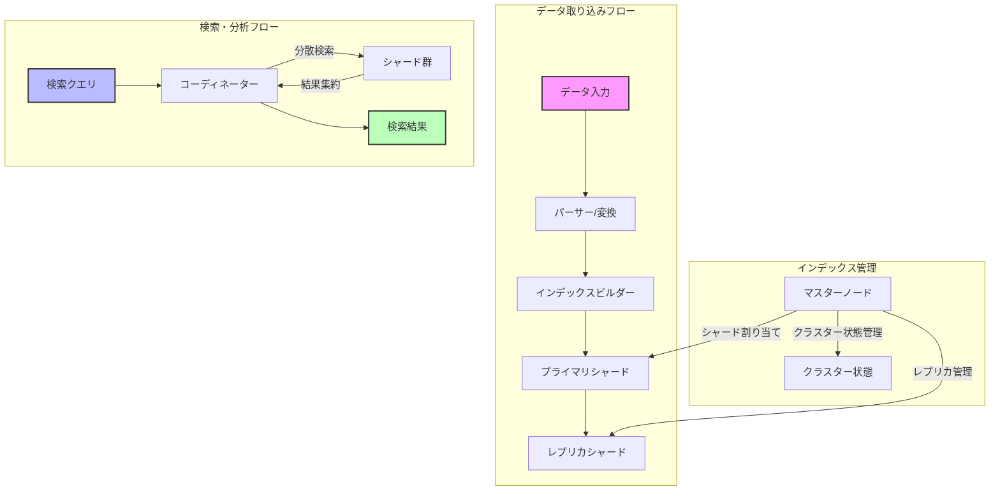

# Amazon OpenSearch Service

## 概要

Amazon OpenSearch Serviceは、OpenSearchとElasticsearchの分散型検索および分析エンジンをフルマネージドで提供するAWSのサービスです。大規模なデータセットのリアルタイム検索、ログ分析、アプリケーションモニタリング、セキュリティ分析などを実現します。

### 主な特徴

- フルマネージド運用
- スケーラブルなアーキテクチャ
- リアルタイム分析
- 高可用性と耐障害性
- セキュアなデータ保護
- Kibana/OpenSearch Dashboardsによる可視化

## ユースケース

1. **ログ分析**
   - アプリケーションログの集中管理
   - システムログの分析
   - セキュリティログの監視

2. **全文検索**
   - Eコマースサイトの商品検索
   - ドキュメント検索システム
   - コンテンツ管理システム

3. **アプリケーションモニタリング**
   - パフォーマンス監視
   - エラー検知
   - リアルタイムメトリクス分析

4. **セキュリティ分析**
   - セキュリティイベントの検知
   - 不正アクセスの監視
   - コンプライアンス報告

## システムアーキテクチャ

### AWSインフラストラクチャ構成

### OpenSearch動作の仕組み

## セキュリティと管理機能

### アクセス制御
- IAMベースの認証・認可
- きめ細かなアクセスポリシー
- VPCベースのネットワーク分離
- 暗号化（保管時および転送時）

### 監視と管理
- CloudWatchとの統合
- 自動バックアップ
- バージョン管理
- スナップショット管理

## 料金モデル

料金は以下の要素に基づいて計算されます：
- インスタンスの時間単位の使用料
- EBSボリュームのストレージ使用量
- データ転送量
- オプション機能（自動スナップショット等）

## ベストプラクティス

1. **クラスター設計**
   - 適切なインスタンスタイプの選択
   - シャード数の最適化
   - レプリカの適切な配置

2. **パフォーマンス最適化**
   - インデックス設計の最適化
   - クエリパフォーマンスのチューニング
   - キャッシュ戦略の実装

3. **セキュリティ**
   - 最小権限の原則の適用
   - 暗号化の有効化
   - 定期的なセキュリティ監査

4. **運用管理**
   - 定期的なバックアップ
   - モニタリングアラートの設定
   - キャパシティプランニング
