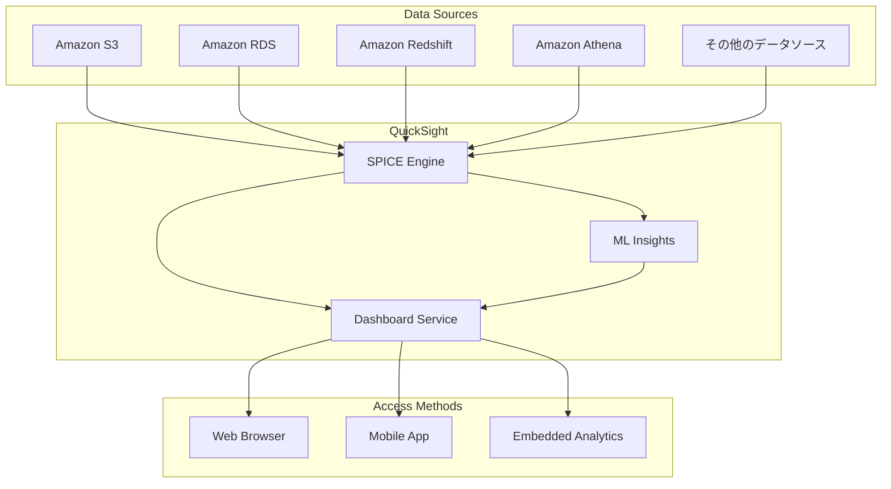

# Amazon QuickSight

## 概要
Amazon QuickSightは、AWSのクラウドネイティブなビジネスインテリジェンス（BI）サービスです。
大規模なデータセットを視覚化し、インタラクティブなダッシュボードを作成することができます。
機械学習を活用した高度な分析機能を提供し、データドリブンな意思決定をサポートします。

## 主要な機能と特徴

### 1. SPICE エンジン
- Super-fast, Parallel, In-memory Calculation Engine
- インメモリ最適化された計算エンジンを使用
- 高速なデータ分析を実現

### 2. データソース接続
- Amazon RDS
- Amazon Aurora
- Amazon Redshift
- Amazon Athena
- Amazon S3
- その他のデータソース（MySQL, PostgreSQL, etc.）

### 3. ML Insights
- 異常値の検出
- 予測分析
- 自然言語クエリ（Q&A）
- 自動ナラティブ生成

### 4. エンベッディング機能
- アプリケーションへのダッシュボード埋め込み
- シングルサインオン（SSO）対応
- カスタマイズ可能なユーザーエクスペリエンス

## アーキテクチャ

## ユースケース

1. **ビジネスインテリジェンス**
   - 売上分析
   - 顧客行動分析
   - マーケティング効果測定

2. **運用モニタリング**
   - システムパフォーマンス監視
   - リソース使用状況の追跡
   - コスト分析

3. **データ可視化**
   - インタラクティブなダッシュボード作成
   - リアルタイムデータ分析
   - レポート自動生成

## 料金体系

### Standard Edition
- ユーザーごとの月額料金
- 基本的な分析機能
- 読み取り専用ユーザーオプション

### Enterprise Edition
- 高度なパーミッション管理
- カスタマイズ可能なダッシュボード
- ML Insightsの利用
- エンベッディング機能

### SPICE容量
- データセットのサイズに応じた従量課金
- 追加容量の購入オプション

## セキュリティ機能

1. **アクセス制御**
   - IAMとの統合
   - Row-level security
   - Column-level security

2. **暗号化**
   - 保存データの暗号化
   - 転送中のデータの暗号化
   - AWS KMSとの統合

3. **コンプライアンス**
   - HIPAA対応
   - SOC準拠
   - その他の規制基準への対応
