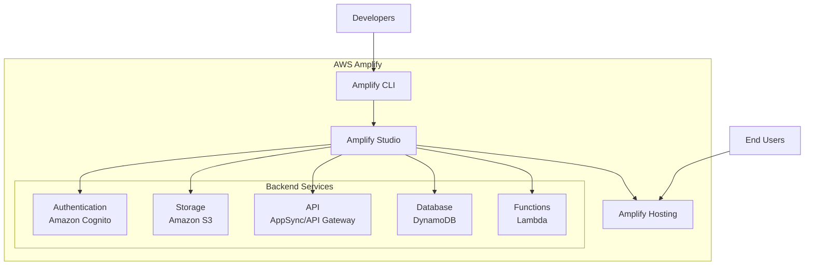
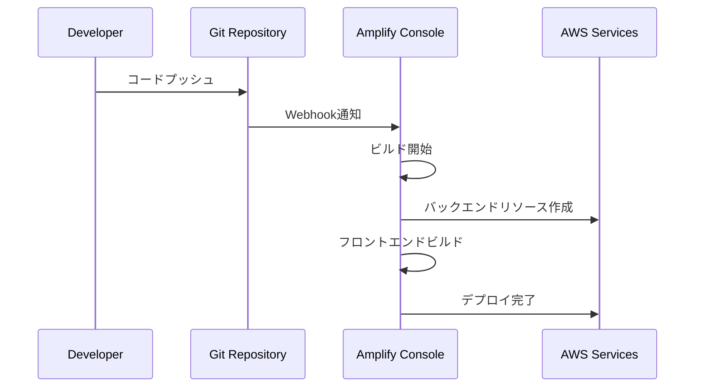

# AWS Amplify

AWS Amplifyは、フルスタックのアプリケーション開発フレームワークで、フロントエンドとバックエンドの開発を統合的に行うことができるサービスです。

## 概要

AWS Amplifyは以下の2つの主要なコンポーネントで構成されています：

1. **Amplify Hosting**：
   - Webアプリケーションのホスティングとデプロイメント
   - CI/CDパイプラインの自動構築
   - プルリクエストのプレビュー環境
   - カスタムドメインの管理

2. **Amplify Studio**：
   - ビジュアルな開発環境
   - バックエンドの構築と管理
   - UIコンポーネントの作成
   - データモデルの定義

## アーキテクチャ

## 主要機能

### 1. 認証（Authentication）
- Amazon Cognitoとの統合
- ソーシャルプロバイダー認証（Google, Facebook, Appleなど）
- MFA（多要素認証）のサポート

### 2. データストア（DataStore）
- オフライン同期
- リアルタイムデータ同期
- 競合解決

### 3. API
- REST APIの構築（API Gateway）
- GraphQL APIの構築（AppSync）
- リアルタイムサブスクリプション

### 4. ストレージ
- S3との統合
- ファイルのアップロード/ダウンロード
- 公開/プライベートストレージの管理

## デプロイメントフロー

## 利点

1. **開発の効率化**
   - フロントエンドとバックエンドの統合開発
   - ビジュアル開発ツールの提供
   - 豊富なUIコンポーネント

2. **スケーラビリティ**
   - AWSサービスとの自動統合
   - サーバーレスアーキテクチャ
   - グローバルCDNの活用

3. **セキュリティ**
   - 組み込みの認証機能
   - SSL/TLS証明書の自動管理
   - IAMとの統合

4. **コスト最適化**
   - サーバーレスアーキテクチャによる従量課金
   - 自動スケーリング
   - 開発環境の統合による運用コスト削減

## ユースケース

1. **Webアプリケーション**
   - シングルページアプリケーション（SPA）
   - プログレッシブWebアプリ（PWA）
   - 静的Webサイト

2. **モバイルアプリケーション**
   - iOSアプリケーション
   - Androidアプリケーション
   - クロスプラットフォームアプリ

3. **エンタープライズアプリケーション**
   - 社内ポータル
   - ダッシュボード
   - データ管理システム
