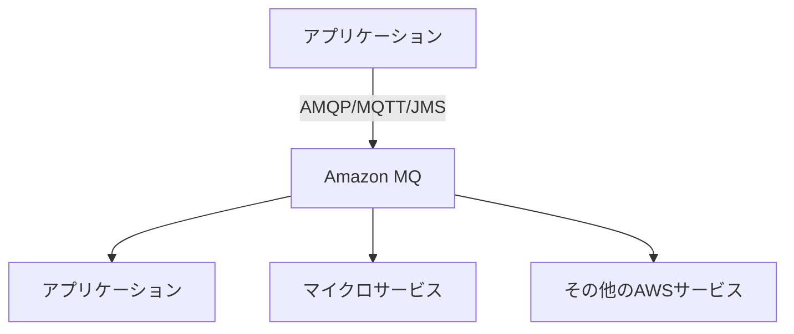
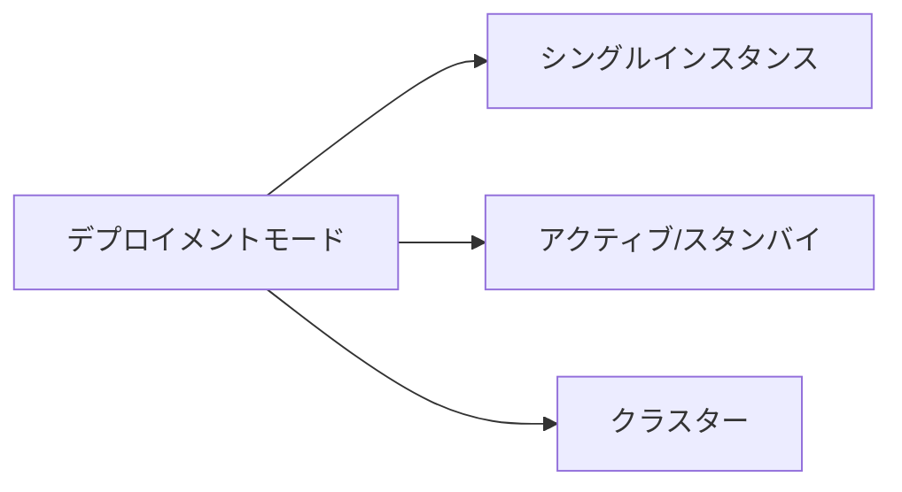
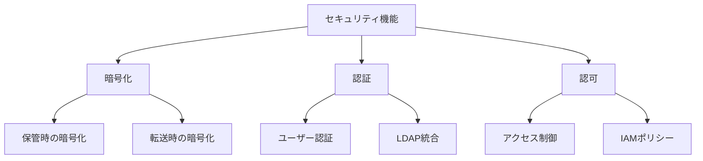
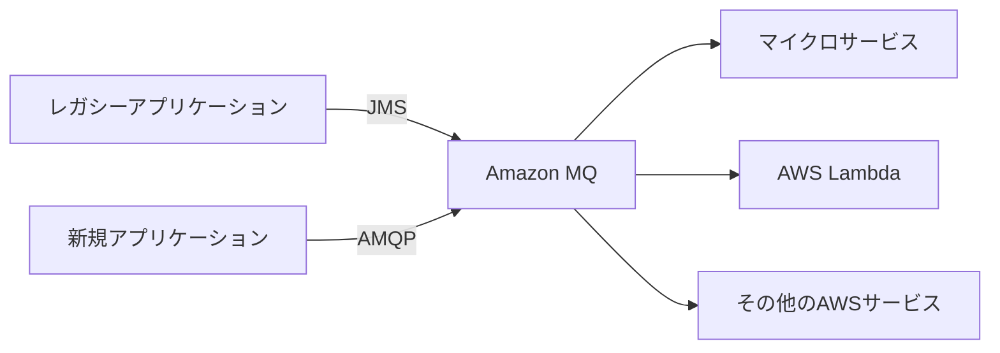
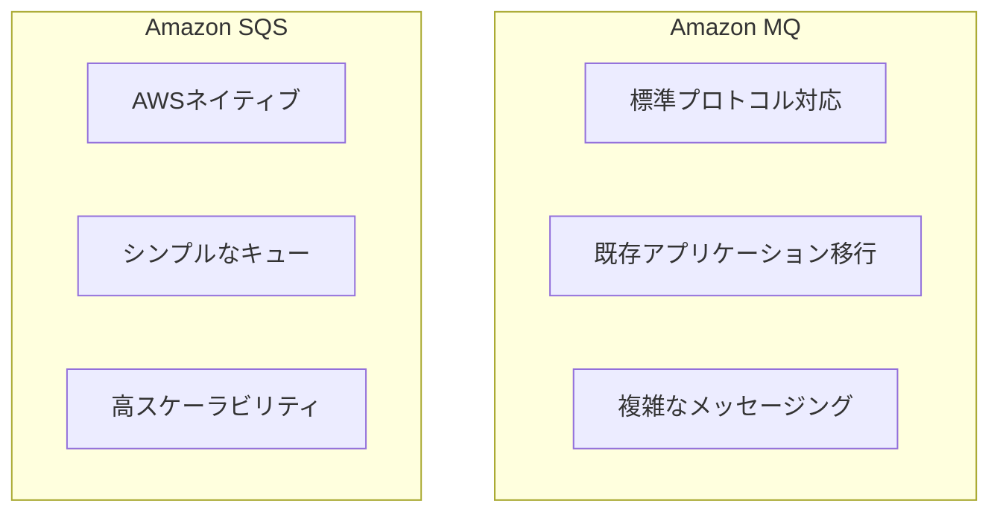
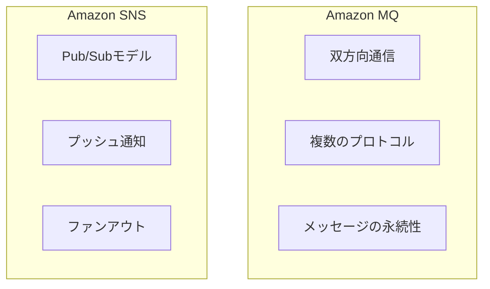

# Amazon MQ

## 概要
Amazon MQは、Apache ActiveMQとRabbitMQのためのマネージドメッセージブローカーサービスです。既存のアプリケーションをクラウドに移行する際に、業界標準のAPIやプロトコルを使用してメッセージングを行うことができます。

## 主要な特徴

### 1. サポートされるブローカーエンジン
- Apache ActiveMQ
  - JMS、NMS、AMQP、STOMP、MQTT、WebSocketをサポート
  - Java、.NET、PHPなど多様な言語・フレームワークに対応
- RabbitMQ
  - AMQP 0-9-1、MQTT、STOMPをサポート
  - 高度なルーティング機能を提供

### 2. デプロイメントモード

1. シングルインスタンス
   - 開発・テスト環境向け
   - コスト効率の良いオプション
   - 高可用性なし

2. アクティブ/スタンバイ
   - 本番環境向け
   - 自動フェイルオーバー
   - 高可用性構成

3. クラスター（RabbitMQのみ）
   - 高スケーラビリティ
   - 高可用性
   - 複数のアベイラビリティゾーンにまたがる構成

### 3. 管理機能
- ウェブベースの管理コンソール
- メトリクスの監視とアラート設定
- セキュリティグループの管理
- メンテナンスウィンドウの設定
- バックアップと復元

### 4. セキュリティ機能

- 保管時の暗号化（KMS統合）
- 転送時の暗号化（TLS）
- IAMとの統合
- セキュリティグループによるネットワークアクセス制御
- VPCサポート

## ユースケース

### 1. アプリケーション統合

- レガシーアプリケーションのクラウド移行
- ハイブリッドクラウド環境での統合
- マイクロサービス間の通信

### 2. イベント駆動アーキテクチャ
- パブリッシュ/サブスクライブモデル
- イベント通知システム
- リアルタイムデータ処理

### 3. 分散システム間の通信
- 非同期メッセージング
- サービス間の疎結合
- 信頼性の高いメッセージ配信

## Amazon MQ vs 他のAWSメッセージングサービス

### 1. Amazon MQ vs Amazon SQS

#### Amazon MQ
- 標準プロトコル（JMS、AMQP等）をサポート
- 既存アプリケーションの移行に最適
- より複雑なメッセージングパターンに対応

#### Amazon SQS
- AWSネイティブのサービス
- シンプルなキューイング機能
- より高いスケーラビリティ

### 2. Amazon MQ vs Amazon SNS

#### Amazon MQ
- 双方向通信が可能
- 複数のメッセージングプロトコルをサポート
- メッセージの永続性を保証

#### Amazon SNS
- Pub/Subモデルに特化
- プッシュ通知に最適
- ファンアウトパターンに適している

## ベストプラクティス

### 1. 高可用性の確保
- 本番環境ではアクティブ/スタンバイ構成を使用
- 複数のアベイラビリティゾーンを活用
- 適切なインスタンスタイプの選択

### 2. パフォーマンスの最適化
- メッセージサイズの最適化
- 適切なデプロイメントモードの選択
- キャッシュサイズの調整
- 接続プールの活用

### 3. セキュリティの強化
- VPC内でのデプロイ
- セキュリティグループの適切な設定
- TLS暗号化の有効化
- 認証メカニズムの実装

### 4. モニタリングとメンテナンス
- CloudWatchメトリクスの監視
- アラートの設定
- 定期的なメンテナンス計画
- バックアップ戦略の実装

## 料金モデル

### 1. インスタンス料金
- ブローカーインスタンスの時間単位の料金
- インスタンスタイプによって異なる
- シングルインスタンスvs高可用性構成

### 2. ストレージ料金
- 使用するストレージ容量に応じた料金
- バックアップストレージの料金

### 3. データ転送料金
- VPC外へのデータ転送に対する料金
- リージョン間のデータ転送料金

## 制限事項

### 1. スケーリング
- 手動でのスケーリングが必要
- インスタンスタイプの変更には再起動が必要

### 2. メッセージサイズ
- 最大メッセージサイズの制限
- ストレージ容量の制限

### 3. 接続数
- インスタンスタイプによる同時接続数の制限
- プロトコルごとの制限

### 4. 可用性
- メンテナンス時の短時間の停止
- フェイルオーバー時の一時的な遅延
