# Amazon Simple Queue Service (SQS)

## アーキテクチャの図式化

### モノリシックアーキテクチャ
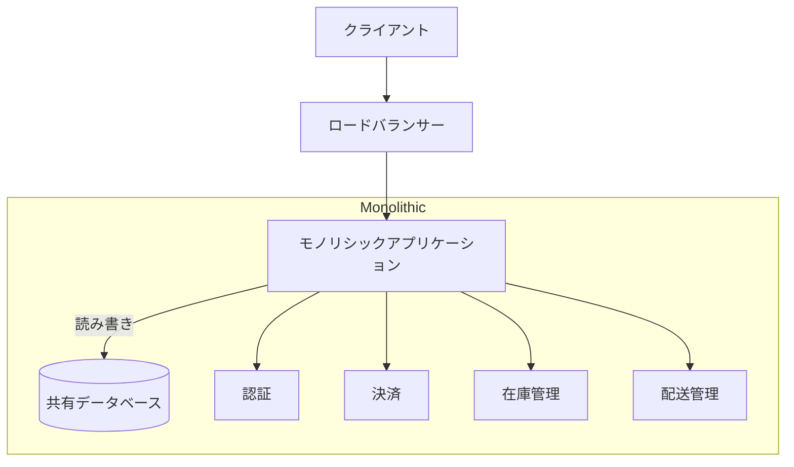

### マイクロサービスアーキテクチャ
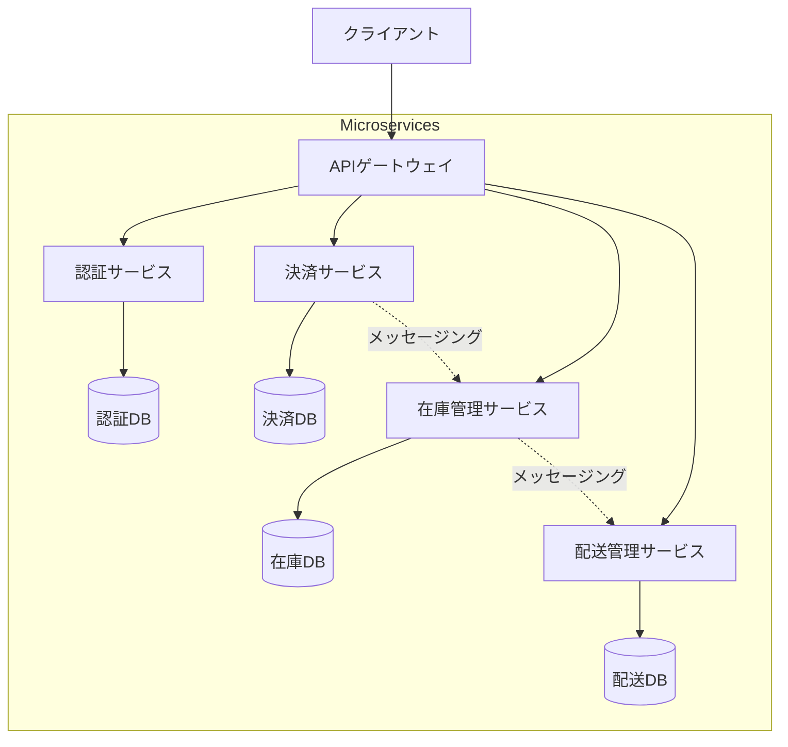

## アプリケーションアーキテクチャの比較

### モノリシックアーキテクチャ

モノリシックアーキテクチャは、従来の一体型アプリケーション設計アプローチです。

#### 特徴
- すべての機能が単一のコードベースに統合されている
- 単一のデプロイユニットとして管理
- 共有データベースを使用
- 垂直スケーリング（スケールアップ）による拡張

#### メリット
- シンプルな開発プロセス
- 容易なデバッグとテスト
- 高速な開発（初期段階）
- シンプルなデプロイメント

#### デメリット
- スケーラビリティの制限
- 新技術採用の困難さ
- コードベースの肥大化による保守性の低下
- チーム間の開発の依存関係が高い

### マイクロサービスアーキテクチャ

マイクロサービスアーキテクチャは、アプリケーションを小さな独立したサービスに分割する現代的なアプローチです。

#### 特徴
- 各機能が独立したサービスとして実装
- サービスごとに独立したデータベース
- REST APIやメッセージングによる通信
- 水平スケーリング（スケールアウト）による拡張
- コンテナ技術との親和性が高い

#### メリット
- 高い柔軟性とスケーラビリティ
- 独立したデプロイメントが可能
- 新技術の採用が容易
- チーム単位での独立した開発が可能
- 部分的な更新やスケーリングが可能

#### デメリット
- 複雑な分散システム管理
- サービス間通信の複雑さ
- 分散トランザクション管理の必要性
- 運用・監視の複雑さ

### アーキテクチャ選択の考慮点

1. プロジェクトの規模
   - 小規模：モノリシック
   - 大規模：マイクロサービス

2. チーム構成
   - 単一チーム：モノリシック
   - 複数チーム：マイクロサービス

3. スケーラビリティ要件
   - 低～中程度：モノリシック
   - 高い要件：マイクロサービス

4. 開発速度
   - 初期段階：モノリシック
   - 長期的な開発：マイクロサービス

5. 技術的成熟度
   - 低い：モノリシック
   - 高い：マイクロサービス

## Amazon SQSの概要

Amazon Simple Queue Service (SQS)は、マイクロサービス、分散システム、サーバーレスアプリケーション間のメッセージング通信を実現するフルマネージドサービスです。

### キューの種類

#### 標準キュー
- 無制限のスループット
- ベストエフォート方式のメッセージ順序
- 少なくとも1回の配信保証
- メッセージの重複が発生する可能性あり

#### FIFOキュー
- First-In-First-Out（FIFO）の厳密な順序保証
- 1回限りの処理保証
- 重複排除
- 1秒あたり最大300件のメッセージ（バッチ使用時は3000件）

### 主要な機能

1. メッセージの保持
   - デフォルトで4日間
   - 最短60秒から最長14日間まで設定可能

2. メッセージの可視性タイムアウト
   - デフォルトで30秒
   - 0秒から12時間まで設定可能
   - 処理中のメッセージを他のコンシューマーから隠す

3. ロングポーリング
   - 空のレスポンスを減らし、レイテンシーを改善
   - 最大20秒間メッセージを待機可能

4. デッドレターキュー（DLQ）
   - 正常に処理できないメッセージの分離
   - トラブルシューティングとデバッグに有用

### ユースケース

1. アプリケーション間の疎結合
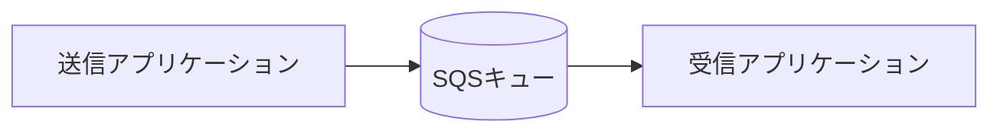

2. 負荷分散とスケーリング
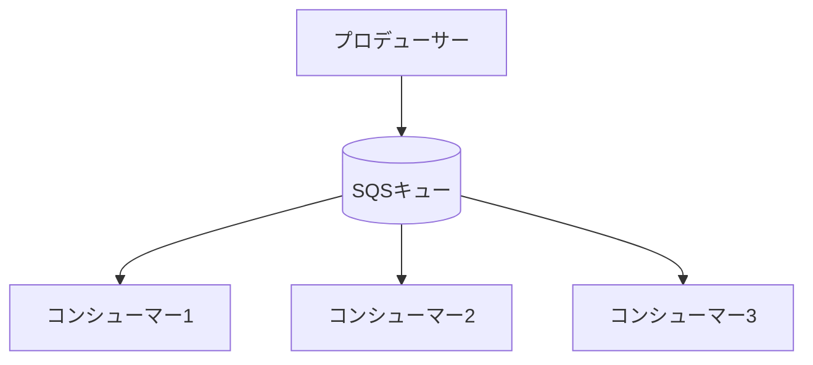

3. バッチ処理とワークロードの平準化
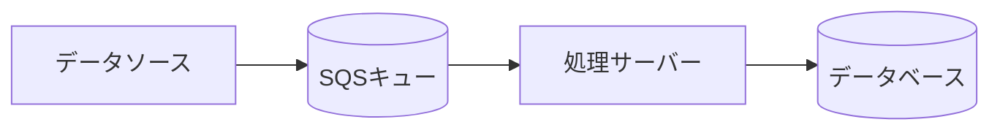

### セキュリティと管理

1. アクセス制御
   - IAMポリシーによる権限管理
   - SQSポリシーによるキューレベルの制御
   - VPCエンドポイントのサポート

2. 暗号化
   - 保管時の暗号化（SSE）
   - AWS KMSとの統合
   - カスタマーマスターキーの使用可能

3. モニタリング
   - CloudWatchメトリクス
   - CloudWatchアラーム
   - AWS X-Rayとの統合

### ベストプラクティス

1. メッセージ処理
   - 適切な可視性タイムアウトの設定
   - バッチ処理の活用
   - エラーハンドリングの実装

2. コスト最適化
   - メッセージサイズの最適化
   - ロングポーリングの使用
   - 適切なスケーリング設定

3. 運用管理
   - デッドレターキューの設定
   - モニタリングとアラートの設定
   - バックアップと災害復旧計画の策定

### メッセージの取得方法

#### 1. ポーリング方式
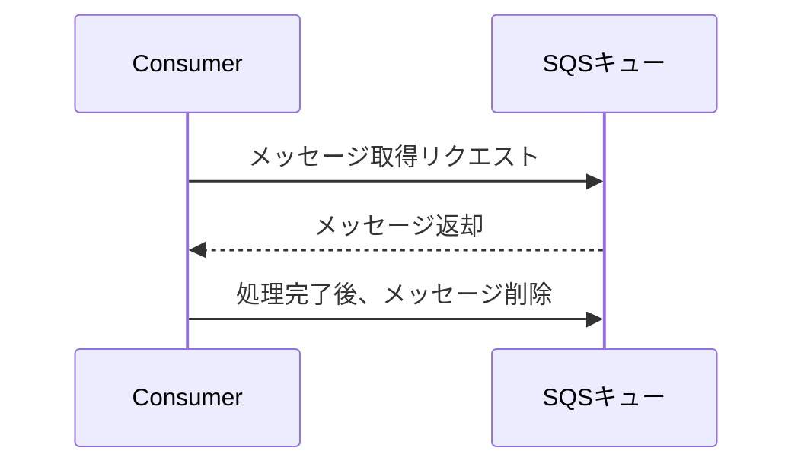

1. ショートポーリング
   - 即時レスポンス
   - 利用可能なメッセージのみを返却
   - 空のレスポンスが多くなる可能性
   - APIコール数が増加

2. ロングポーリング
   - 最大20秒間メッセージを待機
   - 空のレスポンスを削減
   - APIコール数を削減
   - レイテンシーを改善
   - 推奨される取得方法

#### 2. バッチ処理
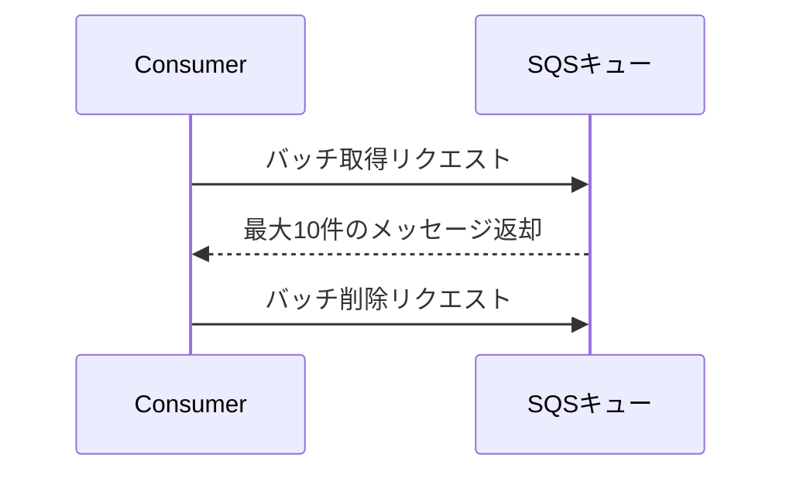

1. バッチ取得（ReceiveMessage）
   - 1回のAPI呼び出しで最大10件取得可能
   - MaxNumberOfMessagesパラメータで件数指定
   - コスト効率の向上
   - スループットの改善

2. バッチ削除（DeleteMessageBatch）
   - 1回のAPI呼び出しで最大10件削除可能
   - 処理効率の向上
   - APIコール数の削減

#### 3. メッセージの処理フロー

1. メッセージの可視性
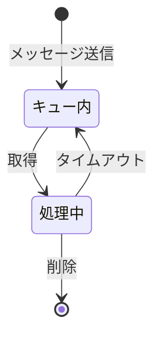

2. 処理手順
   - メッセージの取得（ReceiveMessage）
   - 可視性タイムアウト期間内での処理
   - 処理成功時：メッセージの削除（DeleteMessage）
   - 処理失敗時：タイムアウト後に再処理

3. エラーハンドリング
   - 再試行回数の設定
   - デッドレターキューの活用
   - タイムアウト値の適切な設定
   - エラーログの記録と監視

#### 4. 実装のベストプラクティス

1. 効率的な取得
   - ロングポーリングの使用
   - 適切なバッチサイズの設定
   - 並列処理の実装

2. 信頼性の確保
   - 適切な可視性タイムアウトの設定
   - 冪等性の実装
   - エラー処理の実装

3. パフォーマンスの最適化
   - キャッシングの活用
   - コネクションプーリング
   - 非同期処理の実装

### 可視性タイムアウトの詳細

#### 1. 概要と仕組み
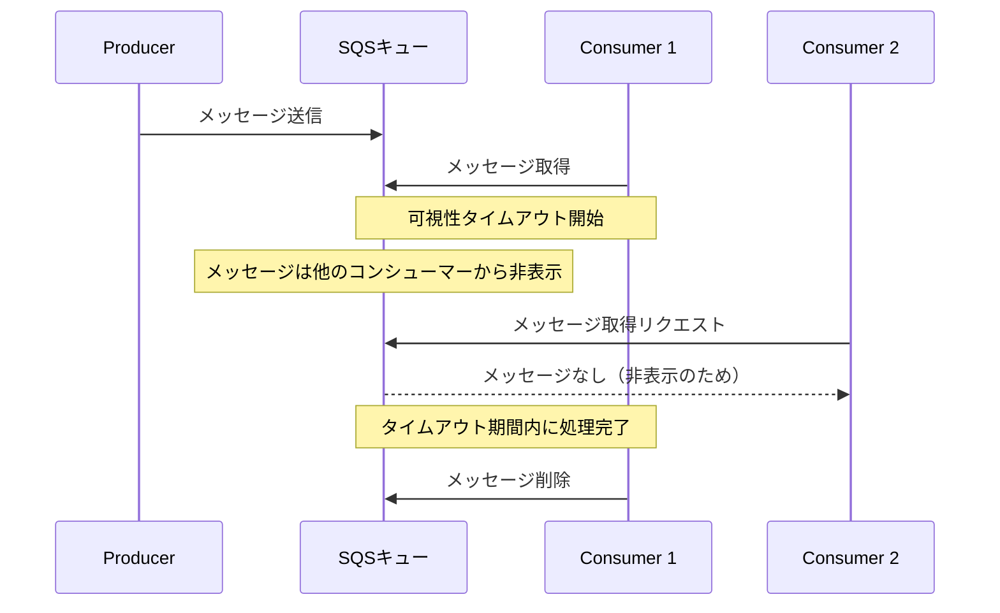

#### 2. 主要な特徴

1. タイムアウト期間
   - デフォルト：30秒
   - 設定範囲：0秒～12時間
   - キュー作成時に設定可能
   - メッセージ単位での動的な変更も可能

2. 動作の仕組み
   - メッセージ取得時に自動的に開始
   - 期間中はメッセージを他のコンシューマーから隠蔽
   - 期間終了後、メッセージは再度キューで利用可能に
   - ChangeMessageVisibilityで期間を延長可能

#### 3. ユースケースと設定例

1. 短時間の処理（30秒以下）
```mermaid
gantt
    title 短時間処理の可視性タイムアウト
    dateFormat ss
    axisFormat %S秒
    
    section メッセージ1
    取得           :0, 1s
    処理           :1, 20s
    削除           :20, 21s
    
    section タイムアウト
    可視性期間     :crit, 0, 30s
```

2. 長時間の処理（30秒以上）
```mermaid
gantt
    title 長時間処理の可視性タイムアウト
    dateFormat mm
    axisFormat %M分
    
    section メッセージ1
    取得           :0, 1m
    処理           :1, 8m
    削除           :8, 9m
    
    section タイムアウト
    初期可視性期間 :crit, 0, 5m
    延長期間       :crit, 5m, 10m
```

#### 4. 設定のベストプラクティス

1. 適切な期間設定
   - 処理時間の150%程度を目安に設定
   - バッチ処理の場合は全体の処理時間を考慮
   - ネットワークの遅延も考慮に入れる

2. 動的な調整
   - 処理の進捗に応じて期間を延長
   - 大量のメッセージを処理する場合は段階的に延長
   - 処理失敗時の再試行も考慮

3. エラーハンドリング
   - タイムアウト発生時の処理を実装
   - 再処理の仕組みを確立
   - デッドレターキューとの連携

#### 5. 実装例

1. 基本的な実装
```python
# 可視性タイムアウトの設定例
sqs.receive_message(
    QueueUrl='queue-url',
    VisibilityTimeout=30,  # 30秒
    MaxNumberOfMessages=1
)
```

2. 動的な延長
```python
# 処理時間が長い場合の延長例
sqs.change_message_visibility(
    QueueUrl='queue-url',
    ReceiptHandle='receipt-handle',
    VisibilityTimeout=300  # 5分に延長
)
```

3. エラー処理
```python
try:
    # メッセージ処理
    process_message(message)
    # 成功時は削除
    sqs.delete_message(
        QueueUrl='queue-url',
        ReceiptHandle='receipt-handle'
    )
except Exception:
    # 失敗時はタイムアウトを待つ
    # メッセージは自動的にキューに戻る
    pass
```

### デッドレターキュー（DLQ）の詳細

#### 1. 概要
デッドレターキュー（DLQ）は、正常に処理できなかったメッセージを分離・保存するための特別なSQSキューです。メインキューで複数回処理に失敗したメッセージを自動的にDLQに移動することで、問題のあるメッセージを分析し、適切な対処を行うことができます。

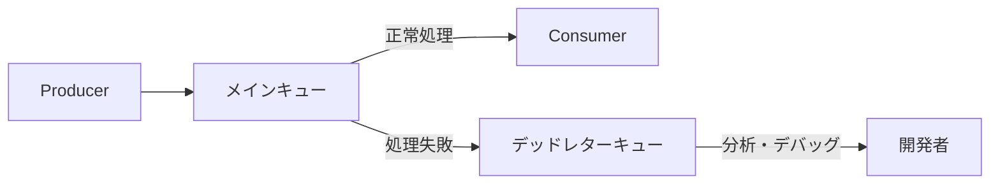

#### 2. 主要な特徴

1. 設定オプション
   - MaxReceiveCount：メッセージの最大受信回数
   - 移動条件：指定回数の処理失敗後に自動的に移動
   - メッセージ保持期間：最大14日間
   - 元のメッセージ属性の保持

2. 動作の仕組み
   - メッセージの処理失敗を検知
   - 失敗回数のカウント
   - 設定した閾値を超えた場合にDLQへ移動
   - 元のメッセージ情報を保持

#### 3. 実装例

1. DLQの作成と設定
```python
# デッドレターキューの作成
dlq_url = sqs.create_queue(
    QueueName='my-dead-letter-queue'
)['QueueUrl']

# DLQのARNを取得
dlq_arn = sqs.get_queue_attributes(
    QueueUrl=dlq_url,
    AttributeNames=['QueueArn']
)['Attributes']['QueueArn']

# メインキューにDLQを設定
sqs.set_queue_attributes(
    QueueUrl='main-queue-url',
    Attributes={
        'RedrivePolicy': json.dumps({
            'deadLetterTargetArn': dlq_arn,
            'maxReceiveCount': '3'  # 3回失敗後にDLQへ
        })
    }
)
```

2. DLQのモニタリング
```python
# DLQのメッセージ数を監視
response = sqs.get_queue_attributes(
    QueueUrl=dlq_url,
    AttributeNames=['ApproximateNumberOfMessages']
)
message_count = int(response['Attributes']['ApproximateNumberOfMessages'])

# CloudWatchアラームの設定
cloudwatch.put_metric_alarm(
    AlarmName='DLQMessageCount',
    MetricName='ApproximateNumberOfMessages',
    Namespace='AWS/SQS',
    Dimensions=[
        {
            'Name': 'QueueName',
            'Value': 'my-dead-letter-queue'
        }
    ],
    Period=300,  # 5分
    EvaluationPeriods=1,
    Threshold=1,
    ComparisonOperator='GreaterThanThreshold'
)
```

#### 4. ベストプラクティス

1. DLQの設計
   - 適切なmaxReceiveCountの設定
   - メッセージ保持期間の最適化
   - アラートの設定
   - 定期的なモニタリング

2. エラーハンドリング
   - エラーの種類に応じた処理
   - リトライ戦略の実装
   - エラーログの記録
   - 自動復旧メカニズムの検討

3. 運用管理
   - DLQのメッセージ分析
   - 根本原因の特定
   - 修正後の再処理
   - 予防措置の実装

#### 5. 一般的なユースケース

1. エラー分析
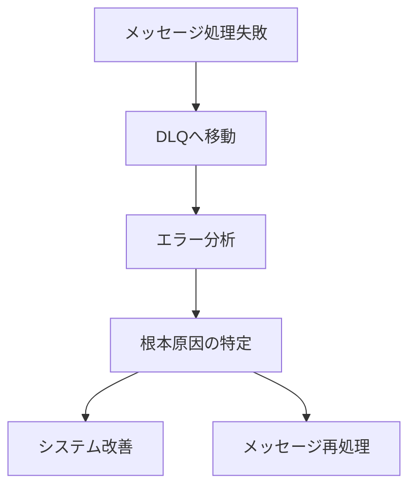

2. システム改善
   - エラーパターンの特定
   - システムの脆弱性発見
   - パフォーマンス最適化
   - 信頼性向上

3. 障害復旧
   - 失敗したメッセージの保存
   - システム復旧後の再処理
   - データ整合性の維持
   - ビジネス継続性の確保

### 遅延キューの詳細

#### 1. 概要
遅延キューは、メッセージを即時に処理せず、指定した時間だけ待機させてから処理可能にする機能です。

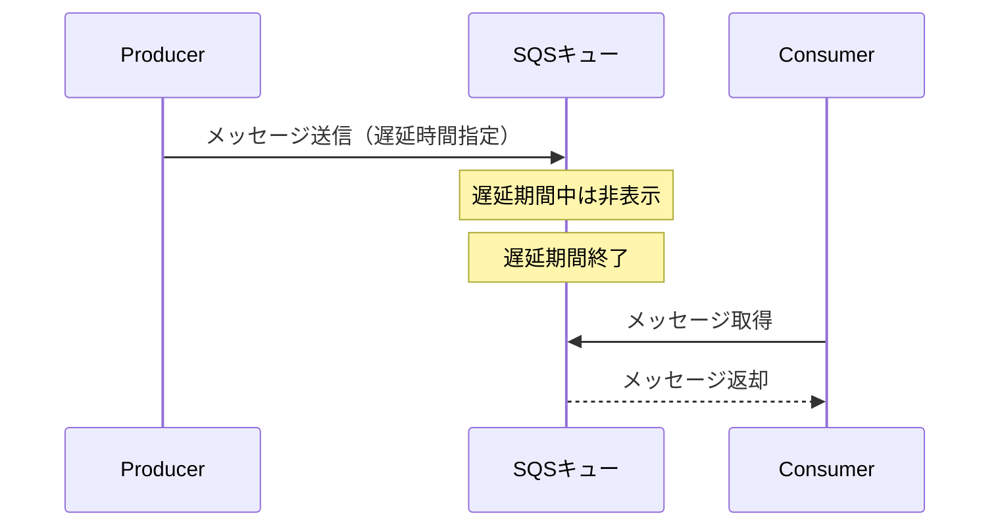

#### 2. 主要な特徴

1. 遅延設定
   - キューレベルでの設定：DelaySeconds
   - メッセージレベルでの設定：MessageDelaySeconds
   - 設定範囲：0秒～15分（900秒）
   - 標準キュー、FIFOキュー両方でサポート

2. 動作の仕組み
   - メッセージ送信時に遅延時間を指定
   - 遅延期間中はメッセージを非表示に
   - 期間終了後に処理可能な状態に
   - 遅延期間中の変更は不可

#### 3. ユースケースと実装例

1. スケジュールされたタスク
```mermaid
gantt
    title スケジュールされたタスクの実行
    dateFormat mm
    axisFormat %M分
    
    section メッセージ1
    遅延期間    :crit, 0, 5m
    処理可能    :5m, 7m
    
    section メッセージ2
    遅延期間    :crit, 0, 10m
    処理可能    :10m, 12m
```

2. 基本的な実装
```python
# キュー作成時の遅延設定
sqs.create_queue(
    QueueName='delayed-queue',
    Attributes={
        'DelaySeconds': '300'  # 5分の遅延
    }
)

# メッセージ送信時の遅延設定
sqs.send_message(
    QueueUrl='queue-url',
    MessageBody='message content',
    DelaySeconds=600  # 10分の遅延
)
```

#### 4. 一般的なユースケース

1. スケジュール処理
   - 定期的なバッチ処理
   - 予約投稿システム
   - メンテナンス通知

2. ワークフロー制御
   - 段階的な処理の実行
   - 依存タスクの管理
   - プロセス間の同期

3. 負荷制御
   - ピーク時の負荷分散
   - リソース使用の最適化
   - レート制限の実装

#### 5. 設計のベストプラクティス

1. 遅延時間の設定
   - ユースケースに応じた適切な遅延時間の選択
   - システムの負荷状況の考慮
   - エラー時の再試行間隔の考慮

2. キュー設計
   - 複数の遅延時間に対する個別のキュー作成
   - デッドレターキューとの連携
   - モニタリングの実装

3. エラーハンドリング
   - タイムアウト時の処理
   - 再試行ロジックの実装
   - エラーログの記録

#### 6. 実装パターン

1. 段階的処理
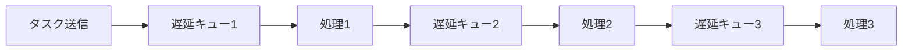

2. 再試行メカニズム
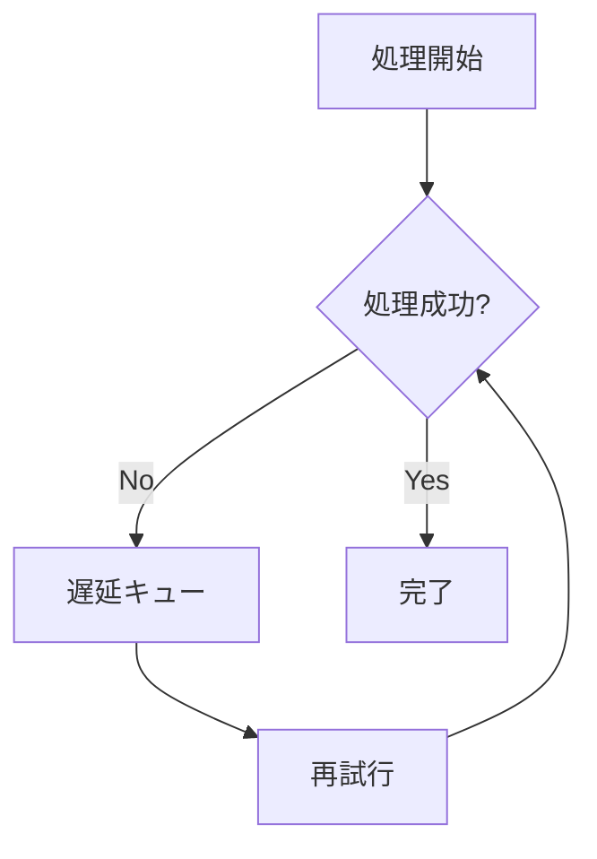

3. モニタリング設定
```python
# CloudWatchアラームの設定例
cloudwatch.put_metric_alarm(
    AlarmName='DelayedMessageCount',
    MetricName='ApproximateNumberOfMessagesDelayed',
    Namespace='AWS/SQS',
    Period=300,  # 5分
    EvaluationPeriods=2,
    Threshold=1000,
    ComparisonOperator='GreaterThanThreshold'
)
```
