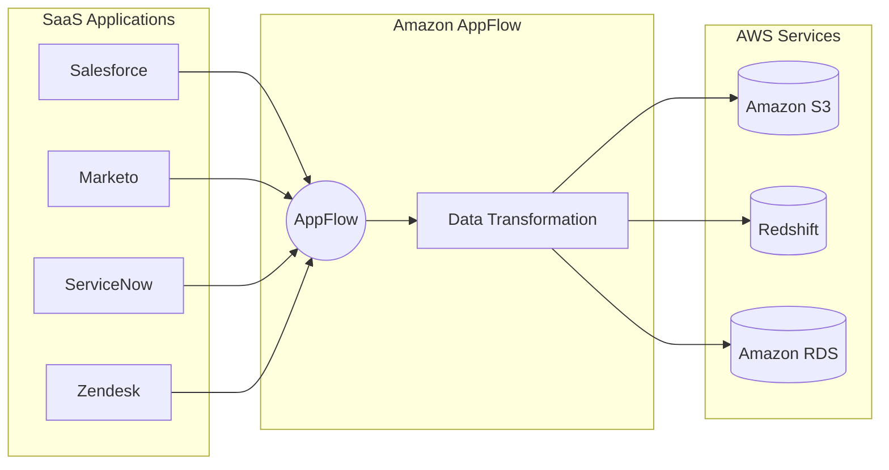

# Amazon AppFlow

## 概要
Amazon AppFlowは、SaaSアプリケーションとAWSサービス間でデータを安全に転送するためのフルマネージドな統合サービスです。コーディング不要で、数回のクリックでデータフローを設定できます。

## 主な特徴と利点

- **コーディング不要**: ドラッグ＆ドロップのインターフェースでデータフローを設定
- **データ変換**: データマッピング、フィルタリング、検証などの変換機能を提供
- **スケジュール設定**: イベントベース、スケジュールベース、オンデマンドでのデータ転送が可能
- **セキュリティ**: AWS PrivateLinkを使用した安全なデータ転送
- **エラーハンドリング**: 自動リトライ、エラー通知機能を提供
- **コスト効率**: 使用した分だけ支払い（データ転送量ベース）

## ユースケース

1. **セールスデータの同期**
   - Salesforceから Amazon Redshiftへの顧客データ転送
   - 販売実績のリアルタイム分析

2. **マーケティングデータの統合**
   - Marketoから Amazon S3へのキャンペーンデータ収集
   - クロスチャネルマーケティング分析

3. **人事データの管理**
   - WorkdayからAmazon RDSへの従業員データ同期
   - 人材分析とレポート作成

## アーキテクチャ

## 統合可能なサービス

### ソース（From）
- Salesforce
- SAP
- Slack
- Zendesk
- ServiceNow
- Marketo
- Google Analytics
- Trend Micro
- Amplitude
- Datadog

### デスティネーション（To）
- Amazon S3
- Amazon Redshift
- Amazon RDS
- Amazon EventBridge
- Salesforce
- Snowflake
- Upsolver

## セキュリティと管理

- **暗号化**: 転送中および保管時のデータ暗号化
- **アクセス制御**: IAMによる細かなアクセス権限管理
- **監査**: AWS CloudTrailとの統合による監査ログ
- **コンプライアンス**: HIPAA, GDPR, PCI DSSなどに準拠

## ベストプラクティス

1. **データフロー設計**
   - 必要最小限のデータのみを転送
   - 適切なスケジュール間隔の設定
   - エラーハンドリングの設定

2. **セキュリティ**
   - VPCエンドポイントの使用
   - 暗号化の有効化
   - 最小権限の原則に従ったIAM設定

3. **コスト最適化**
   - 不要なデータ転送の削除
   - 適切なスケジュール間隔の設定
   - データ量の監視と最適化
