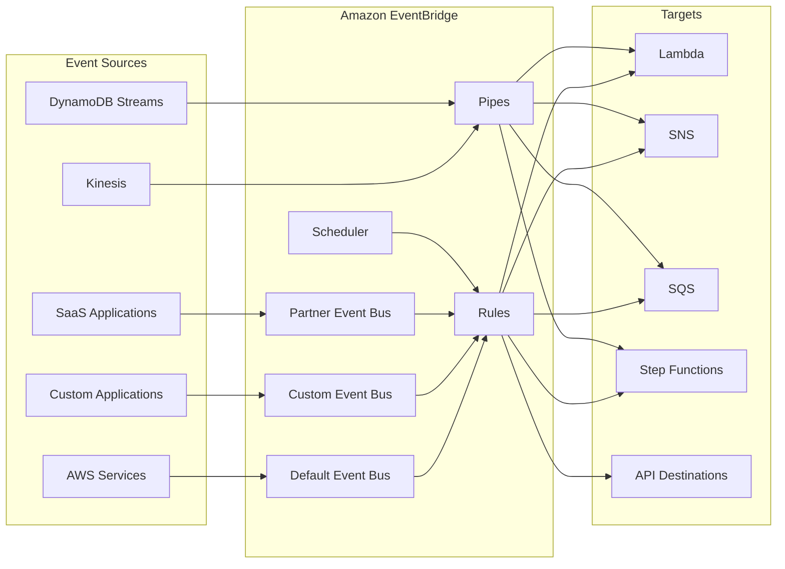

# Amazon EventBridge

Amazon EventBridgeは、アプリケーション間でイベントを配信するためのサーバーレスイベントバスサービスです。

## 概要

- イベントドリブンアーキテクチャを実現するためのサービス
- AWSのサービス、SaaS、カスタムアプリケーション間でイベントを配信
- サーバーレスで管理が不要
- イベントのフィルタリングとルーティングが可能

## 主要な機能

1. EventBridge Rules（イベントバス）
   - イベントバスはイベントを受信し、ルールに基づいて処理するパイプライン
   - イベントタイプ：
     * AWS Servicesイベント：AWSサービスから発生するイベント
     * Custom Events：独自アプリケーションからのカスタムイベント
     * Schedule Events：定期的なスケジュールで発生するイベント
   - ネームスペース：
     * デフォルト：aws.partner
     * カスタム：独自のネームスペースを定義可能

2. EventBridge Pipes
   - ソースからターゲットへの直接的なイベント配信
   - イベントの変換、フィルタリング、エンリッチメント機能
   - サポートされるソース：
     * Kinesis Data Streams
     * DynamoDB Streams
     * Amazon MQ
     * Amazon MSK
     * SQS
   - 単一のソースから単一のターゲットへの配信に最適化

3. EventBridge Scheduler
   - スケジュールベースのイベント生成
   - 一回限りのイベントまたは定期的なイベントをスケジュール
   - cron式やrate式による柔軟なスケジュール設定
   - タイムゾーンのサポート
   - デッドレターキューの設定が可能

4. ターゲット
   - Lambda関数
   - SNSトピック
   - SQSキュー
   - Step Functions
   - その他のAWSサービス

## アーキテクチャ

## ユースケース

1. アプリケーション統合
   - マイクロサービス間の非同期通信
   - システム間のイベント配信
   - ワークフローの自動化

2. モニタリングと運用自動化
   - リソースの状態変更の検知
   - 自動バックアップ
   - セキュリティアラート

3. SaaS統合
   - Zendesk、DataDog等のSaaSサービスとの統合
   - リアルタイムデータ同期

## 利点

1. サーバーレス
   - インフラ管理が不要
   - 自動スケーリング
   - 従量課金制

2. 柔軟性
   - 複数のイベントソースとターゲットをサポート
   - カスタムイベントパターン
   - 詳細なフィルタリング

3. 信頼性
   - AWSマネージドサービス
   - 高可用性
   - イベント配信の保証

## ベストプラクティス

1. イベント設計
   - 明確なイベントスキーマの定義
   - バージョニングの考慮
   - 必要な情報のみを含める

2. ルール管理
   - 適切なフィルタリングパターンの使用
   - デッドレターキューの設定
   - エラーハンドリングの実装

3. モニタリング
   - CloudWatchメトリクスの監視
   - ログの有効化
   - アラートの設定
