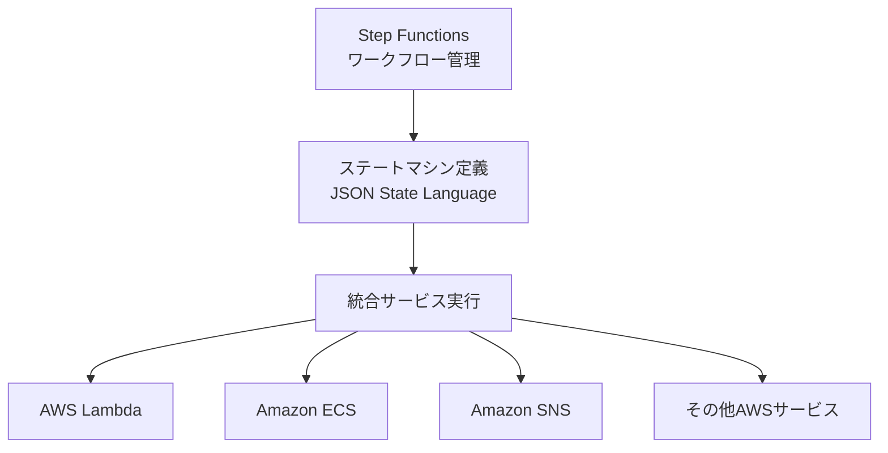
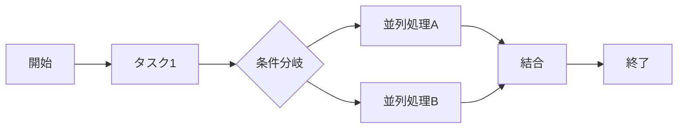
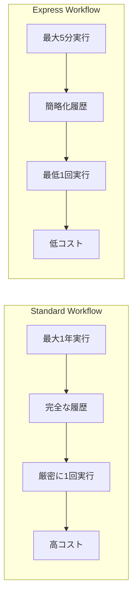
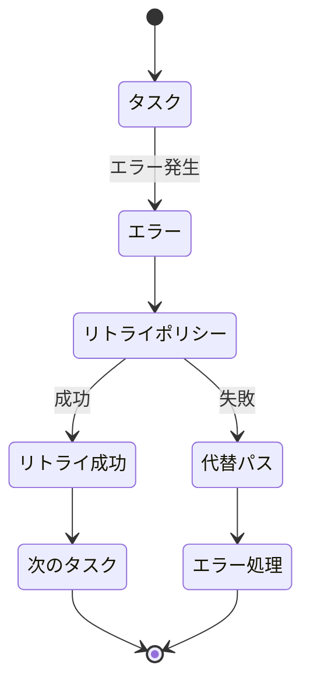
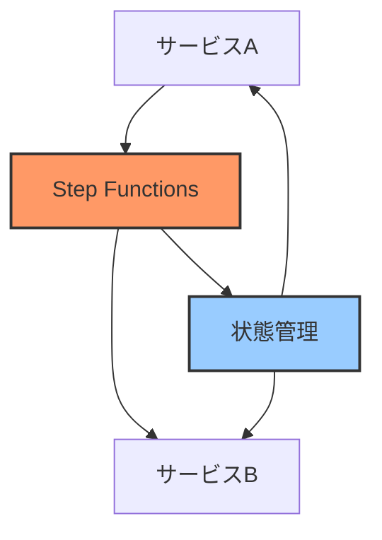

# AWS Step Functions

AWS Step Functions は、複数のAWSサービスを組み合わせて、ビジネスクリティカルなアプリケーションを構築するためのサーバーレスワークフロー管理サービスです。

## 概要

- ビジュアルワークフローを使用して、分散アプリケーションやマイクロサービスのコンポーネントを調整
- JSONベースのステートマシン言語（Amazon States Language）を使用してワークフローを定義
- 完全マネージド型のサービスで、インフラストラクチャの管理が不要
- サーバーレスで、実行時間に応じた料金体系

## 主な機能

### 1. ワークフロー管理

- 複雑なワークフローを視覚的に設計・実行
- エラー処理とリトライロジックを組み込み可能
- 並列処理、条件分岐、待機状態などの制御が可能

### 2. サービス統合
- AWS Lambda
- Amazon ECS
- AWS Fargate
- Amazon SQS
- Amazon SNS
- その他多数のAWSサービスと統合可能

### 3. 実行タイプ

1. **Standard Workflow**
   - 最大1年間の実行時間
   - 完全な実行履歴
   - 厳密に1回の実行保証
   - より高いコスト

2. **Express Workflow**
   - 最大5分間の実行時間
   - 簡略化された実行履歴
   - 少なくとも1回の実行保証
   - より低いコスト
   - 高いイベントレート処理に最適

### 4. エラーハンドリング

- リトライポリシーの設定
- エラー時の代替パスの定義
- タイムアウトの設定
- Catch/Finallyブロックのような例外処理

## ユースケース

1. **データ処理パイプライン**

   - ETLジョブの調整
   - データ変換と移動
   - バッチ処理

2. **マイクロサービス調整**

   - サービス間の通信管理
   - 分散トランザクション
   - APIオーケストレーション

3. **CI/CDパイプライン**
   - ビルド、テスト、デプロイの自動化
   - 承認フローの実装
   - 複数環境へのデプロイ

4. **バッチ処理**
   - 定期的なジョブスケジューリング
   - 大規模データ処理
   - レポート生成

## メリット

1. **サーバーレス**
   - インフラストラクチャ管理が不要
   - 使用量に応じた料金体系
   - 自動スケーリング

2. **可視性**
   - ビジュアルワークフローデザイナー
   - 実行履歴の詳細な追跡
   - CloudWatchとの統合によるモニタリング

3. **信頼性**
   - AWSによる高可用性の保証
   - 組み込みのエラー処理
   - ステートの自動管理

4. **柔軟性**
   - 多様なAWSサービスとの統合
   - カスタムロジックの実装が可能
   - 既存のアプリケーションとの統合が容易

## ベストプラクティス

1. **設計**
   - ワークフローを小さな、再利用可能なコンポーネントに分割
   - エラー処理を適切に実装
   - タイムアウトとリトライポリシーを設定

2. **実装**
   - 適切な実行タイプ（Standard/Express）の選択
   - 並列処理の活用
   - 状態遷移のログ記録

3. **運用**
   - モニタリングとアラートの設定
   - コスト最適化
   - セキュリティ設定の定期的な見直し

## セキュリティ

- IAMロールとポリシーによるアクセス制御
- VPC内での実行が可能
- AWS KMSによる暗号化
- CloudTrailによる監査ログ

## 料金

- 状態遷移回数に基づく課金
- 実行タイプ（Standard/Express）による料金の違い
- リージョンによる料金の違い
- 無料利用枠あり（毎月4,000状態遷移まで）
