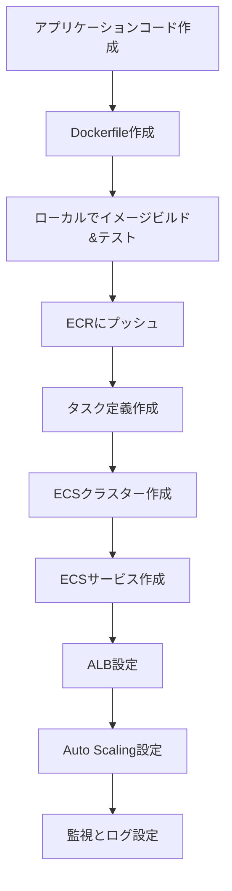
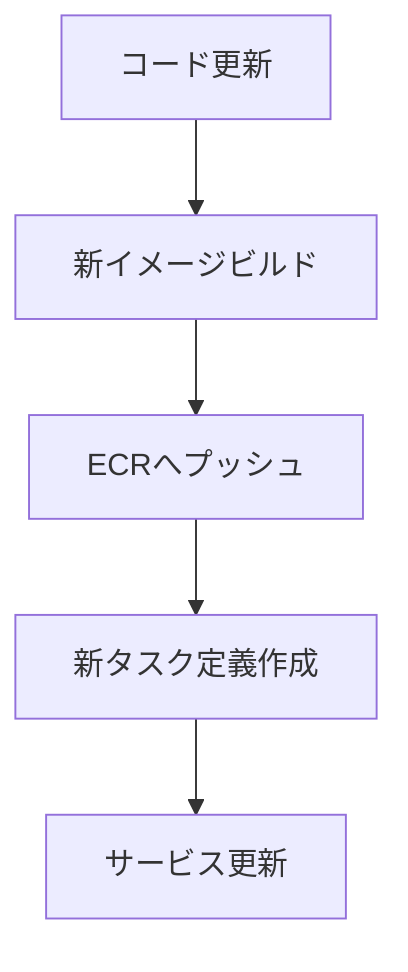

# Amazon Elastic Container Service (ECS)

## 概要

Amazon ECS は、コンテナ化されたアプリケーションを簡単に実行、停止、管理できるフルマネージドコンテナオーケストレーションサービスです。

### 主要コンポーネント

- **ECS クラスター**: コンテナを実行するためのインフラストラクチャのグループ化
- **タスク定義**: アプリケーションの設計図（コンテナ定義、リソース要件など）
- **ECS サービス**: タスク定義に基づいて指定された数のタスクを維持
- **タスク**: タスク定義に基づいて実行される実際のコンテナインスタンス

### 起動タイプ

1. **AWS Fargate**

   - サーバーレスでコンテナを実行
   - インフラストラクチャの管理が不要
   - ペイ・パー・ユース方式

2. **EC2 起動タイプ**
   - EC2 インスタンス上でコンテナを実行
   - インフラストラクチャの完全なコントロールが可能
   - コスト最適化が可能

### 主な特徴

- AWS 各種サービスとの統合（ALB, CloudWatch, IAM など）
- オートスケーリング機能
- コンテナの自動配置と管理
- ヘルスチェックと自動リカバリー
- Docker Compose 互換

## ECS を使用したアプリケーション開発フロー

## ECS の継続的デリバリーフロー

## ベストプラクティス

1. **セキュリティ**

   - IAM ロールを適切に設定
   - セキュリティグループの最小権限設定
   - シークレット情報は AWS Secrets Manager を使用

2. **モニタリング**

   - CloudWatch でメトリクスとログを監視
   - コンテナインサイトの有効化
   - アラートの設定

3. **コスト最適化**

   - Fargate スポットの活用
   - リザーブドインスタンスの検討（EC2 起動タイプの場合）
   - 適切なタスクサイズの設定

4. **可用性**
   - 複数のアベイラビリティーゾーンの使用
   - ヘルスチェックの適切な設定
   - グレースフルデプロイメントの実装

## よくある使用シナリオ

- マイクロサービスアーキテクチャの実装
- バッチ処理ワークロード
- CI/CD パイプラインの一部として
- Web アプリケーションのホスティング
