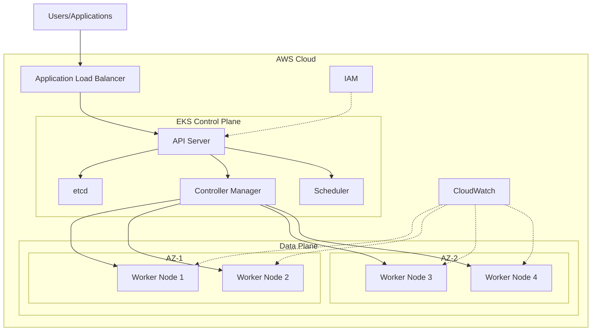

# Amazon Elastic Kubernetes Service (EKS)

## EKS とは？（一般向け解説）

EKS は、コンテナアプリケーションを大規模に運用するための AWS のサービスです。

### わかりやすい例え

スーパーマーケットの運営に例えると：

- EKS は大きなスーパーマーケットの管理システムのようなものです
- 商品（アプリケーション）を適切な棚（サーバー）に配置
- 混雑時には自動的にレジ（サーバー）を増やす
- 在庫（リソース）を効率的に管理
- 安全管理や監視カメラ（セキュリティ）も完備

### メリット

- 📦 アプリケーションの管理が簡単
- 🔄 システムの自動拡張・縮小が可能
- 💪 高い信頼性と安定性
- 💰 必要な分だけ支払う料金体系
- 🛡 セキュリティ対策が充実

### どんな時に使う？

- Web サービスの運営
- スマートフォンアプリのバックエンド
- データ分析システム
- AI アプリケーションの実行

Amazon EKS は、AWS が提供するマネージド Kubernetes サービスです。Kubernetes クラスターの運用管理を簡素化し、セキュアで信頼性の高いコンテナオーケストレーションを実現します。

## Kubernetes（k8s）について

### Kubernetes とは？

Kubernetes（略称：k8s）は、コンテナアプリケーションの管理を自動化するためのオープンソースのプラットフォームです。

### わかりやすい例え

オーケストラの指揮者に例えると：

- 指揮者（Kubernetes）が演奏者（コンテナ）を指揮
- 楽譜（設定ファイル）に従って全体を調整
- 演奏者が具合悪くなった時の交代要員も準備（自動復旧）
- 観客（アクセス）が増えたら演奏者も増員（スケーリング）

### Kubernetes の主な機能

- 🔄 自動デプロイと更新
- 🩹 自己修復機能
- ⚖️ 負荷分散
- 📈 自動スケーリング
- 🔍 障害検知

### なぜ Kubernetes が必要？

1. **複雑なアプリケーションの管理**

   - 多数のコンテナを効率的に運用
   - サービス間の連携を自動化

2. **安定性の向上**

   - システム障害からの自動復旧
   - トラフィック変動への自動対応

3. **開発効率の向上**

   - 開発環境と本番環境の一貫性確保
   - デプロイの自動化

4. **リソースの効率的な利用**
   - サーバーリソースの最適化
   - コスト削減

### EKS と Kubernetes の関係

- EKS は AWS による Kubernetes のマネージドサービス
- 面倒な Kubernetes の管理作業を AWS に任せられる
- AWS の他のサービスと簡単に連携可能
- セキュリティや監視機能が充実

## 主な特徴

- **マネージドコントロールプレーン**: Kubernetes マスターノードの管理を AWS が行い、高可用性を確保
- **マルチ AZ 対応**: 複数のアベイラビリティゾーンにワーカーノードを配置可能
- **セキュリティ**: AWS IAM との統合による認証認可の一元管理
- **ネットワーキング**: VPC との統合、Application Load Balancer との連携
- **モニタリング**: CloudWatch との統合による監視機能

## アーキテクチャ

## 主なユースケース

1. マイクロサービスアプリケーションの実行
2. バッチ処理ワークロード
3. 機械学習ワークロードの実行
4. ハイブリッドクラウド環境の構築

## 料金体系

- コントロールプレーン: 時間単位の課金
- ワーカーノード: EC2 インスタンス料金
- ストレージ: EBS ボリューム料金
- データ転送: ネットワーク転送料金

## 統合サービス

- **AWS Load Balancer Controller**: Ingress リソースの管理
- **Amazon ECR**: コンテナイメージレジストリ
- **AWS IAM Authenticator**: IAM ベースの認証
- **Amazon VPC CNI**: ネットワーキング
- **CloudWatch Container Insights**: モニタリング

## ベストプラクティス

1. 適切なインスタンスタイプの選択
2. Auto Scaling の設定
3. セキュリティグループの適切な設定
4. リソース制限の設定
5. 定期的なバージョンアップデート

## 制限事項

- リージョンごとのクラスター数
- ノードグループあたりのノード数
- ポッド数の制限
- API 呼び出し制限

## 関連サービス

- Amazon ECS
- Amazon ECR
- AWS Fargate
- Amazon EC2
- AWS Auto Scaling
