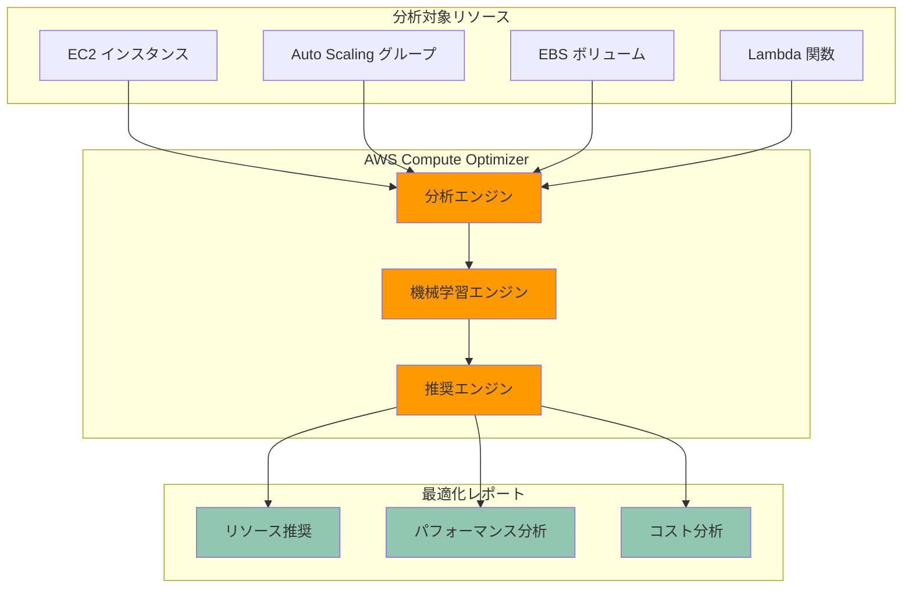

# AWS Compute Optimizer

AWS Compute Optimizer は、機械学習を活用してワークロードの分析を行い、最適な AWS リソースの推奨を提供するサービスです。

## 概要

- 機械学習モデルによるリソース使用状況の分析
- コスト効率とパフォーマンスの最適化
- リソースの過剰プロビジョニングや不足の特定

## アーキテクチャ概要

## 主な機能

### リソース分析

- CPU 使用率の分析
- メモリ使用率の評価
- ネットワークパフォーマンスの確認
- ディスク I/O パターンの分析

### 推奨事項の提供

- インスタンスタイプの推奨
- Auto Scaling グループの設定推奨
- EBS ボリュームの最適化提案
- Lambda 関数の設定推奨

### レポート機能

- 詳細な分析レポート
- コスト削減の可能性
- パフォーマンス改善の機会
- 推奨事項の優先順位付け

## サポートされるリソース

- Amazon EC2 インスタンス
- Amazon EC2 Auto Scaling グループ
- Amazon EBS ボリューム
- AWS Lambda 関数

## メリット

- コスト最適化の実現
- パフォーマンスの向上
- リソース使用効率の改善
- 運用負荷の軽減
- データに基づく意思決定

## 制限事項

- 一部のインスタンスタイプのみ対応
- 分析には一定期間のメトリクスデータが必要
- リージョンによる利用制限
- 推奨の実装は手動で必要

## 設定と運用

### 初期設定

- サービスの有効化
- IAM ロールの設定
- メトリクス収集の設定
- 分析対象の選択

### 継続的な運用

- 定期的な推奨事項の確認
- パフォーマンス指標の監視
- コスト最適化の実施
- 設定の見直しと調整

## ベストプラクティス

- 定期的な推奨事項の確認
- 段階的な最適化の実施
- テスト環境での検証
- パフォーマンス要件との整合性確認
- コスト目標との整合性確認

## 料金

- 基本的な分析機能は無料
- 高度な分析機能は有料
- リソース数に応じた課金
- データ保持期間による料金変動

## まとめ

AWS Compute Optimizer は、機械学習を活用して AWS リソースの最適化を支援する強力なツールです。適切なリソースサイジングとコスト最適化を実現しながら、パフォーマンス要件を満たすための推奨事項を提供します。ただし、推奨事項の実装には慎重な検討と計画が必要です。
