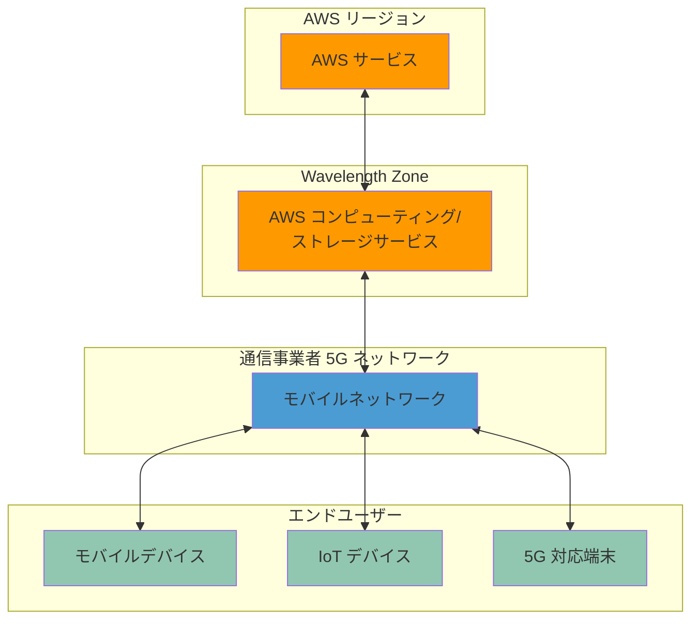
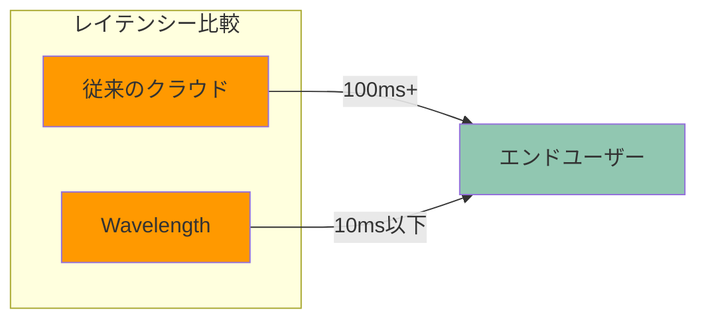

# AWS Wavelength

AWS Wavelength は、5G ネットワークのエッジに AWS のコンピューティングとストレージサービスを統合し、超低レイテンシーのアプリケーションを実現するサービスです。

## 概要

- 通信事業者の 5G ネットワーク内に AWS インフラを配置
- ミリ秒単位の超低レイテンシーを実現
- モバイルエッジコンピューティング（MEC）の実装

## アーキテクチャ概要

## 主な特徴

### インフラストラクチャ

- Wavelength Zone での AWS サービスの実行
- 5G ネットワークとの直接統合
- 既存の AWS リージョンとのシームレスな連携

### サポートされるサービス

- Amazon EC2
- Amazon EBS
- Amazon VPC
- Amazon ECS/EKS
- Application Load Balancer
- AWS CloudFormation

### ネットワーク機能

- キャリアネットワークとの直接接続
- 超低レイテンシー通信
- 高帯域幅の確保
- セキュアな通信経路

## ユースケース

- リアルタイムゲーミング
- ライブストリーミング
- AR/VR アプリケーション
- 自動運転車両
- IoT デバイス制御
- スマートシティアプリケーション

## メリット

- 超低レイテンシーの実現
- モバイルユーザーへの最適化
- スケーラブルなインフラ
- AWS の管理ツールとの統合
- セキュリティとコンプライアンスの確保

## 制限事項

- 利用可能な地域が限定的
- 特定の通信事業者との連携が必要
- 一部の AWS サービスのみ利用可能
- コストが比較的高い

## アーキテクチャの考慮事項

### アプリケーション設計

- エッジ処理の最適化
- レイテンシー要件の定義
- フェイルオーバー戦略
- データ同期メカニズム

### ネットワーク設計

- トラフィックルーティング
- バックホール接続
- セキュリティ対策
- 帯域幅管理

## セキュリティ

- AWS IAM による認証と認可
- VPC セキュリティグループ
- ネットワーク ACL
- 暗号化通信

## 料金体系

- コンピューティングリソース使用料
- ストレージ使用料
- データ転送料金
- IP アドレス料金

## デプロイメントと運用

### デプロイメント

- Wavelength Zone の選択
- VPC 設定
- アプリケーションのデプロイ
- モニタリングの設定

### 運用管理

- パフォーマンス監視
- リソース最適化
- 障害対応
- スケーリング管理

## まとめ

AWS Wavelength は、5G ネットワークを活用した超低レイテンシーアプリケーションの開発と運用を可能にする革新的なサービスです。モバイルエッジコンピューティングの要件が厳しいユースケースに特に適していますが、利用可能な地域や通信事業者の制限を考慮する必要があります。
