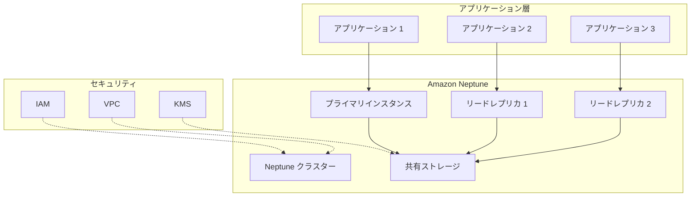
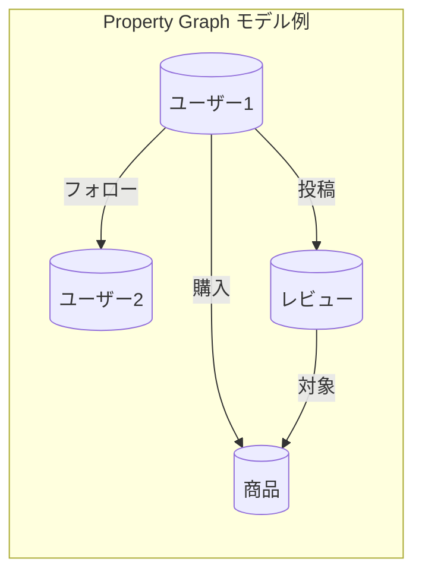
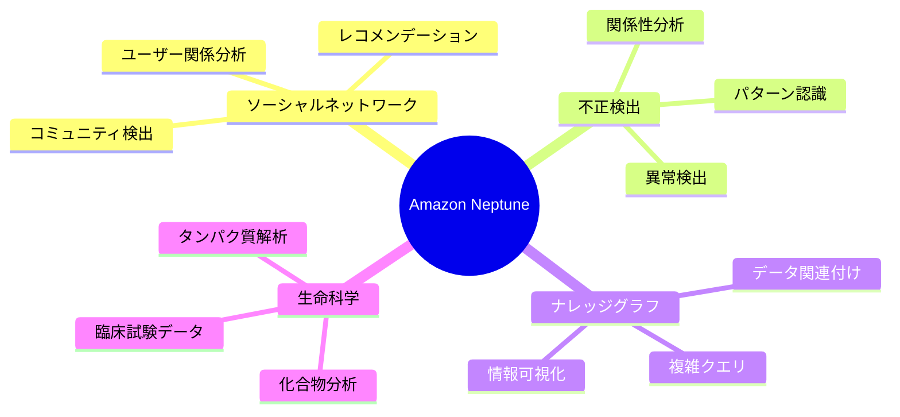

# Amazon Neptune

Amazon Neptune は、高度に接続されたデータセットを扱うために設計された、フルマネージドのグラフデータベースサービスです。

## 主な特徴

- **フルマネージドサービス**: インフラストラクチャの管理、パッチ適用、バックアップなどを自動化
- **高可用性**: マルチ AZ デプロイメントによる 99.99%の可用性
- **高性能**: 数十億のリレーションシップを持つグラフの高速なクエリ処理
- **セキュリティ**: VPC 内での実行、KMS による暗号化、IAM によるアクセス制御

## ユースケース

1. **ソーシャルネットワーキング**

   - ユーザー間の関係性の分析
   - コミュニティ検出
   - レコメンデーションエンジン

2. **不正検出**

   - パターン認識
   - リアルタイムの異常検出
   - 関係性分析による不正の特定

3. **ナレッジグラフ**

   - データの意味的な関連付け
   - 複雑なクエリの実行
   - 情報の関係性の可視化

4. **生命科学研究**
   - 化合物の相互作用分析
   - タンパク質ネットワーク解析
   - 臨床試験データの関係性分析

## サポートされるグラフモデルとクエリ言語

- **Property Graph**

  - Apache TinkerPop Gremlin
  - SPARQL 1.1

- **RDF (Resource Description Framework)**
  - W3C 標準の SPARQL クエリ言語

## スケーラビリティ

- 最大 15 のリードレプリカ
- ストレージは自動的に拡張（最大 64TB）
- バーストに対応する高スループット

### リードレプリカの詳細

- リードレプリカは 0 ～ 15 個まで追加可能
- フェイルオーバー時の動作：
  - リードレプリカがプライマリインスタンスに昇格
  - フェイルオーバーの優先順位：
    1. 指定した優先度（0-15）に基づく
    2. 優先度が同じ場合は、インスタンスサイズが大きい方
    3. 優先度とサイズが同じ場合は任意に選択

### ストレージの詳細

- 自動スケーリング機能：
  - 10 GB 単位で拡張
  - 最大 64 TB まで対応
- 高可用性設計：
  - 3 つのアベイラビリティーゾーンに計 6 個のデータコピーを作成
  - フォールトトレランス：
    - 6 つ中最大 3 個がエラーでも読み取り可能
    - 6 つ中最大 2 個がエラーでも書き込み可能
  - Aurora と同様のクォーラムベースのストレージシステムを採用

## 監視とメンテナンス

- Amazon CloudWatch との統合
- 自動バックアップ（最大 35 日間）
- 継続的なパッチ適用
- パフォーマンスインサイトによる監視

## セキュリティ機能

- AWS KMS による保存時の暗号化
- 転送時の暗号化（SSL/TLS）
- IAM による細かなアクセス制御
- VPC によるネットワーク分離

## 料金

- インスタンスの時間単位の課金
- ストレージ使用量に基づく課金
- データ転送量に基づく課金
- I/O 操作に基づく課金

## ベストプラクティス

1. 適切なインスタンスサイズの選択
2. マルチ AZ デプロイメントの利用
3. 定期的なバックアップの実施
4. パフォーマンスインサイトの活用
5. 効率的なクエリ設計

## 制限事項

- リージョンによる利用可能性
- インスタンスタイプごとの制限
- クエリタイムアウトの設定
- 同時接続数の制限

## アーキテクチャ図

## データモデル図

## ユースケース図

