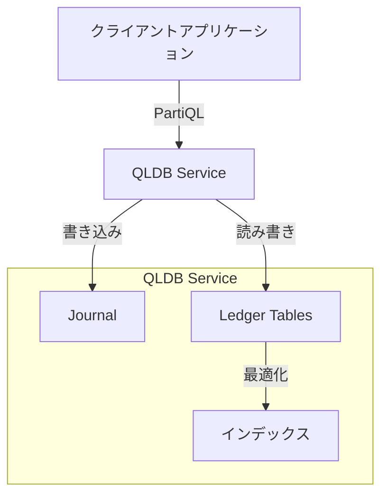
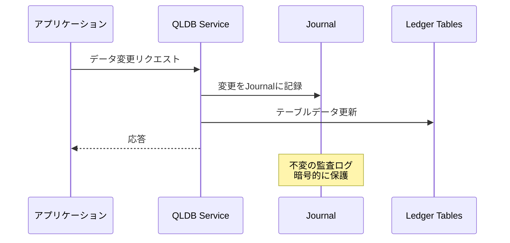
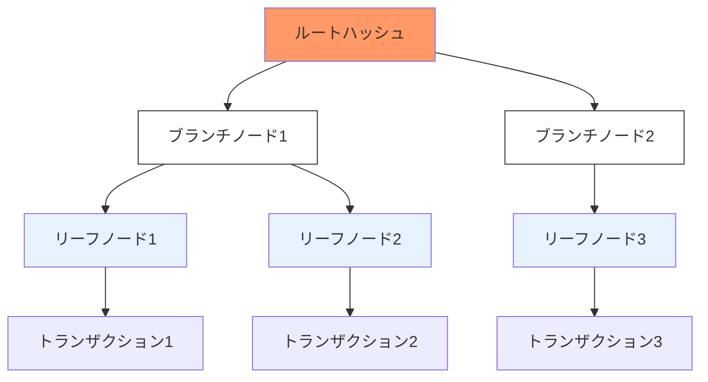

# Amazon Quantum Ledger Database (QLDB)

## アーキテクチャ図

## データフロー

## 暗号的検証の仕組み

QLDBは、マークルパトリシアツリー（Merkle Patricia Tree）を使用してデータの暗号的検証を実現しています。これは、イーサリアムでも採用されている効率的なデータ構造で、以下の特徴があります：

- データの完全性を保証
- 効率的な検証パスの生成
- スペース効率の良いストレージ
- 高速な検索と更新

各ノードは以下の役割を持ちます：

1. **ルートノード**: ツリー全体のハッシュ値を保持
2. **ブランチノード**: 中間ノードで、複数の子ノードへの参照を保持
3. **リーフノード**: 実際のトランザクションデータとそのハッシュを保持

このツリー構造により、特定のトランザクションの存在証明や、データの改ざんがないことを効率的に証明できます。

Amazon QLDBは、完全マネージド型の台帳データベースサービスで、信頼できる中央機関が所有する透過的で不変、かつ暗号的に検証可能なトランザクションログを提供します。

## 特徴

- **不変性**: データの変更履歴を完全に追跡し、改ざんや削除を防止
- **暗号的検証**: SHA-256ハッシュチェーンを使用して、データの整合性を保証
- **透過性**: すべての変更履歴を完全に監査可能
- **高性能**: PartiQLを使用したSQLライクなクエリ言語をサポート
- **サーバーレス**: 自動的にスケーリングし、使用分のみ課金

## ユースケース

- **金融取引記録**: 銀行取引、クレジットカード取引、保険金請求の記録
- **サプライチェーン**: 製品の追跡、在庫管理、配送記録
- **医療記録**: 患者の治療履歴、処方箋記録、医療機器の使用記録
- **規制遵守**: 監査ログ、コンプライアンス記録
- **デジタル資産管理**: ライセンス、所有権、資産移転の記録

## 主要コンポーネント

1. **Journal**
   - すべてのデータ変更を時系列で記録
   - 追加のみ可能で、既存のデータは変更不可
   - 暗号化されたハッシュチェーンで保護

2. **Ledger Tables**
   - ドキュメントベースのデータモデル
   - SQLライクなPartiQLでクエリ可能
   - インデックス付けとトランザクション処理をサポート

3. **Verification**
   - Merkleツリーを使用した暗号的検証
   - データの整合性を数学的に証明可能

## 利点

- **完全マネージド**: インフラストラクチャの管理が不要
- **高可用性**: マルチAZで自動的にレプリケーション
- **スケーラブル**: 需要に応じて自動的にスケーリング
- **セキュア**: 保存時と転送時の暗号化
- **コスト効率**: 使用分のみの従量課金制

## 制限事項

- リージョン内でのみ利用可能
- クロスリージョンレプリケーション非対応
- 最大ドキュメントサイズは4MB
- 1台帳あたりの最大テーブル数は50
- PartiQLの一部のSQL機能は未サポート

## 料金体系

1. **ストレージ料金**
   - Journal ストレージ: GB/月
   - インデックス付きストレージ: GB/月

2. **I/O料金**
   - 読み取りI/O リクエスト
   - 書き込みI/O リクエスト

3. **Journal ストリーミング**
   - データ転送量に基づく課金

4. **暗号的検証**
   - ダイジェスト計算とプルーフ生成に対する課金
