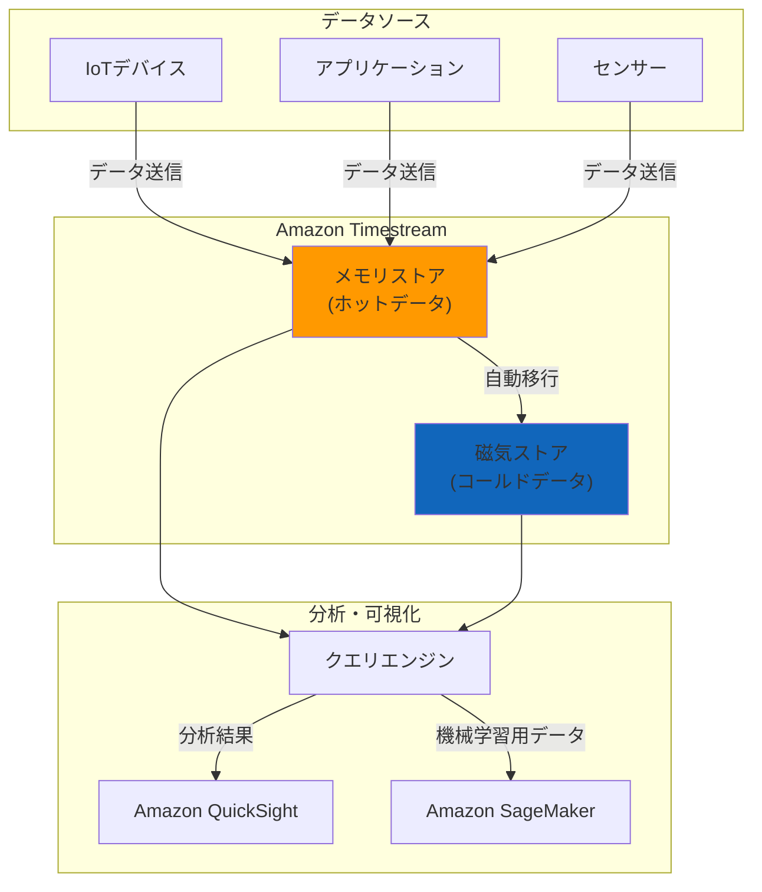

# Amazon Timestream

Amazon Timestream は、AWS が提供する完全マネージド型の時系列データベースサービスです。IoT アプリケーション、運用監視、分析などの時系列データを効率的に保存・分析することができます。

## 主な特徴

### 1. 時系列データに最適化

- 1 日に数兆件のイベントを処理可能
- データは自動的に時系列順に整理・保存
- 時系列特有のクエリパターンに最適化された性能

### 2. アダプティブクエリ処理

- ホットデータ（最近のデータ）はメモリに保存
- コールドデータ（古いデータ）は自動的に低コストのストレージに移動
- データの経過時間に応じて自動的にストレージ層を変更

### 3. サーバーレスアーキテクチャ

- インフラストラクチャの管理が不要
- 使用量に応じた自動スケーリング
- 従量課金制で効率的なコスト管理

## ユースケース

1. **IoT アプリケーション**

   - センサーデータの収集と分析
   - デバイスのテレメトリ監視
   - 予知保全

2. **運用監視**

   - インフラストラクチャの監視
   - アプリケーションのパフォーマンス追跡
   - システムメトリクスの分析

3. **産業用テレメトリ**
   - 製造設備の監視
   - 品質管理データの収集
   - プロセス最適化

## データモデル

- **時系列テーブル**: データを保存する基本単位
- **ディメンション**: データを分類するためのメタデータ
- **メジャー**: 実際の測定値やメトリクス
- **タイムスタンプ**: データが記録された時点

## クエリ言語

Timestream は SQL ライクなクエリ言語をサポートしており、以下の機能を提供します：

- 時系列特有の関数（時間間隔の計算など）
- 集計関数
- 時系列データの補間
- パターン認識

## 統合サービス

- Amazon QuickSight（可視化）
- Amazon SageMaker（機械学習）
- AWS IoT Core（IoT データ収集）
- Amazon Kinesis（ストリーミングデータ）

## セキュリティ

- AWS IAM によるアクセス制御
- 保存データの暗号化
- VPC エンドポイントのサポート
- AWS CloudTrail による監査ログ

## 料金体系

- データの取り込み量
- ストレージ使用量
- クエリ処理量

に基づいて課金されます。

## ベストプラクティス

1. **データモデリング**

   - 効率的なクエリのためのディメンション設計
   - 適切なデータ保持期間の設定

2. **パフォーマンス最適化**

   - クエリパターンに基づいたパーティション戦略
   - 適切なインデックス設計

3. **コスト最適化**
   - データライフサイクルの管理
   - クエリの最適化

## 一般の方向けの解説

### Amazon Timestream とは？

Amazon Timestream は、時間に関連したデータを扱うための特別なデータベースです。例えば以下のようなデータを記録・分析するのに適しています：

- 温度センサーの測定値（毎分の気温など）
- ウェブサイトへのアクセス数（1 時間ごとの PV 数など）
- 工場の機械の状態（稼働時間、振動、温度など）
- スマートホームデバイスからの情報（電力使用量、室温など）

### なぜ Timestream を使うの？

従来の一般的なデータベースでも時間に関連したデータは保存できますが、Timestream には以下のような特長があります：

1. **データの保存方法が賢い**

   - 新しいデータ（24 時間以内など）は高速なメモリに保存
   - 古いデータは自動的に安価な保存場所に移動
   - これにより、コストを抑えながら高速な検索が可能

2. **簡単に使える**

   - サーバーの管理が不要
   - 使用量に応じて自動的に拡張
   - データが増えても特別な対応が不要

3. **便利な分析機能**
   - 「1 時間ごとの平均値」といった計算が簡単
   - グラフ作成などの可視化も容易
   - 異常値の検出なども可能

### 具体的な使用例

1. **スマート家電の管理**

   - エアコンの使用状況を記録
   - 電力消費量の分析
   - 省エネのためのパターン分析

2. **健康管理アプリ**

   - 心拍数の記録
   - 運動量の追跡
   - 睡眠時間の分析

3. **ビジネス分析**
   - オンラインショップの注文数推移
   - ウェブサイトのアクセス統計
   - 売上の時間帯別分析

このように、時間とともに変化するデータを記録し分析したい場合に、Amazon Timestream は非常に便利なサービスとなります。

## アーキテクチャ図

### 図の説明

1. **データの流れ**

   - IoT デバイス、アプリケーション、センサーからデータが送信されます
   - 新しいデータは最初にメモリストアに保存されます
   - 古くなったデータは自動的に磁気ストアに移行されます

2. **ストレージ層**

   - メモリストア：最新のデータを高速に処理
   - 磁気ストア：長期保存用の低コストストレージ

3. **分析処理**
   - クエリエンジンが両方のストレージからデータを取得
   - QuickSight でグラフ化や可視化
   - SageMaker で機械学習モデルの作成
