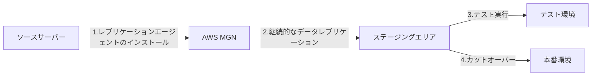
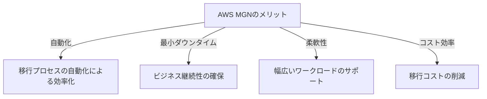
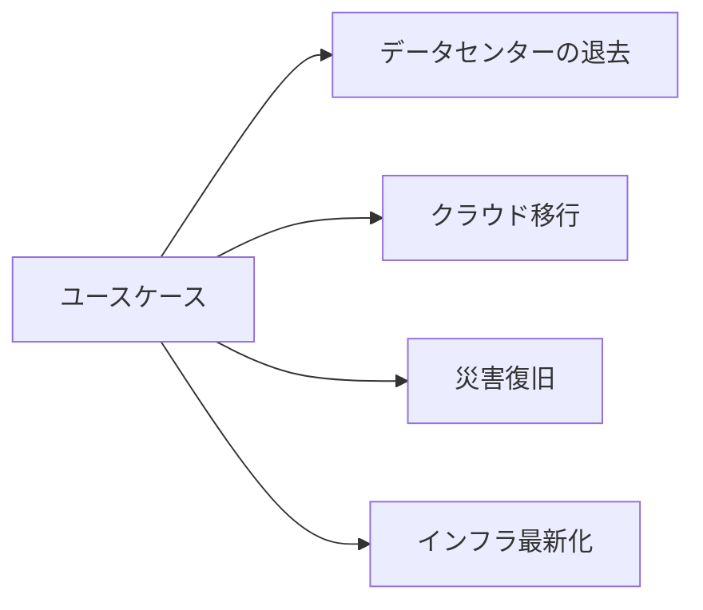

# AWS Application Migration Service (AWS MGN)

AWS Application Migration Service (AWS MGN)は、物理、仮想、クラウドのインフラストラクチャからAWSへアプリケーションを移行するための、高速で信頼性の高い自動化されたリフトアンドシフトソリューションです。

## 概要

- AWS MGNは、以前のAWS Server Migration Service (SMS)の後継サービス
- オンプレミスやその他のクラウドで実行されているアプリケーションを、最小限のダウンタイムでAWSに移行
- 自動化されたリフトアンドシフトアプローチを採用
- 幅広いプラットフォーム、オペレーティングシステム、データベースをサポート

## 動作の仕組み

1. **初期セットアップ**
   - ソースサーバーにレプリケーションエージェントをインストール
   - AWSアカウントとの接続を確立

2. **継続的なレプリケーション**
   - ソースサーバーのデータを継続的にAWSにレプリケート
   - 変更されたデータのみを転送し、ネットワーク使用量を最適化

3. **テスト移行**
   - 本番移行前にテスト環境でアプリケーションの動作を確認
   - 設定の調整や問題の特定が可能

4. **カットオーバー**
   - 最終的なデータ同期を実行
   - ターゲットサーバーを起動し、本番環境への切り替えを実施

## メリット

- **自動化された移行プロセス**
  - 手動作業の削減
  - エラーリスクの低減
  - 移行時間の短縮

- **最小限のダウンタイム**
  - 継続的なデータレプリケーション
  - 効率的なカットオーバープロセス
  - ビジネス継続性の確保

- **幅広い互換性**
  - 物理サーバー、仮想マシン、その他クラウドプラットフォームをサポート
  - 主要なオペレーティングシステムに対応
  - データベースやアプリケーションの移行に対応

- **コスト効率**
  - 移行ツールの追加コストなし
  - 効率的なリソース使用
  - 運用コストの削減

## ユースケース

1. **データセンターの退去**
   - オンプレミスインフラのクラウド移行
   - ハードウェア保守コストの削減

2. **クラウド移行**
   - 他クラウドからAWSへの移行
   - マルチクラウド戦略の実装

3. **災害復旧**
   - バックアップと復旧の自動化
   - ビジネス継続性の確保

4. **インフラストラクチャの最新化**
   - レガシーシステムの近代化
   - クラウドネイティブアーキテクチャへの移行

## 注意点

- 移行前の十分なテストと検証が必要
- ネットワーク帯域幅の要件を考慮
- アプリケーションの依存関係の把握
- セキュリティとコンプライアンス要件の確認
