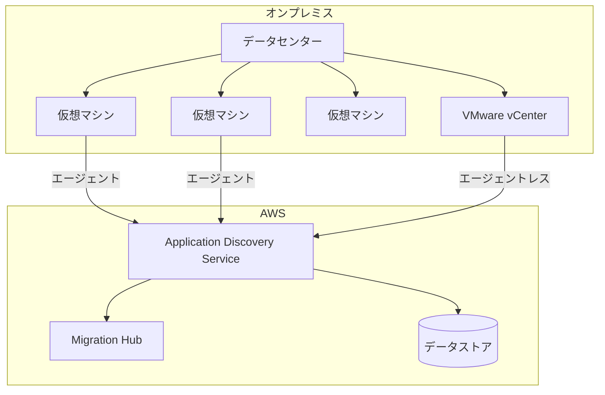
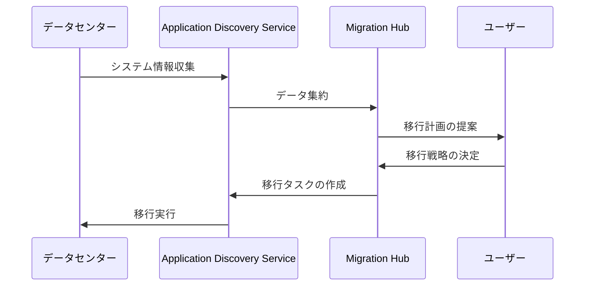

# Application Discovery Service

## 概要
AWS Application Discovery Serviceは、オンプレミスのデータセンターにある情報を収集し、システム構成、依存関係、パフォーマンスなどの情報を収集・追跡するサービスです。これらの情報は、AWSへの移行計画を立てる際に活用されます。

## 主な機能

### データ収集方法
1. **エージェントベースの発見**
   - サーバーにエージェントをインストール
   - 詳細なシステム構成情報を収集
   - アプリケーション間の依存関係を特定
   - パフォーマンスデータを収集

2. **エージェントレスの発見**
   - VMware vCenterを通じて情報収集
   - 基本的なシステム情報の収集
   - ホスト、VM構成の把握

### 収集される情報
- サーバー構成
- ハードウェア構成
- プロセス
- ネットワーク接続
- パフォーマンスメトリクス

## アーキテクチャ図

## 利用シナリオ

## 主なメリット
- 詳細なシステム情報の自動収集
- アプリケーション依存関係の可視化
- データに基づいた移行計画の立案
- AWS Migration Hubとの統合
- コスト見積もりの精度向上

## ベストプラクティス
1. 移行前の十分なデータ収集期間の確保
2. エージェントベースとエージェントレスの適切な使い分け
3. 収集データの定期的な検証
4. セキュリティ要件の遵守
5. Migration Hubとの連携による一元管理

## 制限事項
- エージェントは特定のOSバージョンのみサポート
- エージェントレス発見はVMware環境のみ対応
- データ収集には一定の時間が必要
- ネットワーク帯域幅への影響考慮が必要
