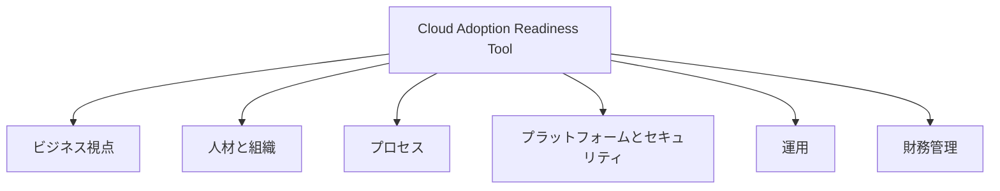
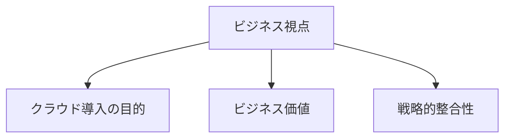
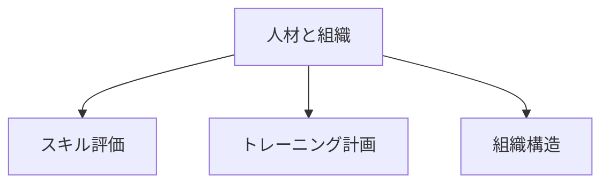
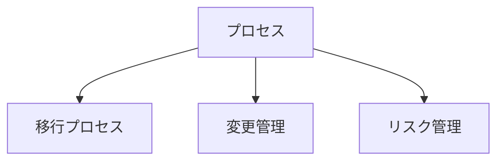
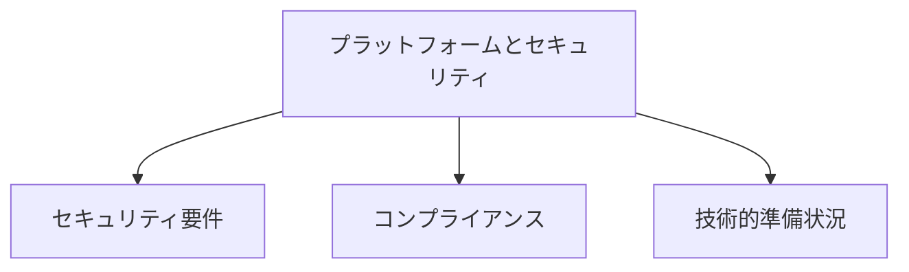
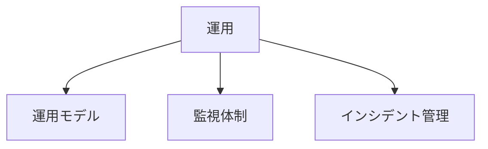
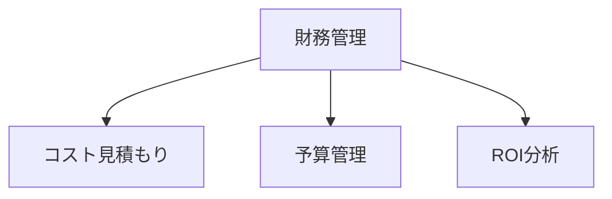

# Cloud Adoption Readiness Tool (CART)

## 概要
Cloud Adoption Readiness Tool (CART)は、組織のクラウド導入準備状況を評価するためのAWSが提供する無料の評価ツールです。このツールを使用することで、組織のクラウド導入に向けた準備状況を包括的に評価し、ギャップを特定することができます。

## 評価領域

### メイン評価領域

### 1. ビジネス視点の詳細

### 2. 人材と組織の詳細

### 3. プロセスの詳細

### 4. プラットフォームとセキュリティの詳細

### 5. 運用の詳細

### 6. 財務管理の詳細

## 主要な評価領域の詳細

### 1. ビジネス視点
- クラウド導入の明確な目的と目標の設定
- 期待されるビジネス価値の定義
- 組織の戦略との整合性確認

### 2. 人材と組織
- 必要なスキルの評価と不足の特定
- トレーニングと育成計画の策定
- クラウド運用に適した組織構造の検討

### 3. プロセス
- クラウド移行プロセスの確立
- 変更管理プロセスの整備
- リスク管理フレームワークの構築

### 4. プラットフォームとセキュリティ
- セキュリティ要件の定義
- コンプライアンス要件の確認
- 技術的な準備状況の評価

### 5. 運用
- クラウド運用モデルの設計
- 監視体制の確立
- インシデント管理プロセスの整備

### 6. 財務管理
- クラウド移行・運用コストの見積もり
- 予算管理プロセスの確立
- ROI（投資対効果）分析

## 評価プロセス

## メリット
- 組織のクラウド準備状況の客観的評価
- 具体的な改善領域の特定
- データに基づいた意思決定の支援
- 段階的なクラウド導入計画の策定
- リスクの早期特定と対策

## 活用のベストプラクティス
1. 定期的な評価の実施（四半期または半年ごと）
2. 主要なステークホルダーの参加
3. 評価結果に基づく具体的なアクションプランの作成
4. 進捗の定期的なモニタリング
5. 必要に応じた計画の見直しと調整
