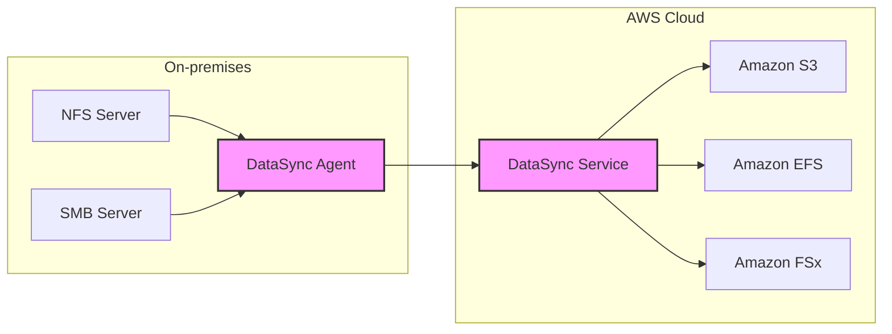
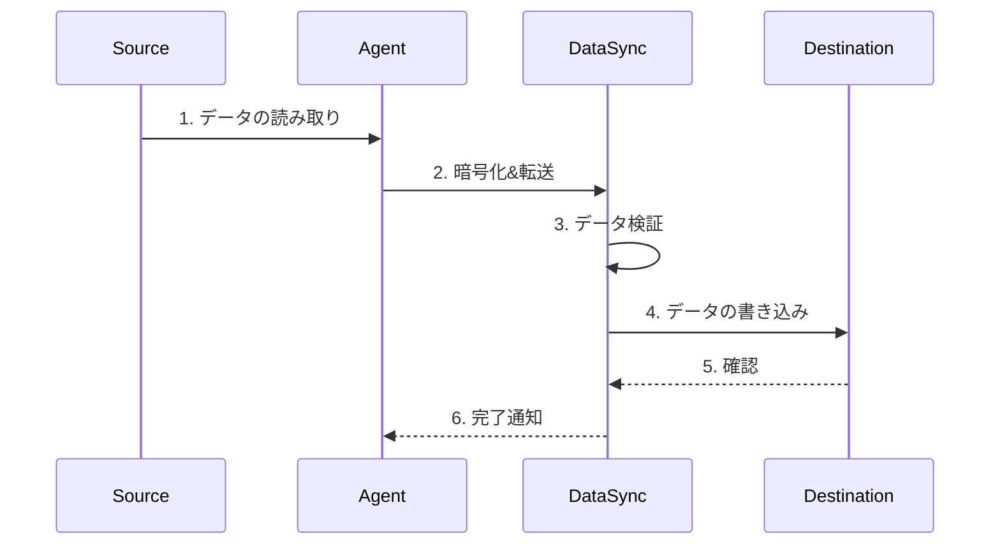

# AWS DataSync

## 概要
AWS DataSyncは、オンプレミスストレージとAWSストレージサービス間、またはAWSストレージサービス間でデータを高速かつ安全に移動・複製するためのデータ転送サービスです。

## 主な特徴と利点

### 高速な転送
- 最大10Gbpsの転送速度
- TCP調整による帯域幅の最適化
- インラインデータ圧縮
- 並列処理による高速転送

### セキュリティ
- 転送中のデータの暗号化（TLS）
- 保管中のデータの暗号化（AWS KMS）
- IAMによるアクセス制御
- VPCエンドポォイントのサポート

### 自動化と管理
- ファイルパーミッションと メタデータの保持
- データ整合性の自動検証
- スケジュール転送のサポート
- AWS CloudWatchとの統合による監視

### サポートされるストレージ
- オンプレミス：NFS、SMB、HDFS、自己管理型オブジェクトストレージ
- AWS：Amazon S3、Amazon EFS、Amazon FSx for Windows File Server、Amazon FSx for Lustre

## ユースケース

1. データ移行
   - オンプレミスからAWSへの大規模データ移行
   - レガシーストレージシステムの近代化

2. データレプリケーション
   - ディザスタリカバリのためのバックアップ
   - クラウドバーストのためのデータ同期

3. データ処理パイプライン
   - 分析やMLワークロード用のデータ収集
   - クラウドベースの処理のためのデータ準備

## アーキテクチャ

## データ転送プロセス

## 料金

DataSyncの料金は、転送されたデータ量に基づいて課金されます：

- データ転送料金：$0.04/GB
- 最小料金なし
- 追加料金：
  - AWS リージョン間のデータ転送
  - インターネット経由のデータ転送
  - Direct Connect経由のデータ転送

## ベストプラクティス

1. ネットワーク設定
   - 十分な帯域幅の確保
   - Direct Connectの使用検討
   - VPCエンドポイントの活用

2. パフォーマンス最適化
   - 適切なタスク設定
   - 並列転送の活用
   - 帯域幅制限の適切な設定

3. コスト最適化
   - スケジュール転送の活用
   - 増分転送の利用
   - 適切な転送時間帯の選択
