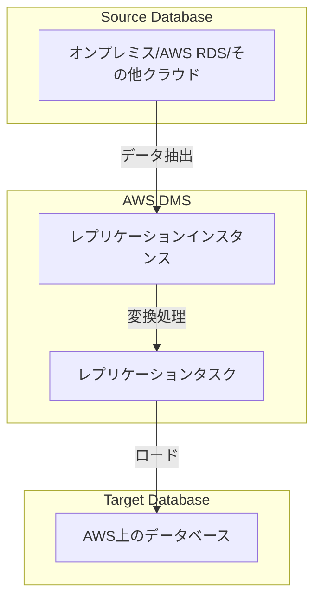
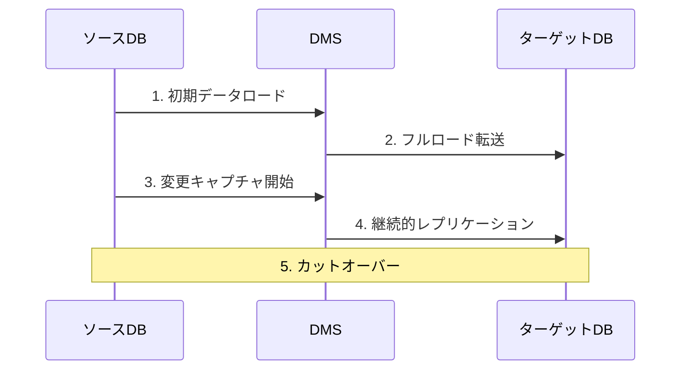

# AWS Database Migration Service (DMS)

## 概要
AWS Database Migration Service (DMS) は、データベースを AWS に安全に移行するためのクラウドサービスです。移行中もソースデータベースは完全に運用可能な状態を維持し、ダウンタイムを最小限に抑えることができます。

## アーキテクチャ

## 主な機能

1. **継続的なレプリケーション**
   - 一回限りの移行だけでなく、継続的なレプリケーションもサポート
   - Change Data Capture (CDC) による差分データの同期

2. **異種データベース間の移行**
   - 異なるデータベースエンジン間の移行をサポート
   - スキーマ変換ツールによる自動的なスキーマ変換

3. **高可用性**
   - マルチAZ配置によるレプリケーションインスタンスの冗長化
   - 自動フェイルオーバー機能

## サポートされるデータベース

### ソースデータベース
- Oracle
- Microsoft SQL Server
- MySQL
- PostgreSQL
- MongoDB
- SAP
- DB2
- その他

### ターゲットデータベース
- Amazon Aurora
- Amazon Redshift
- Amazon DynamoDB
- Amazon S3
- その他のAWSマネージドデータベース

## 移行プロセス

1. **初期セットアップ**
   - レプリケーションインスタンスの作成
   - ソース/ターゲットエンドポイントの設定
   - 移行タスクの設定

2. **フルロード**
   - 既存データの完全コピー
   - テーブル構造の移行

3. **変更のキャプチャと適用**
   - CDC（Change Data Capture）による差分データの取得
   - 継続的なレプリケーション

4. **カットオーバー**
   - アプリケーションの切り替え
   - 最終検証

## 主な特徴と利点

1. **最小限のダウンタイム**
   - 継続的レプリケーションによりダウンタイムを数分に抑制
   - ビジネス継続性の確保

2. **コスト効率**
   - 従量課金制
   - 専用ハードウェア不要

3. **高い信頼性**
   - AWS管理のサービス
   - 自動モニタリングと復旧

4. **柔軟性**
   - 多様なデータベースエンジンをサポート
   - カスタム変換ルールの適用が可能

## ベストプラクティス

1. **事前評価**
   - Database Migration Assessmentツールの使用
   - 互換性の確認

2. **テスト移行**
   - 本番移行前のテスト実施
   - パフォーマンスの検証

3. **モニタリング**
   - CloudWatchによる監視
   - レプリケーション遅延の追跡

4. **セキュリティ**
   - 暗号化の有効化
   - IAMロールの適切な設定
