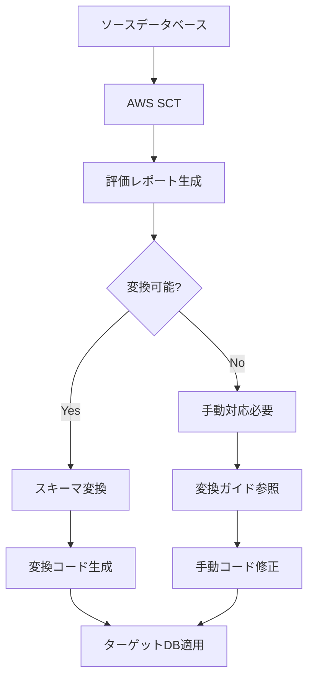

# AWS Schema Conversion Tool (AWS SCT)

AWS Schema Conversion Tool (AWS SCT) は、既存のデータベーススキーマを異なるデータベースプラットフォームに変換するためのツールです。

## 主な機能

- データベーススキーマの自動変換
- ストアドプロシージャ、ビュー、関数などのデータベースオブジェクトの変換
- コード変換レポートの生成
- データベース移行の評価レポート作成
- 変換されたコードのテストと検証機能

## サポートされるデータベース

### ソースデータベース
- Oracle
- Microsoft SQL Server
- MySQL
- PostgreSQL
- IBM Db2
- SAP ASE

### ターゲットデータベース
- Amazon Aurora (MySQL/PostgreSQL)
- Amazon RDS for MySQL
- Amazon RDS for PostgreSQL
- Amazon RDS for MariaDB
- Amazon Redshift

## 変換プロセス

## 主なユースケース

1. オンプレミスからAWSへの移行
2. データベースプラットフォームの変更
3. データウェアハウスの近代化
4. アプリケーションの近代化

## 利点

- 自動変換による時間とコストの削減
- 変換の複雑さの評価
- ベストプラクティスに基づく変換
- AWS DMSとの統合による完全な移行ソリューション

## 制限事項

- 全ての機能が自動変換できるわけではない
- 特定のデータベース固有の機能は手動変換が必要
- 変換後のパフォーマンスチューニングが必要な場合がある

## AWS DMSとの違い

- AWS SCT: スキーマ構造の変換に特化
- AWS DMS: 実際のデータ移行に特化

両ツールは補完的な関係にあり、多くの場合一緒に使用されます。
