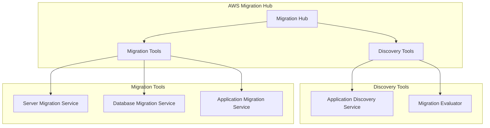
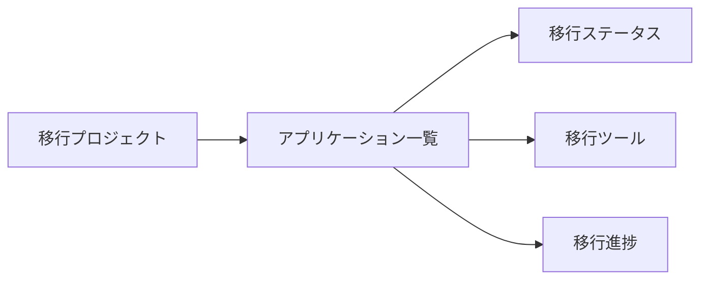
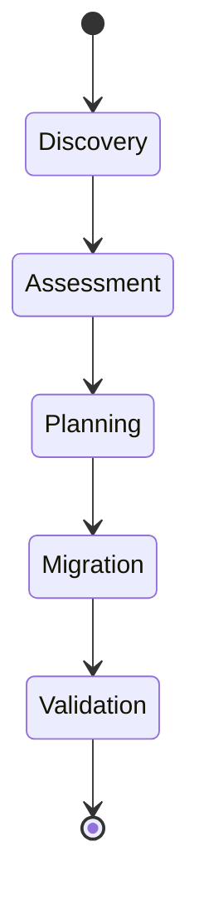

# AWS Migration Hub

AWS Migration Hub は、AWS への移行プロジェクトを一元的に管理・追跡するためのサービスです。

## 概要

Migration Hub は以下の機能を提供します：

- 複数のアプリケーション移行を一元的に追跡
- 移行の進捗状況をリアルタイムで可視化
- 複数の AWS 移行ツールとの統合
- 移行評価レポートの生成

## アーキテクチャ

## 主要機能

### 1. 移行プロジェクトの一元管理

### 2. 移行のライフサイクル

## 統合される AWS 移行ツール

- AWS Application Discovery Service

  - オンプレミス環境のアプリケーション検出
  - 依存関係のマッピング

- AWS Database Migration Service (DMS)

  - データベースの移行
  - 継続的なレプリケーション

- AWS Server Migration Service (SMS)

  - VMware ベースの仮想マシンの移行
  - 増分レプリケーション

- AWS Application Migration Service (MGN)
  - リフト&シフト移行
  - 自動化された移行プロセス

## メリット

1. 可視性の向上

   - 移行プロジェクト全体の進捗を一目で把握
   - ステータスのリアルタイム更新

2. 効率的な管理

   - 複数のツールを一元管理
   - 統合されたダッシュボード

3. リスク軽減

   - 移行の問題を早期に特定
   - 依存関係の可視化

4. コスト最適化
   - 移行計画の最適化
   - リソース使用の効率化

## ベストプラクティス

1. 事前の詳細な検出フェーズの実施
2. 依存関係の完全なマッピング
3. 段階的な移行アプローチの採用
4. 定期的な進捗レビューの実施
5. 移行後の検証プロセスの確立
