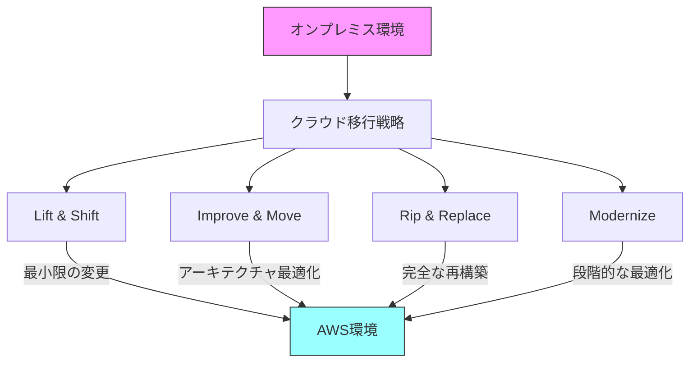
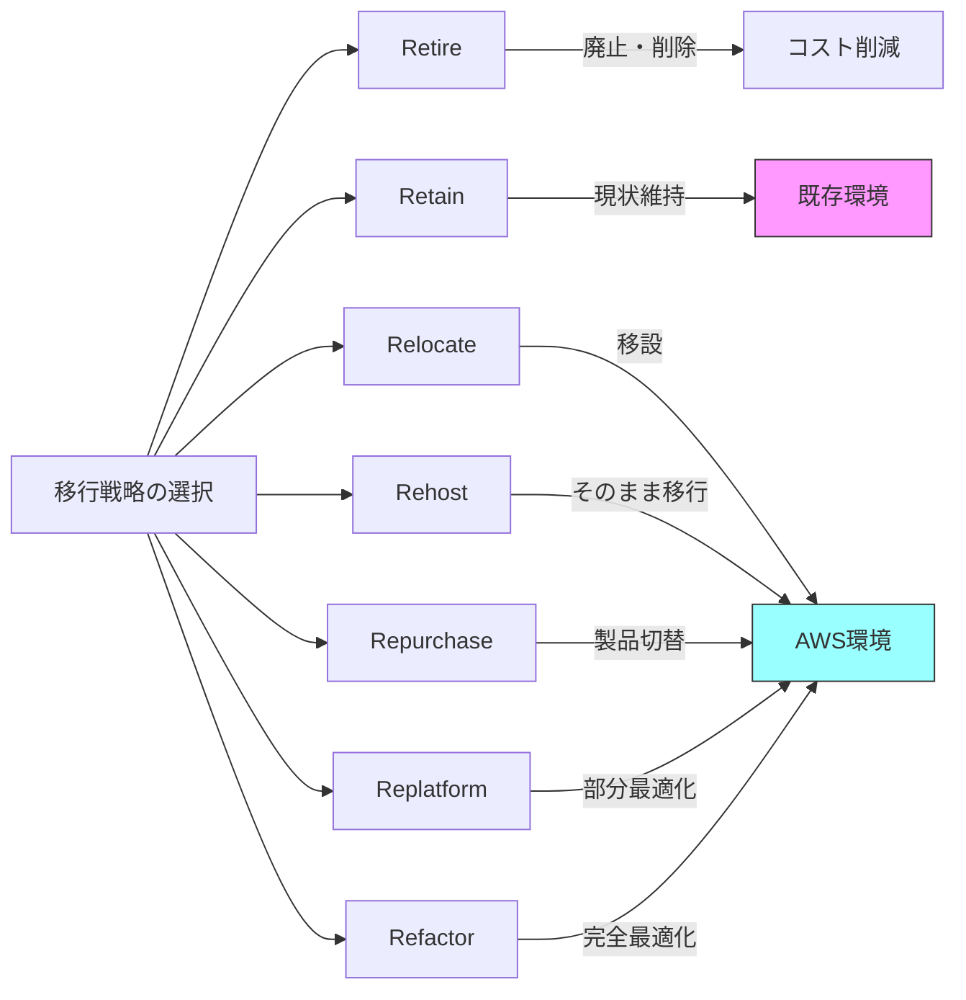

# AWS Migration

## 移行の種類と定義の関係

## 移行の種類と定義

### Lift & Shift
- アプリケーション構成を変更せずクラウド環境に移行
- システム仕様を現行踏襲し、移行のワークロードを最小化

### Improve & Move
- クラウド環境に最適なアーキテクチャになるよう、構成を変更
- システム仕様および運用方法が変わるため、移行にかかるワークロードは大きくなる

### Rip & Replace
- 既存アプリケーションのイメージは利用せず、まったく新しい構成のシステムをクラウド環境上に置き換える

### Modernize
- クラウド環境に移行（Lift & Shift）した後、コンテナ等を使ってクラウドに最適された形に変更する

## 7つのR（移行戦略）

### 1. Retire
- 不要と判断したアプリケーション・データベースを廃止、または削除する

### 2. Retain
- ビジネス上、AWS へ移行する理由がないシステムを、もともとの環境で稼働させ続ける

### 3. Relocate
- オンプレミスで稼働していたシステムをクラウドへ移行する

### 4. Rehost
- 既存のアプリケーションに手を加えず、そのまま AWS に移行する

### 5. Repurchase
- アプリケーションを、既存製品から別な製品に切り替える
- ライセンスモデルの製品から、SaaS 製品に切り替える

### 6. Replatform
- AWS の機能を活かすために、アプリケーションを部分的に最適化し、移行する

### 7. Refactor / Rearchitecture
- AWS 移行に伴い、クラウドネイティブな機能を最大限に活かすため、プログラムコードレベルでのアプリケーション改修を行う
