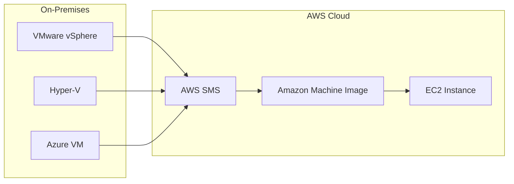

# AWS Server Migration Service (SMS)

## 概要
AWS Server Migration Service (SMS)は、オンプレミスのVMware vSphere、Microsoft Hyper-V/SCVMM、Azure仮想マシンをAWSクラウドに移行するためのサービスです。増分レプリケーションを使用して、ライブサーバーの移行を自動化し、最小限のダウンタイムで移行を実現します。

## 主な機能

### 自動化された移行
- サーバーの移行プロセスを自動化
- 増分レプリケーションによる効率的な移行
- 複数のサーバーを同時に移行可能

### スケジュール設定
- 移行ジョブのスケジュール設定が可能
- オフピーク時間での移行実行
- 帯域幅使用の最適化

### 増分レプリケーション
- 変更されたブロックのみを転送
- ネットワーク帯域幅の効率的な使用
- 移行時間の短縮

### マルチマシン移行
- 複数のサーバーを一括で移行
- アプリケーションスタック全体の移行
- 依存関係の維持

## アーキテクチャ

## ユースケース

### アプリケーション移行
- 既存のアプリケーションをAWSに移行
- 最小限のダウンタイムでの移行
- アプリケーションの依存関係を維持

### データセンター統合
- 複数のデータセンターの統合
- コスト効率の向上
- 運用の簡素化

### クラウド移行
- オンプレミスからクラウドへの移行
- ハイブリッドクラウド環境の構築
- クラウドネイティブへの段階的な移行

## メリット

1. **自動化による効率化**
   - 手動作業の削減
   - エラーリスクの低減
   - 運用コストの削減

2. **最小限のダウンタイム**
   - ビジネス継続性の確保
   - サービス中断の最小化
   - ユーザー影響の軽減

3. **柔軟な移行オプション**
   - 段階的な移行が可能
   - 移行スケジュールの調整
   - 複数のソースプラットフォームに対応

## デメリット

1. **ネットワーク依存**
   - 安定した接続が必要
   - 帯域幅要件への考慮
   - ネットワークコストの発生

2. **特定のプラットフォームのみ対応**
   - サポート対象が限定的
   - 一部のレガシーシステムは非対応
   - カスタム設定が必要な場合あり

## ベストプラクティス

1. **事前評価**
   - 移行対象の詳細な分析
   - 依存関係のマッピング
   - 必要なリソースの見積もり

2. **段階的な移行**
   - テスト環境での検証
   - パイロット移行の実施
   - フィードバックの反映

3. **モニタリングと最適化**
   - 移行プロセスの監視
   - パフォーマンスの最適化
   - 問題の早期発見と対応
