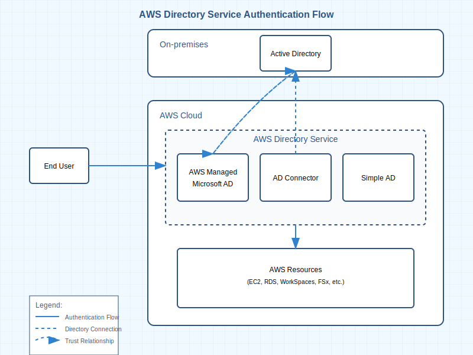

# AWS Directory Service for Microsoft Active Directory

AWS Directory Service for Microsoft Active Directory（AWS Managed Microsoft AD）は、マネージド型の Microsoft Active Directory（AD）サービスです。AWS クラウド上で Microsoft Active Directory の機能を利用できます。

## 概要

AWS Managed Microsoft AD は以下の主要な機能を提供します：

- ユーザー、グループ、コンピューターアカウントの管理
- グループポリシーの適用
- シングルサインオン（SSO）
- Kerberos 認証
- LDAP プロトコルのサポート

## ユースケース

1. **ハイブリッドクラウド環境の統合**

   - オンプレミスの Active Directory との双方向信頼関係の確立
   - シームレスなリソースアクセス

2. **AWS リソースの管理**

   - Amazon EC2 インスタンスの管理
   - Amazon RDS の Windows 認証
   - Amazon FSx との統合

3. **セキュリティとコンプライアンス**
   - 多要素認証（MFA）のサポート
   - 監査ログの生成
   - セキュリティポリシーの一元管理

## アーキテクチャ

AWS Managed Microsoft AD は、2 つのドメインコントローラーを異なる AZ に自動的にデプロイし、高可用性を確保します：

- 自動バックアップと復元
- 24 時間監視
- 自動パッチ適用
- スケーラブルな構成



## セットアップと設定

1. **ディレクトリの作成**

   ```bash
   aws ds create-microsoft-ad \
       --name corp.example.com \
       --password "Secret123!" \
       --vpc-settings VpcId=vpc-12345678,SubnetIds=subnet-a1b2c3d4,subnet-e5f6g7h8
   ```

2. **信頼関係の設定**
   - オンプレミス AD との信頼関係確立
   - 双方向フォレスト信頼の構成

## セキュリティのベストプラクティス

1. **パスワードポリシー**

   - 強力なパスワード要件の設定
   - 定期的なパスワード変更の強制

2. **アクセス制御**

   - 最小権限の原則に基づくアクセス付与
   - セキュリティグループの適切な設定

3. **監視とログ記録**
   - CloudWatch との統合
   - セキュリティイベントの監視

## 料金

AWS Managed Microsoft AD は以下の要素に基づいて課金されます：

- ディレクトリのサイズ（Small、Large）
- 使用時間
- 追加ドメインコントローラー

## 制限事項

- リージョンごとの制限
- ドメインコントローラーの最大数
- 信頼関係の制限

## 関連サービス

- AWS IAM
- Amazon Cognito
- AWS Single Sign-On
- Amazon WorkSpaces

## Directory Service の比較

| 機能             | AWS Managed Microsoft AD                         | AD Connector                             | Simple AD                          |
| ---------------- | ------------------------------------------------ | ---------------------------------------- | ---------------------------------- |
| 概要             | 完全なマネージド型 Microsoft AD                  | オンプレミス AD へのプロキシ             | Samba ベースの軽量 AD 互換サービス |
| ユースケース     | エンタープライズアプリケーション、複雑な AD 要件 | オンプレミス AD の拡張、ハイブリッド環境 | 基本的な AD 機能のみ必要な場合     |
| スケール         | 最大 20,000 ユーザー                             | オンプレミス AD に依存                   | 最大 5,000 ユーザー                |
| 信頼関係         | 双方向信頼関係をサポート                         | オンプレミス AD との直接接続             | 信頼関係非サポート                 |
| MFA              | サポート                                         | サポート                                 | 非サポート                         |
| LDAP             | 完全な LDAP サポート                             | オンプレミス AD へ転送                   | 基本的な LDAP のみ                 |
| グループポリシー | 完全な GPO サポート                              | オンプレミス GPO を使用                  | 基本的な GPO のみ                  |
| 料金             | 最も高価                                         | 中程度                                   | 最も安価                           |
| 高可用性         | マルチ AZ 自動フェイルオーバー                   | マルチ AZ サポート                       | マルチ AZ サポート                 |
| AWS サービス統合 | 最も広範な統合                                   | 制限付き統合                             | 基本的な統合のみ                   |

## Microsoft Entra ID（旧 Azure AD）について

2023 年 7 月より、Microsoft Azure Active Directory は Microsoft Entra ID に名称が変更されました。

### 主な変更点

1. **ブランド変更**

   - Azure Active Directory → Microsoft Entra ID
   - 関連サービスも Microsoft Entra ブランドに統合

2. **影響範囲**

   - AWS Directory Service との統合機能は継続して利用可能
   - 設定手順や技術的な構成に大きな変更なし
   - ドキュメントや UI 上の表記が徐々に更新

3. **新機能と統合**
   - Microsoft Entra Verified ID（分散型 ID）
   - Microsoft Entra Identity Governance
   - Microsoft Entra Permissions Management

### AWS 環境での注意点

- AWS Managed Microsoft AD との信頼関係設定手順は変更なし
- AD Connector での接続設定も従来通り
- ドキュメントやエラーメッセージで両方の名称が混在する可能性あり

> **Note**: 本ドキュメント内では、文脈に応じて「Azure AD」「Entra ID」の両方の表記が使用される場合があります。
