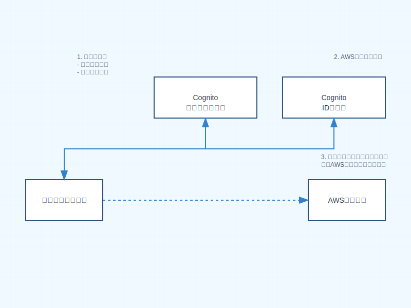
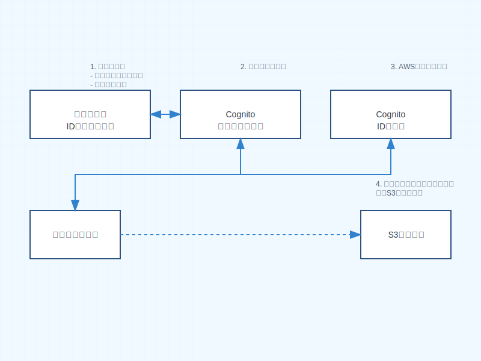
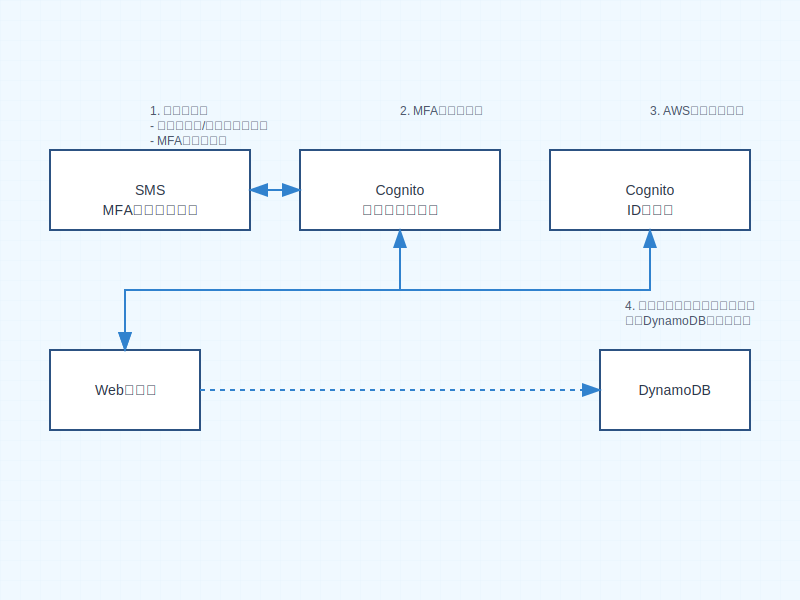

# Amazon Cognito

Amazon Cognito は、ウェブアプリケーションやモバイルアプリケーションに対して認証、認可、およびユーザー管理機能を提供する AWS のサービスです。

## 主な機能

1. **ユーザープール (User Pools)**

   - ユーザーの登録と認証を管理
   - パスワードポリシーの設定
   - 多要素認証（MFA）のサポート
   - ソーシャル ID プロバイダー連携（Google、Facebook、Amazon など）

2. **ID プール (Identity Pools)**
   - 認証されたユーザーに対して AWS リソースへのアクセス権限を付与
   - 一時的な AWS 認証情報の発行

## 認証フロー

### 認証フローの説明

1. **ユーザー登録/サインイン**

   - ユーザーはアプリケーションを通じて登録またはサインインを実行
   - Cognito ユーザープールで認証処理を実施

2. **トークン発行**

   - 認証成功後、ID トークン、アクセストークン、更新トークンを発行
   - トークンは JWT (JSON Web Token) 形式

3. **AWS リソースアクセス**
   - ID プールを使用して、一時的な AWS 認証情報を取得
   - 取得した認証情報で AWS リソースにアクセス

## セキュリティ機能

- **パスワードポリシー**：強力なパスワード要件の設定
- **MFA**：SMS、TOTP などの多要素認証
- **アダプティブ認証**：リスクベースの認証
- **暗号化**：データの保管時および転送時の暗号化

## 統合機能

- **API ゲートウェイ連携**
- **Application Load Balancer 連携**
- **AWS AppSync 連携**
- **AWS Amplify 連携**

## ベストプラクティス

1. **セキュリティ**

   - MFA の有効化
   - 強力なパスワードポリシーの設定
   - アダプティブ認証の活用

2. **スケーラビリティ**

   - ユーザープールの適切な設計
   - キャッシュ戦略の実装

3. **コスト最適化**
   - 必要な機能のみを有効化
   - ユーザー数に応じた適切なスケーリング

## 想定シナリオ

### シナリオ 1: モバイルアプリケーションのユーザー認証

**ユースケース**:

- スマートフォンアプリケーションでのユーザー認証
- ソーシャル ID プロバイダー（Google、Facebook）との連携
- 認証済みユーザーによる S3 バケットへのアクセス

**フロー説明**:

1. ユーザーがモバイルアプリを起動し、ソーシャル ID プロバイダーでログインを選択
2. Cognito ユーザープールがソーシャルプロバイダーと連携して認証を実行
3. 認証成功後、JWT トークンを発行
4. アプリケーションが ID プールを使用して AWS 認証情報を取得
5. 取得した認証情報を使用して S3 バケットにアクセス

### シナリオ 2: Web アプリケーションの多要素認証

**ユースケース**:

- 企業向け Web アプリケーションでの厳格な認証
- MFA を使用した追加のセキュリティ層
- 認証済みユーザーによる DynamoDB アクセス

**フロー説明**:

1. ユーザーが Web アプリケーションにユーザー名とパスワードを入力
2. Cognito が初期認証を実行し、MFA コードを要求
3. ユーザーが SMS で受け取った MFA コードを入力
4. 認証成功後、アプリケーションがトークンを受け取り
5. ID プールを通じて一時的な AWS 認証情報を取得
6. アプリケーションが一時的な認証情報をクライアントに返却
7. クライアントは一時的な認証情報を使用して直接 DynamoDB にアクセス

> **注意**: Cognito ID プールは直接 AWS リソースにアクセスするのではなく、
> クライアントが使用できる一時的な AWS 認証情報（IAM ロール）を提供します。
> この認証情報を使用して、クライアントは許可された AWS リソースに直接アクセスできます。
