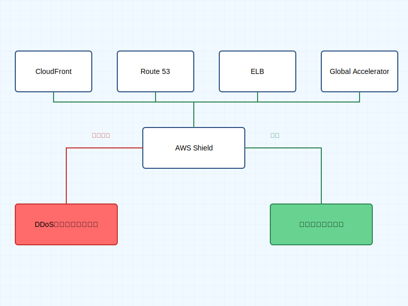

# AWS Shield

AWS Shield は、DDoS（分散型サービス拒否）攻撃に対する保護を提供するマネージドサービスです。

## 概要

AWS Shield には以下の 2 つのサービスレベルがあります：

### AWS Shield Standard

- すべての AWS ユーザーに追加料金なしで自動的に提供
- 一般的で頻発するネットワーク/トランスポートレイヤーの DDoS 攻撃から保護
- AWS のエッジロケーションで常時モニタリングと自動防御を実施

### AWS Shield Advanced

- 有料のオプションサービス
- より高度な DDoS 攻撃対策が必要な大規模組織向け
- WAF（Web Application Firewall）との統合による層別防御
- 24 時間 365 日の DDoS 対応チームによるサポート
- DDoS 攻撃による追加コストから保護

## 主な特徴

1. **常時保護**

   - インフラストラクチャレイヤー（レイヤー 3）の攻撃対策
   - トランスポートレイヤー（レイヤー 4）の攻撃対策
   - アプリケーションレイヤー（レイヤー 7）の攻撃対策（Advanced）

2. **自動検知と緩和**

   - リアルタイムの攻撃検知
   - 自動的な防御メカニズムの適用
   - トラフィック異常の可視化

3. **統合サービス保護**
   - Amazon CloudFront
   - Amazon Route 53
   - Elastic Load Balancing (ELB)
   - AWS Global Accelerator

## AWS Shield Advanced の追加機能

1. **コスト保護**

   - DDoS 攻撃による使用量スパイクからの保護
   - AWS WAF と AWS Firewall マネージャーの料金を含む

2. **専門家によるサポート**

   - AWS DDoS 対応チーム（DRT）への 24 時間アクセス
   - カスタマイズされた緩和策の作成と実装
   - インシデント中のリアルタイムサポート

3. **詳細な可視性とレポート**
   - リアルタイムのメトリクスとレポート
   - CloudWatch メトリクスとの統合
   - 攻撃の詳細な分析と対応履歴

## ベストプラクティス

1. **アーキテクチャの設計**

   - CloudFront の使用によるエッジでの防御
   - Route 53 での保護された DNS の利用
   - ELB を使用した負荷分散とスケーリング

2. **モニタリングと可視性**

   - CloudWatch アラームの設定
   - Health API の監視
   - Shield Advanced メトリクスの活用

3. **インシデント対応**
   - DDoS 対応計画の作成
   - エスカレーションプロセスの確立
   - 定期的な訓練と更新

## まとめ

AWS Shield は、AWS のインフラストラクチャを保護する重要なセキュリティサービスです。Standard と Advanced の 2 つのティアにより、組織の規模やニーズに応じた適切な保護レベルを選択できます。
