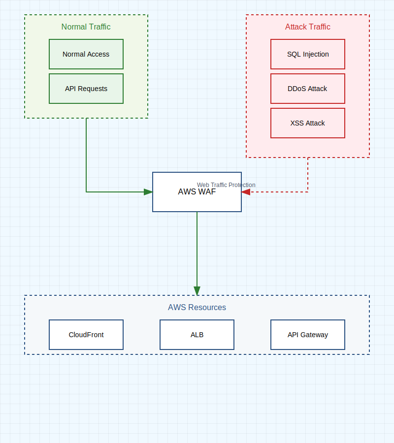

# AWS WAF (Web Application Firewall)

AWS WAF は、Web アプリケーションを保護するためのファイアウォールサービスです。一般的な Web の脆弱性や攻撃からアプリケーションを保護し、可用性を確保し、セキュリティを強化します。

## 主な特徴

### 1. Web アクセスコントロール

- IP アドレスベースのフィルタリング
- 地理的位置情報に基づくアクセス制御
- リクエストサイズの制限
- カスタムルールの作成

### 2. 保護対象

- Amazon CloudFront
- Application Load Balancer
- Amazon API Gateway
- AWS AppSync GraphQL API
- Amazon Cognito ユーザープール

## セキュリティ機能

### 1. マネージドルール

- SQL インジェクション対策
- クロスサイトスクリプティング（XSS）対策
- 不正なリクエストヘッダーの検出
- サイズ制限の実施

## WAF ルール

### 1. ルールの種類

#### マネージドルールグループ

- AWS が管理する事前設定ルール
- サードパーティプロバイダーが提供するルール
- 一般的な脆弱性に対する保護（OWASP Top 10 など）

#### カスタムルールグループ

- 組織固有のセキュリティ要件に基づくルール
- 独自のビジネスロジックに基づく保護
- 特定のアプリケーション要件に対応

### 2. ルールの構成要素

#### 条件

- IP セットの一致
- 地理的位置情報
- 文字列一致
- 正規表現パターン
- サイズ制約

#### アクション

- Allow - リクエストを許可
- Block - リクエストをブロック
- Count - リクエストを計数（テストモード）
- CAPTCHA - 人間による操作の確認

### 3. ルールの優先順位

1. **IP レートベースルール**

   - DDoS 攻撃対策
   - ブルートフォース攻撃防止

2. **マネージドルール**

   - 既知の脆弱性対策
   - 一般的な攻撃パターンの防御

3. **カスタムルール**
   - アプリケーション固有の保護
   - ビジネスロジックに基づく制御

### 4. ルールの評価

- 順次評価：設定された優先順位に従って評価
- 最初のマッチ：一致したルールのアクションを実行
- 継続的な監視：ルールの効果を常時確認
- 動的な更新：新しい脅威に対応して更新可能

## 監視とロギング

### 1. リアルタイムメトリクス

- ブロックされたリクエストの数
- 許可されたリクエストの数
- ルールマッチの統計

### 2. ログ分析

- Amazon CloudWatch との統合
- Amazon Kinesis Data Firehose へのログ転送
- AWS Security Hub との連携

## ベストプラクティス

1. **段階的な実装**

   - テストモードでの開始
   - ルールの効果を確認
   - 本番環境への慎重な展開

2. **定期的な見直し**

   - ルールの有効性評価
   - 新しい脅威への対応
   - パフォーマンスの最適化

3. **統合セキュリティ**
   - AWS Shield との連携
   - Amazon GuardDuty との統合
   - AWS Firewall Manager での一元管理
