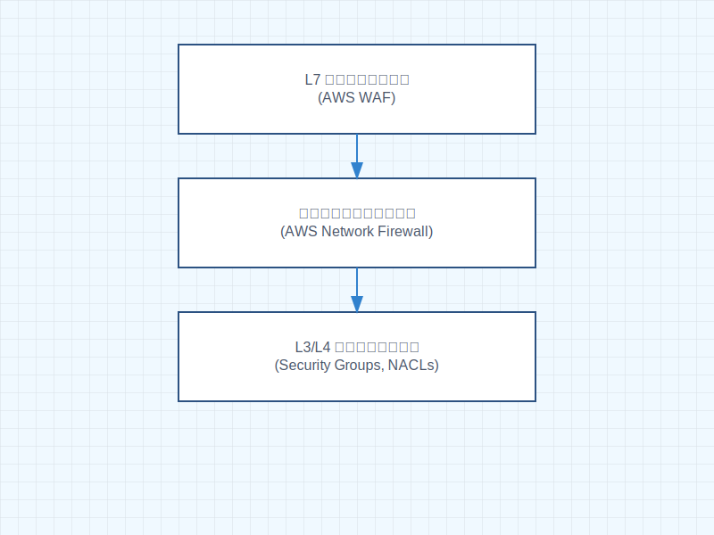

# ファイアウォール（Firewall）概要

ファイアウォールは、ネットワークセキュリティの重要な要素として、不正なアクセスからネットワークを保護する仕組みです。

## ファイアウォールの階層

現代のファイアウォールは、以下の主要な階層で実装されています：

### 1. L3/L4 ファイアウォール（ネットワーク層）

- IP アドレスとポート番号によるフィルタリング
- ステートフルインスペクション
- AWS Security Groups、Network ACLs がこの層に該当

### 2. L7 ファイアウォール（アプリケーション層）

- HTTP や HTTPS などのアプリケーションプロトコルの検査
- Web アプリケーションファイアウォール（WAF）
- AWS WAF がこの層に該当

### 3. 次世代ファイアウォール（NGFW）

- アプリケーション認識
- 脅威検知
- IPS/IDS 機能
- AWS Network Firewall がこの層に該当

## AWS のファイアウォールサービス

1. **AWS Network Firewall**

   - VPC レベルの保護
   - ステートフルおよびステートレスルール
   - トラフィックフィルタリングとインスペクション

2. **AWS WAF**

   - Web アプリケーションの保護
   - SQL インジェクション対策
   - クロスサイトスクリプティング（XSS）対策

3. **Security Groups**

   - インスタンスレベルのファイアウォール
   - ステートフル
   - インバウンド/アウトバウンドルール

4. **Network ACLs**
   - サブネットレベルのファイアウォール
   - ステートレス
   - 番号付きルールリスト
