## DynamoDB の長期データ保持とバックアップ戦略

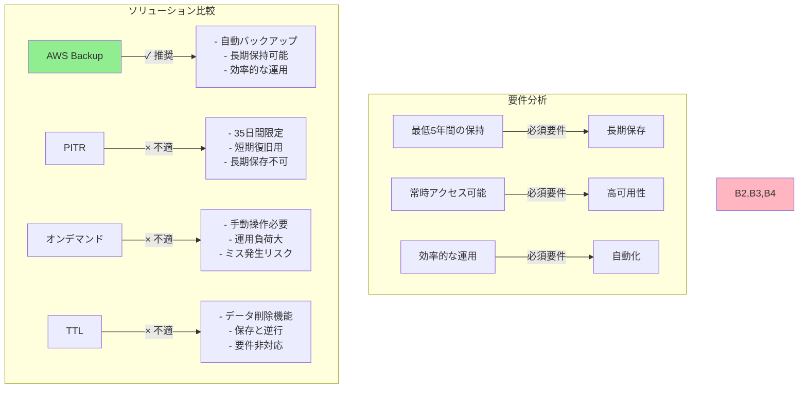

### 正解: B. AWS Backup を使用

AWS Backup は以下の理由で最適な選択となります：

1. **長期保存対応**

   - 5 年以上のデータ保持が可能
   - 柔軟な保持ポリシー設定
   - コンプライアンス要件に対応

2. **自動化された運用**

   - バックアップスケジュールの自動設定
   - 定期的なバックアップの自動実行
   - 人的ミスのリスク軽減

3. **効率的な管理**
   - 一元的なバックアップ管理
   - ライフサイクル管理の自動化
   - 運用コストの最適化

### 他の選択肢が不適切な理由

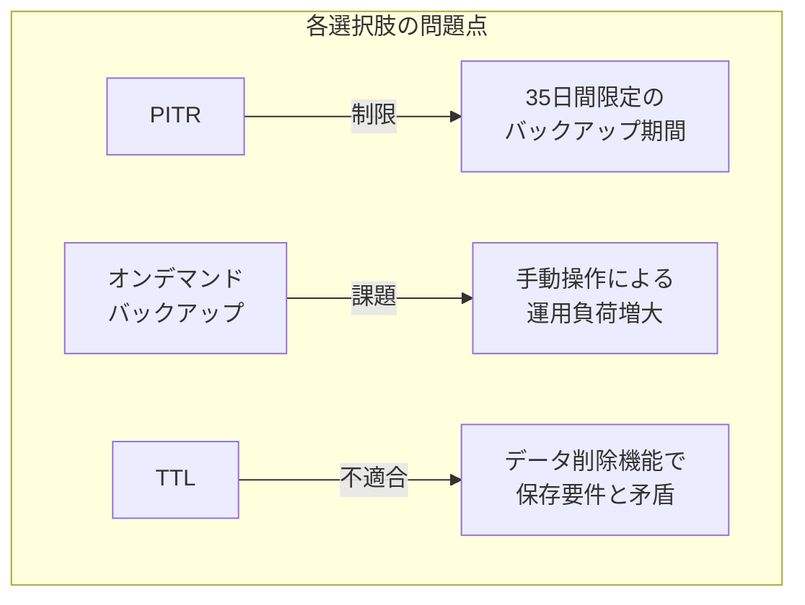

1. **選択肢 A（PITR）**

   - 35 日間のみのバックアップ保持
   - 5 年間の要件を満たせない
   - 長期保存には不向き

2. **選択肢 C（オンデマンドバックアップ）**

   - 手動操作が必要
   - 運用負荷が高い
   - ヒューマンエラーのリスク
   - スケーリングが困難

3. **選択肢 D（TTL）**
   - データを削除する機能
   - 長期保存の目的と逆行
   - バックアップとして機能しない

### AWS Backup の具体的な利点

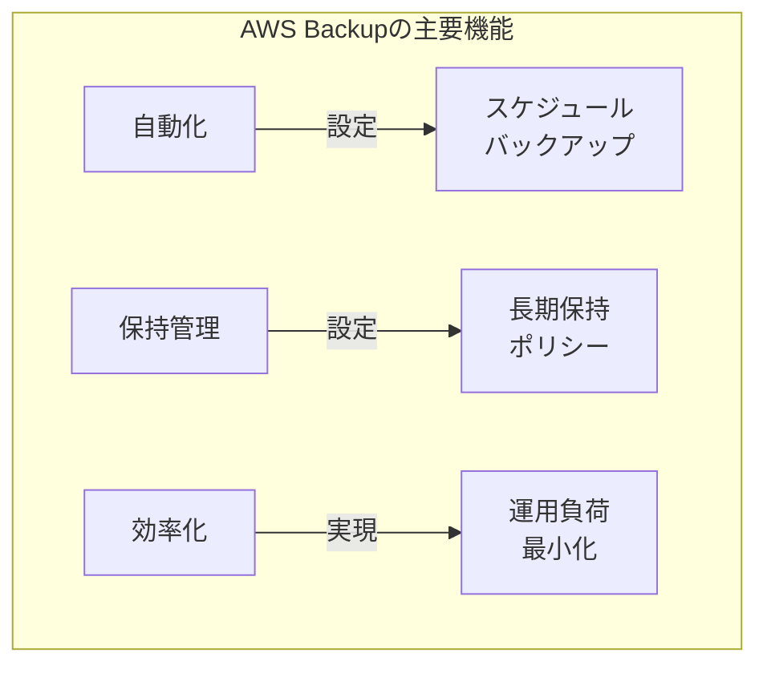

1. **バックアップ管理**

   - 定期的なバックアップスケジュール
   - 自動実行による確実性
   - 統合された管理コンソール

2. **保持ポリシー**

   - 長期保存の自動化
   - きめ細かい保持ルール
   - コンプライアンス対応

3. **コスト最適化**
   - 効率的なストレージ利用
   - 自動化による運用コスト削減
   - スケーラブルな管理

## DynamoDB のキャパシティモードと使い分け

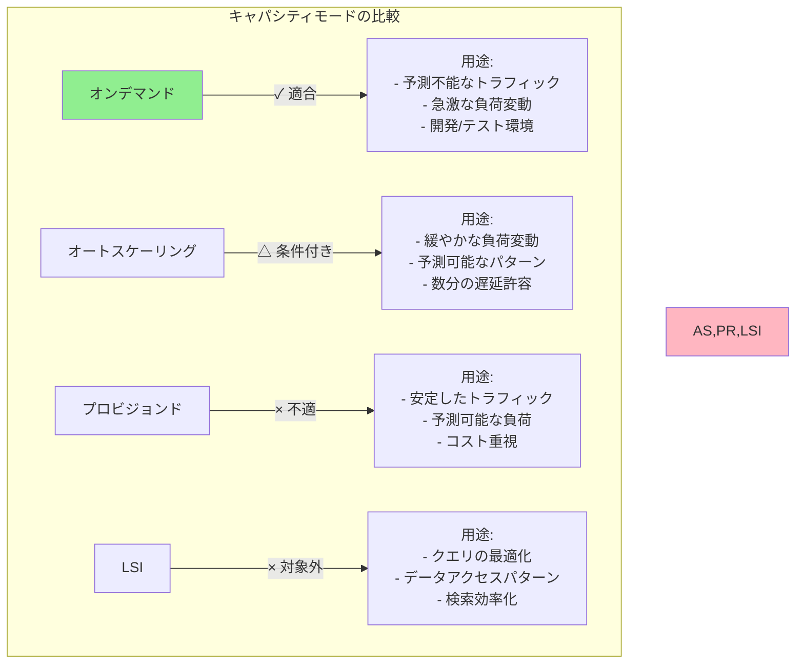

### 各選択肢の特徴と適したユースケース

1. **ローカルセカンダリインデックス（LSI）**

   - **主な用途**

     - 複雑なクエリの最適化
     - 代替的なデータアクセスパターンの提供
     - 特定の属性による効率的な検索

   - **適したシナリオ**
     - 複数の属性でのソートが必要
     - 特定のクエリパターンの高速化
     - データの整合性が重要

2. **オートスケーリング**

   - **主な用途**

     - 予測可能な負荷変動への対応
     - 定期的なトラフィックパターン
     - 段階的な容量調整

   - **適したシナリオ**
     - 日中と夜間で負荷が異なる
     - 週次/月次の負荷パターンが存在
     - スケーリングの遅延が許容される

3. **プロビジョンドキャパシティ（アラーム付き）**

   - **主な用途**

     - 安定した負荷パターン
     - 予測可能なトラフィック
     - コスト最適化重視

   - **適したシナリオ**
     - 一定の負荷が継続する
     - 急激な変動が少ない
     - 長期的な容量計画が可能

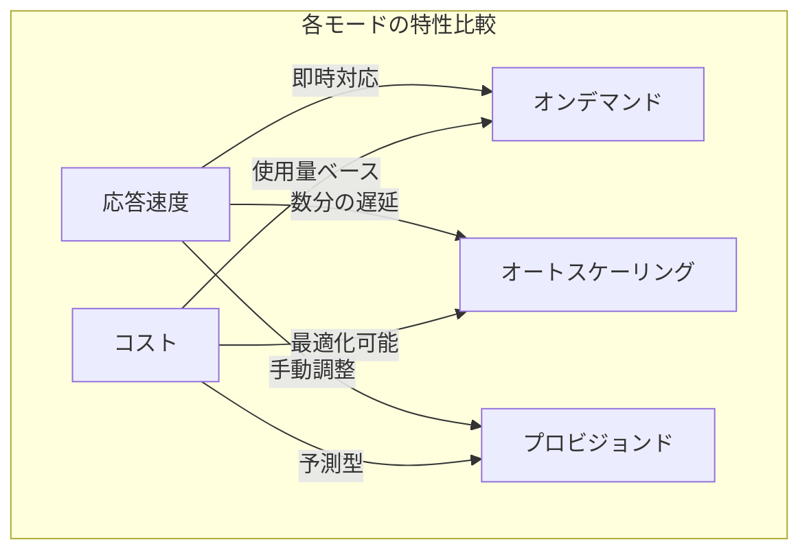

### 不適切な選択肢の問題点

1. **LSI を選択した場合の問題**

   - キャパシティ管理とは無関係
   - トラフィック制御機能なし
   - パフォーマンスチューニングが主目的

2. **オートスケーリングを選択した場合の問題**

   - スケーリングに数分の遅延
   - 急激な負荷変動に対応できない
   - 予測不能なトラフィックには不向き

3. **プロビジョンド（アラーム付き）を選択した場合の問題**

   - 手動介入が必要
   - リアルタイム対応が困難
   - リソースの過剰/過少プロビジョニングのリスク

## AMI と KMS キーの安全な共有戦略

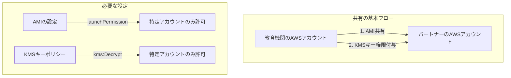

### 正解: B の選択理由

1. **AMI の共有設定**

   - launchPermission で特定アカウントのみに制限
   - 公開設定を避けてセキュリティを確保
   - 最小権限の原則に従う

2. **KMS キーの権限設定**

   - パートナーアカウントに必要最小限の権限を付与
   - 暗号化されたスナップショットの復号を許可
   - キーの管理権限は維持

3. **セキュリティの確保**
   - アクセス制御が明確
   - 権限の範囲が限定的
   - 監査可能性の確保

### 他の選択肢が不適切な理由

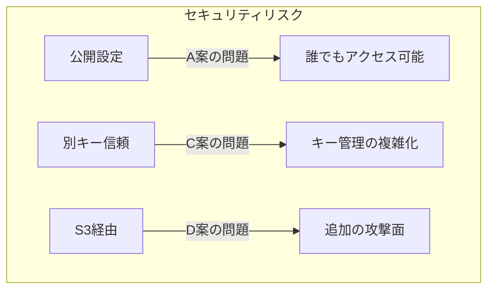

1. **選択肢 A の問題点**

   - AMI を公開設定にすることでセキュリティリスク増大
   - 意図しないアクセスの可能性
   - コンプライアンス要件違反の可能性

2. **選択肢 C の問題点**

   - 複数の KMS キーによる管理の複雑化
   - キー間の信頼関係による追加リスク
   - 運用管理の負担増加

3. **選択肢 D の問題点**
   - S3 を経由する追加のセキュリティリスク
   - 不必要なデータ移動
   - プロセスの複雑化

### 具体的な設定手順

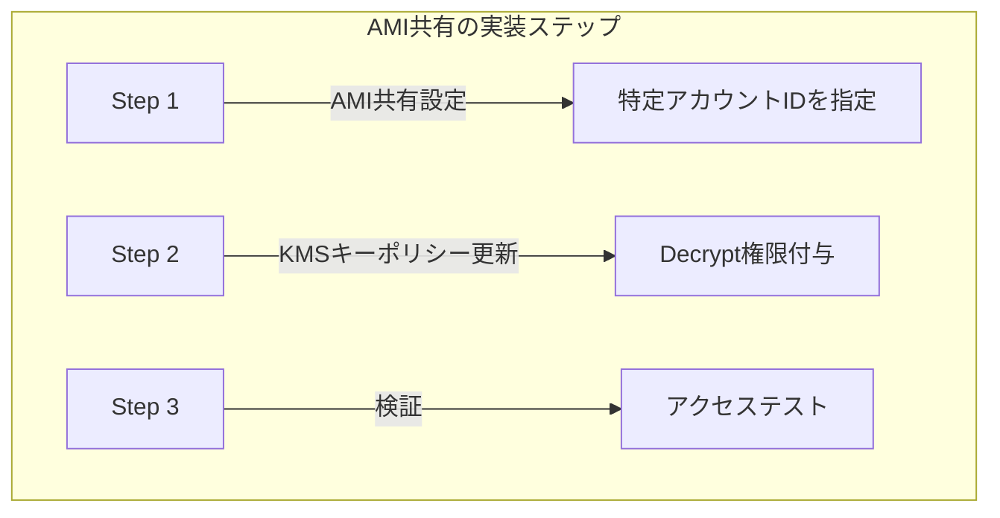

1. **AMI の共有設定**

   - AWS CLI または Console で launchPermission を設定
   - パートナーの AWS アカウント ID を指定
   - 共有範囲を明確に制限

2. **KMS キーポリシーの設定**

   - パートナーアカウントに kms:Decrypt 権限を付与
   - 必要最小限の権限のみを許可
   - 時間制限の設定を検討

3. **セキュリティベストプラクティス**
   - 定期的な権限の見直し
   - アクセスログの監視
   - 不要になった共有設定の削除

## 並列処理とメッセージキューの設計パターン

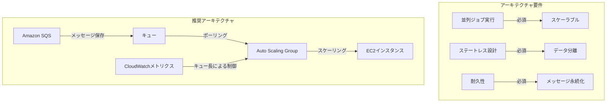

### 正解: C の選択理由

1. **SQS の利点**

   - メッセージの永続化
   - 耐久性の確保
   - 最低 1 回の処理保証
   - 非同期処理の実現

2. **Auto Scaling の設定**

   - キュー内のメッセージ数に基づくスケーリング
   - 需要に応じた適切なリソース割り当て
   - 効率的なコスト管理

3. **アーキテクチャの特徴**
   - ステートレス設計の実現
   - 高い可用性
   - スケーラビリティの確保

### 各選択肢の詳細分析

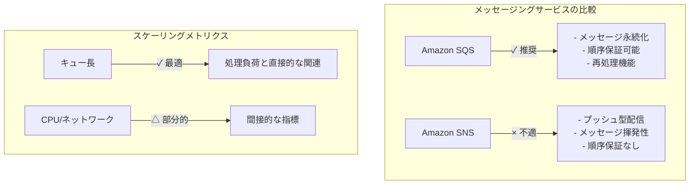

1. **選択肢 A の問題点**

   - SNS はプッシュ型で永続化なし
   - CPU 使用率は間接的な指標
   - メッセージの取りこぼしリスク

2. **選択肢 B の問題点**

   - ネットワーク使用量は不適切なメトリクス
   - 処理負荷との相関が低い
   - 非効率なスケーリング

3. **選択肢 D の問題点**
   - SNS のメッセージは一時的
   - 順序保証がない
   - 耐久性要件を満たさない

### 実装のベストプラクティス

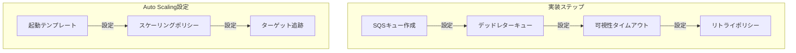

1. **キュー設定**

   - 適切な可視性タイムアウト
   - デッドレターキューの設定
   - メッセージ保持期間の設定

2. **スケーリング設定**

   - キュー長に基づくターゲット追跡
   - 適切なクールダウン期間
   - 最小/最大インスタンス数

3. **監視と運用**
   - CloudWatch メトリクスの監視
   - アラートの設定
   - 処理性能の最適化

## メッセージングサービスと水平スケーリング

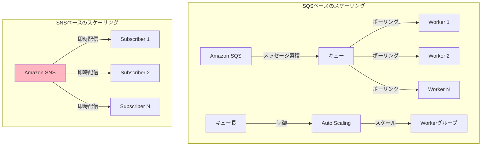

### SQS が水平スケーリングに適している理由

1. **負荷の制御**

   - メッセージをキューに蓄積可能
   - 処理能力に応じた消費
   - バックプレッシャーの自然な形成

2. **スケーリングの精度**

   - キュー長による直接的な負荷測定
   - 処理待ちタスク数の正確な把握
   - 適切なスケーリング判断が可能

3. **耐障害性**
   - メッセージの永続化
   - 処理の確実性
   - 再試行メカニズム

### SNS の水平スケーリングにおける課題

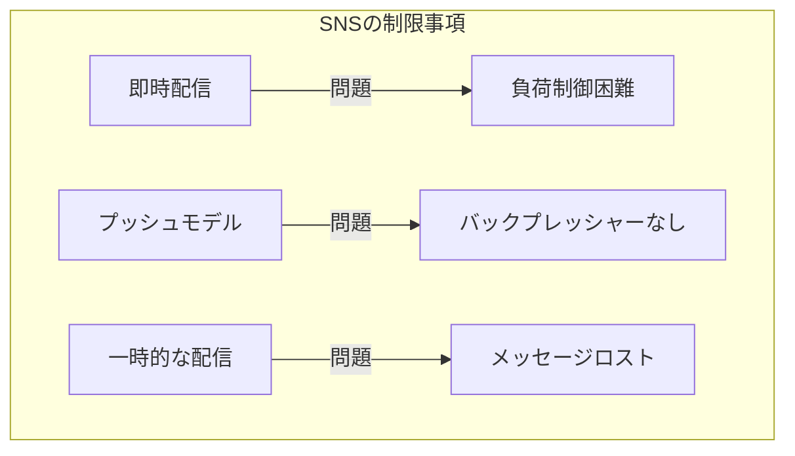

1. **負荷制御の難しさ**

   - 即時配信によるスパイク
   - 処理能力を超えた配信
   - バッファリング機能の欠如

2. **スケーリング指標の不適切さ**

   - メッセージ数の把握が困難
   - 処理待ちの測定不可
   - 適切なスケーリング判断が困難

3. **メッセージの信頼性**
   - 配信保証の限界
   - 再試行機能の制限
   - 処理の確実性が低い

### SNS の適切な使用シナリオ

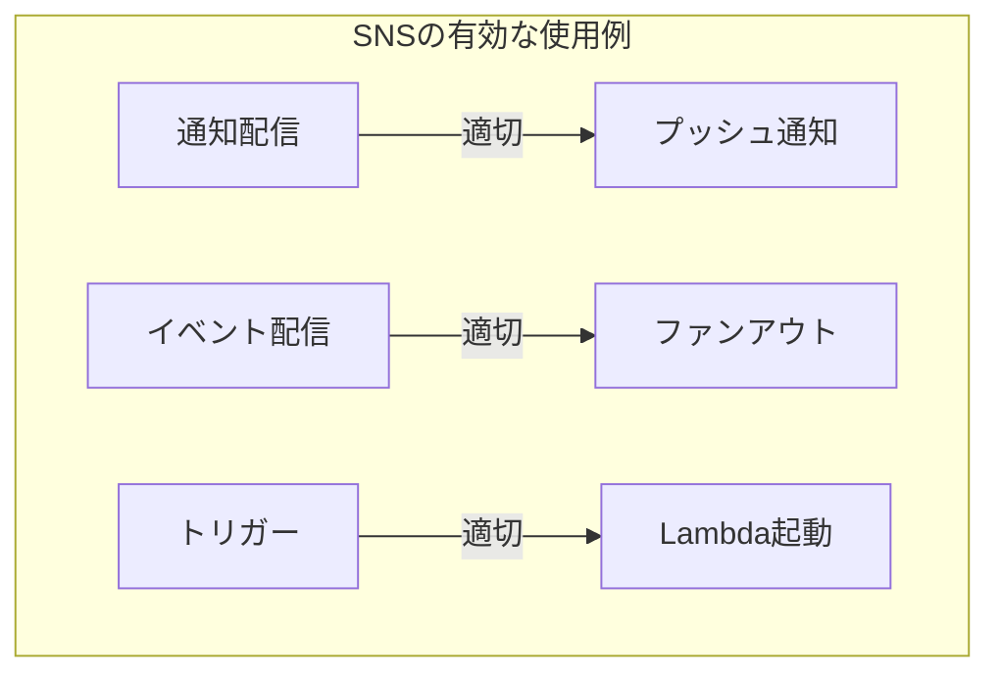

1. **通知システム**

   - モバイルプッシュ通知
   - メール配信
   - アラート通知

2. **イベントブロードキャスト**

   - 複数サービスへの同時通知
   - ファンアウトパターン
   - イベント駆動アーキテクチャ

3. **トリガーメカニズム**
   - Lambda 関数の起動
   - マイクロサービス間通信
   - 非同期ワークフロー開始

### SQS と SNS の組み合わせパターン

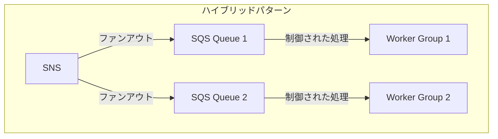

1. **ファンアウト＋キュー**

   - SNS でのメッセージ配信
   - SQS での負荷制御
   - 適切なスケーリング

2. **ベストプラクティス**

   - SNS は配信のみに使用
   - SQS で処理を制御
   - 各コンポーネントの長所を活用

3. **利点**
   - 柔軟な配信
   - 確実な処理
   - スケーラブルな設計

## グローバル配信のためのアーキテクチャ選択

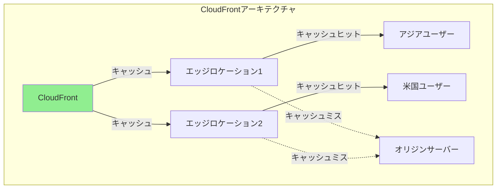

### CloudFront が最適な理由

1. **パフォーマンスの最適化**

   - エッジロケーションでのキャッシュ
   - 最寄りのエッジからの配信
   - 動的/静的コンテンツの最適化

2. **実装の容易さ**

   - オリジンサーバーの変更不要
   - 迅速な展開が可能
   - 段階的な移行

3. **コスト効率**
   - トラフィック削減
   - オリジンサーバーの負荷軽減
   - 帯域幅コストの最適化

### 他の選択肢の課題

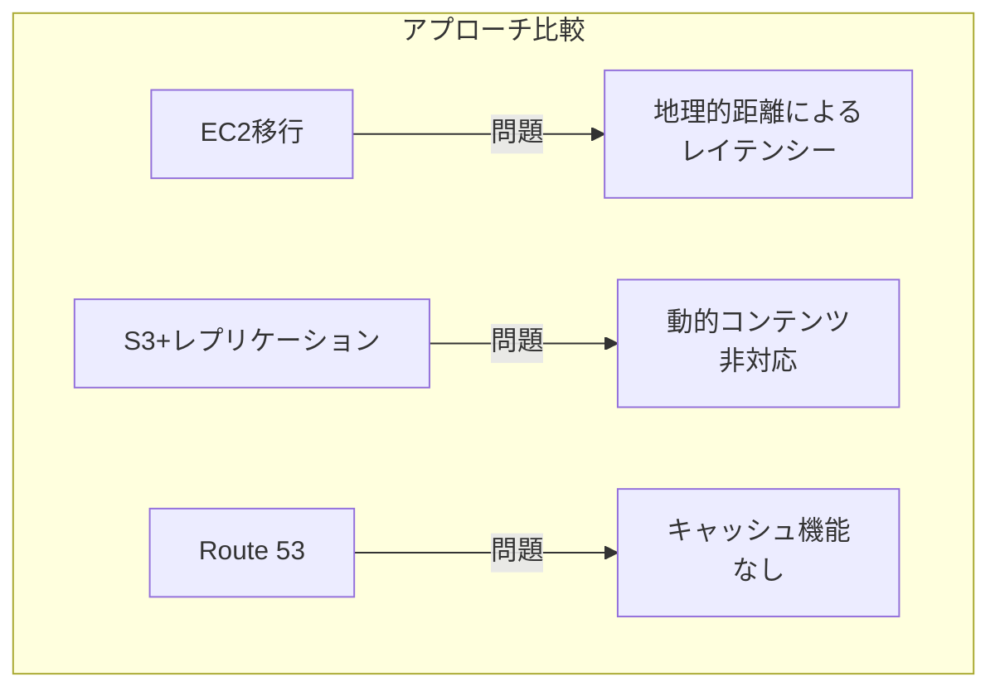

1. **EC2 移行の問題点**

   - 地理的な距離による遅延
   - リージョン固定の制限
   - スケーリングの複雑さ

2. **S3 レプリケーションの問題点**

   - 動的コンテンツに非対応
   - 更新の遅延
   - 複雑な同期管理

3. **Route 53 の限界**
   - キャッシュ機能なし
   - 単純な DNS ルーティング
   - エンドユーザー体験の制限

### CloudFront の具体的なメリット

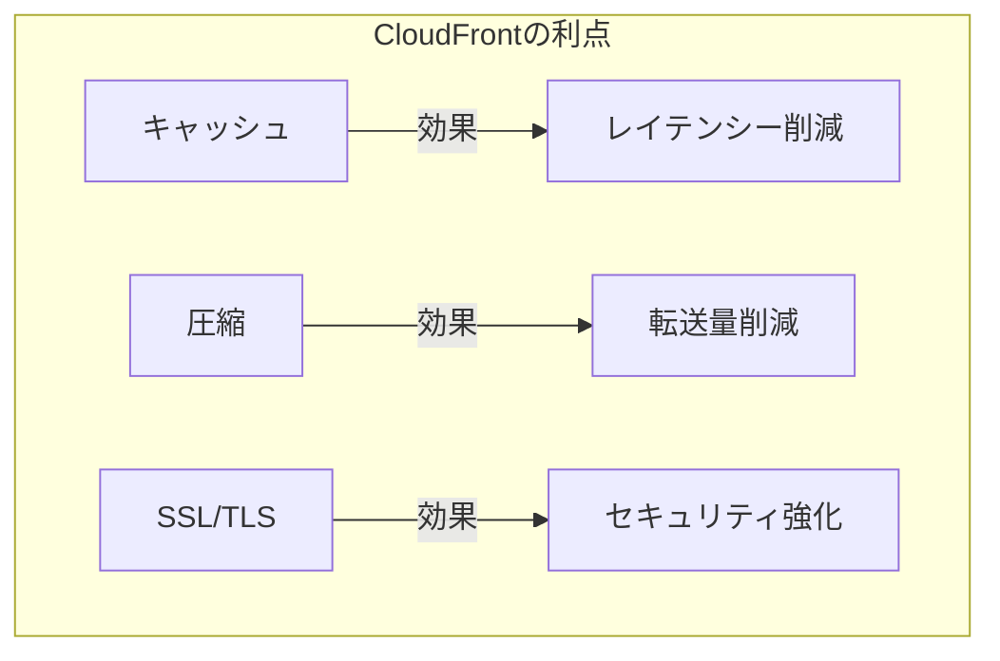

1. **キャッシュ戦略**

   - カスタマイズ可能なキャッシュ設定
   - TTL の柔軟な制御
   - 動的コンテンツの最適化

2. **セキュリティ**

   - SSL/TLS 対応
   - WAF 統合
   - DDoS 保護

3. **運用管理**
   - 詳細なモニタリング
   - リアルタイムログ
   - 簡単な設定変更

### 実装のベストプラクティス

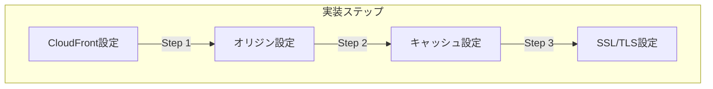

1. **初期設定**

   - オリジンサーバーの指定
   - キャッシュ動作の設定
   - SSL 証明書の設定

2. **最適化設定**

   - キャッシュ TTL の調整
   - 圧縮の有効化
   - カスタムヘッダーの設定

3. **監視と調整**
   - アクセスログの分析
   - キャッシュヒット率の監視
   - パフォーマンスの最適化

## EC2 インスタンスの購入オプション選択戦略

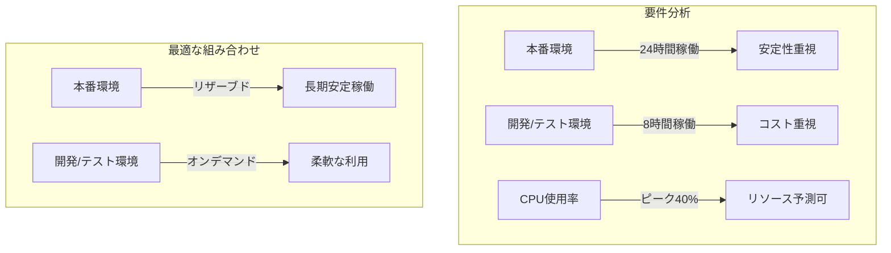

### 各購入オプションの特徴と適用シナリオ

1. **リザーブドインスタンス**

   - **メリット**

     - 大幅な割引（最大 72%）
     - 安定した可用性
     - 予算計画が立てやすい

   - **最適な用途**
     - 24 時間稼働システム
     - 長期利用（1-3 年）
     - 安定した負荷

2. **オンデマンドインスタンス**

   - **メリット**

     - 柔軟な起動/停止
     - 最小利用時間なし
     - 初期費用なし

   - **最適な用途**
     - 開発/テスト環境
     - 変動の大きい負荷
     - 短期プロジェクト

3. **スポットインスタンス**

   - **メリット**

     - 最大 90%割引
     - コスト最適化
     - 一時的な処理に最適

   - **デメリット**
     - 突然の中断リスク
     - 可用性保証なし
     - 本番環境には不向き

### 環境別の最適な選択

```mermaid
graph TD
    subgraph "本番環境の選択"
        PR1[リザーブド] -->|"✓ 推奨"| PR2["- 安定稼働<br>- コスト予測可能<br>- 長期利用"]
        SP1[スポット] -->|"× 不適"| SP2["- 中断リスク<br>- 可用性低下<br>- SLA未達"]
    end

    subgraph "開発/テスト環境の選択"
        OD1[オンデマンド] -->|"✓ 推奨"| OD2["- 柔軟な利用<br>- 自動停止可能<br>- コスト制御"]
        RV1[リザーブド] -->|"× 不適"| RV2["- 過剰な支払い<br>- 柔軟性低下<br>- リソース固定"]
    end
```

### コスト最適化のポイント

1. **本番環境**

   - リザーブドインスタンスの適切な期間選択
   - インスタンスサイズの最適化
   - 支払いオプションの検討（全額前払い/部分前払い/前払いなし）

2. **開発/テスト環境**

   - 自動停止スケジュールの実装
   - 必要最小限のインスタンスサイズ
   - 不要なリソースの迅速な削除

3. **全体的な戦略**
   - 定期的な使用状況の監視
   - コスト配分の可視化
   - リソース使用効率の最適化

### 実装のベストプラクティス

```mermaid
graph TD
    subgraph "自動化の実装"
        A1[CloudWatch] -->|"スケジュール"| A2[Lambda]
        A2 -->|"停止"| A3[開発/テスト環境EC2]
        A1 -->|"モニタリング"| A4[アラート]
    end
```

1. **スケジュール管理**

   - AWS Lambda による自動停止
   - CloudWatch Events でスケジュール設定
   - タグベースの管理

2. **コスト監視**

   - CloudWatch メトリクスの活用
   - コストアラートの設定
   - 予算管理の徹底

3. **最適化プロセス**
   - 定期的な使用パターン分析
   - インスタンスサイズの見直し
   - 購入オプションの再評価

## S3 データ保護要件の分析と実装

```mermaid
graph TD
    subgraph "要件の分解"
        R1[規制要件] -->|"必須"| R4["保存後の<br>編集禁止"]
        R2[規制要件] -->|"必須"| R5["保存後の<br>削除禁止"]
        R3[業務要件] -->|"必要"| R6["アップロード<br>機能"]
    end

    subgraph "必要な保護レベル"
        P1[WORM対応] -->|"Write Once,<br>Read Many"| P4[変更不可]
        P2[完全性保護] -->|"データ保護"| P5[改ざん防止]
        P3[アクセス制御] -->|"権限管理"| P6[参照制御]
    end
```

### 要件の読み解き方

1. **キーワードの特定**

   - "保存後"→ データ登録後の処理
   - "編集や削除ができなくなる"→ WORM（Write Once, Read Many）要件
   - "規制の要件"→ コンプライアンス要件

2. **必要な機能の整理**

   - データの不変性確保
   - 完全性の保証
   - アクセス制御

3. **制約条件の確認**
   - 学生によるアップロード
   - ウェブ/モバイル対応
   - 長期保存の必要性

### 選択肢の評価基準

```mermaid
graph TD
    subgraph "保護機能の比較"
        V[バージョニング] -->|"履歴保持"| V1["変更追跡"]
        L[オブジェクトロック] -->|"WORM"| L1["変更防止"]
        P[バケットポリシー] -->|"アクセス制御"| P1["権限管理"]
    end
```

1. **S3 オブジェクトロック**

   - **強み**

     - WORM 機能の提供
     - 法的要件への対応
     - 管理者でも変更不可

   - **用途**
     - コンプライアンス対応
     - 監査データの保護
     - 法的記録の保持

2. **S3 バージョニング**

   - **強み**

     - 変更履歴の保持
     - 誤削除からの復旧
     - データの追跡可能性

   - **用途**
     - 変更管理
     - バックアップ
     - 監査証跡

### 正解の実装方法

```mermaid
graph TD
    subgraph "実装ステップ"
        S1[S3バケット作成] -->|"Step 1"| S2[バージョニング有効化]
        S2 -->|"Step 2"| S3[オブジェクトロック設定]
        S3 -->|"Step 3"| S4[保持期間設定]
    end
```

1. **基本設定**

   - バケットの作成
   - バージョニングの有効化
   - オブジェクトロックの設定

2. **保護設定**

   - 保持期間の指定
   - コンプライアンスモードの選択
   - リーガルホールドの検討

3. **アクセス管理**
   - IAM ポリシーの設定
   - バケットポリシーの構成
   - 最小権限の原則適用

### 他の選択肢が不適切な理由

1. **バケットポリシーのみ（選択肢 B）**

   - 管理者による変更が可能
   - ポリシー自体の変更リスク
   - WORM 要件を満たさない

2. **ACL のみ（選択肢 C）**

   - アクセス制御のみ
   - 削除保護が不十分
   - 管理者権限での変更可能

3. **チェックサム（選択肢 D）**
   - 改ざん検知のみ
   - 変更/削除の防止なし
   - コンプライアンス非対応
