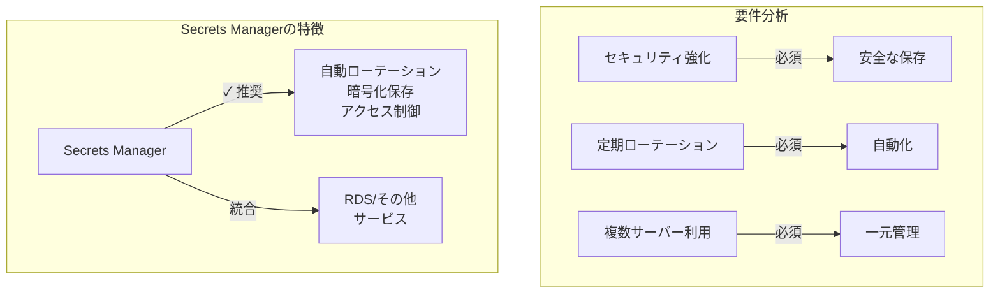
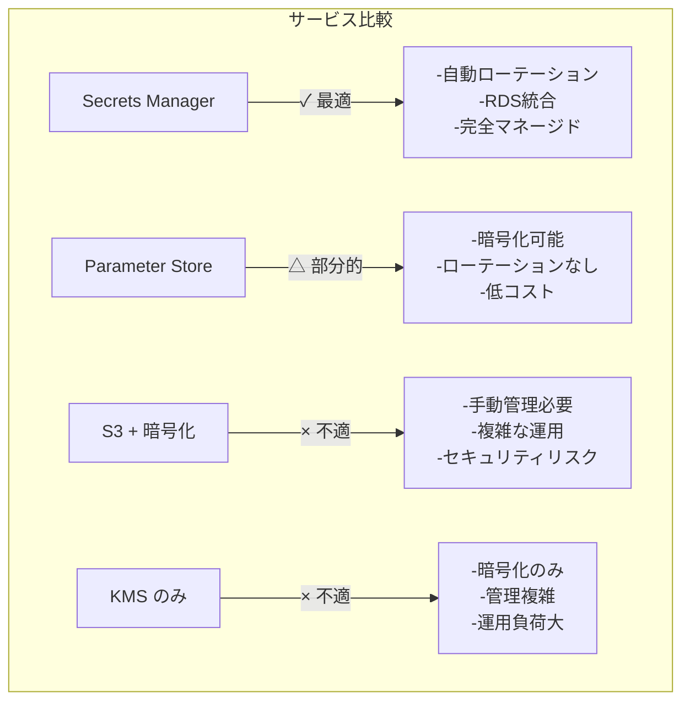
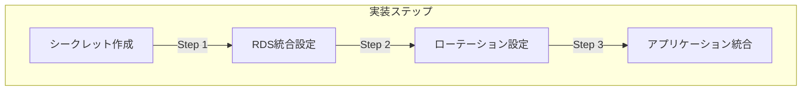
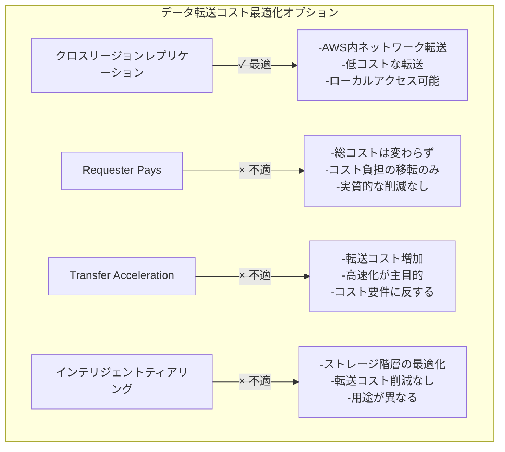
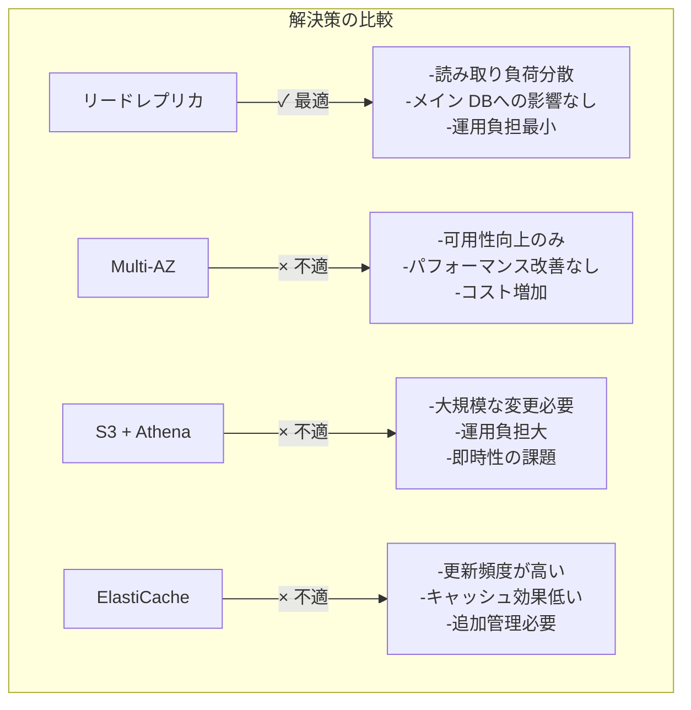

## 資格情報管理サービスの選択と実装

### Secrets Manager が最適な理由

1. **セキュリティ機能**

   - 暗号化された保存
   - きめ細かなアクセス制御
   - AWS KMS との統合

2. **自動化機能**

   - 資格情報の自動ローテーション
   - RDS との直接統合
   - Lambda による拡張可能性

3. **運用効率**
   - 一元管理
   - API アクセス
   - 監査ログ機能

### 各選択肢の詳細比較

### 実装のポイント

1. **Secrets Manager の設定**

   - シークレットの作成
   - RDS 資格情報の保存
   - ローテーション設定

2. **アクセス制御**

   - IAM ロールの設定
   - 最小権限の原則
   - 監査ログの有効化

3. **アプリケーション統合**
   - SDK の利用
   - エラーハンドリング
   - キャッシュ戦略

### 他の選択肢が不適切な理由

1. **Parameter Store の制限**

   - 自動ローテーションなし
   - RDS との直接統合なし
   - 高度な機能が限定的

2. **S3 による管理の問題点**

   - 手動管理が必要
   - 複雑なアクセス制御
   - ローテーション機能なし

3. **KMS のみの場合の課題**
   - 暗号化機能のみ提供
   - 資格情報の管理が複雑
   - 運用負荷が高い

### ベストプラクティス

1. **セキュリティ設定**

   - 暗号化の有効化
   - アクセスポリシーの設定
   - 監査ログの設定

2. **ローテーション設定**

   - 適切な間隔の設定
   - フェイルセーフの確保
   - 通知の設定

3. **監視と管理**
   - CloudWatch との統合
   - アラートの設定
   - 定期的な監査

### 補足：データ転送コストの最適化

### 各オプションの詳細比較：

1. **CRR（クロスリージョンレプリケーション）**

   - AWS 内ネットワークを使用した効率的な転送
   - インターネット経由より低コスト
   - オーストラリアでのローカルアクセスが可能

2. **Requester Pays**

   - コストの負担者が変更されるだけ
   - 総コストは変わらず
   - 実質的なコスト削減にならない

3. **Transfer Acceleration**

   - 転送速度は向上
   - コストが増加
   - コスト削減という要件に適合しない

4. **インテリジェントティアリング**
   - アクセスパターンに基づくストレージ階層の自動最適化
   - ストレージコストの削減が目的
   - データ転送コストには影響しない
   - バケット間の同期機能は提供していない

### データベースパフォーマンスの最適化

### リードレプリカが最適な理由：

1. **パフォーマンス分離**

   - 分析クエリをリードレプリカで実行
   - メイン DB への影響を排除
   - 他アプリケーションのパフォーマンス確保

2. **導入の容易さ**

   - 設定が簡単
   - アプリケーション変更最小限
   - 運用負担が少ない

3. **コスト効率**
   - 必要な機能のみ追加
   - 過剰な機能追加を回避
   - スケーラブルな解決策

### 他の選択肢が不適切な理由：

1. **Multi-AZ 構成**

   - 可用性向上が目的
   - パフォーマンス問題は解決されない
   - コストが増加

2. **S3 + Athena**

   - 大規模なアーキテクチャ変更が必要
   - データ移行の手間
   - 運用負担が増加

3. **ElastiCache**
   - 更新頻度の高いデータには不向き
   - キャッシュ管理の追加負担
   - 複雑性が増加
