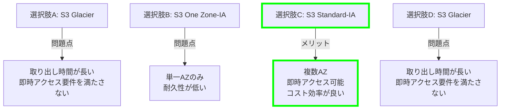
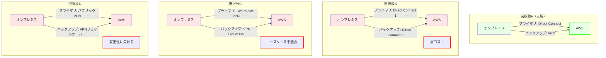
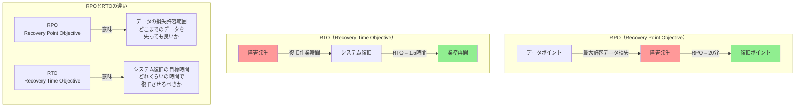
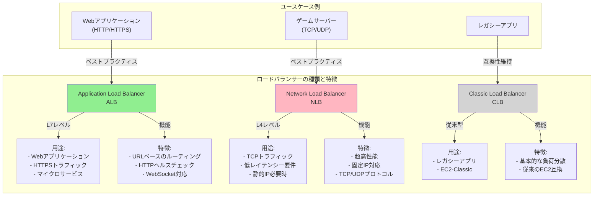
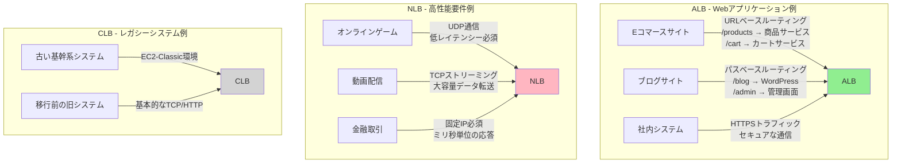
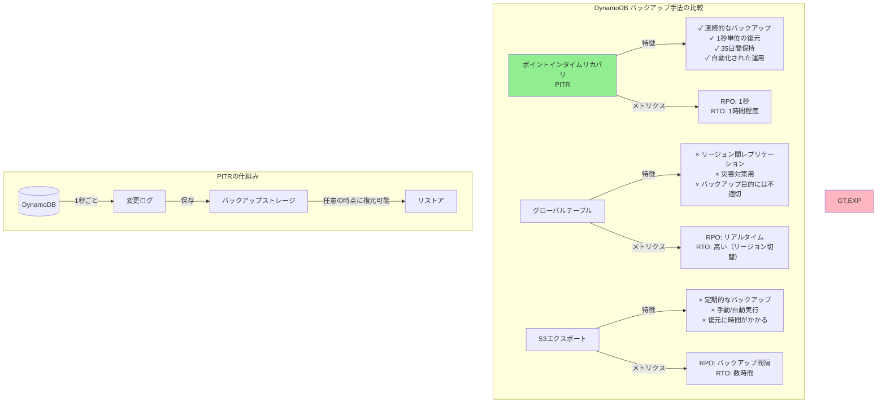

## S3 ストレージクラスの選択と要件適合性

全体的な説明
問題文で即時アクセスが要求されているため、S3 Glacier では取り出し時間が要件を満たさない可能性がある。そのため、選択肢 C が要件に適した解決策である。

S3 ライフサイクルポリシーは、アクセス頻度等に応じて、自動的にオブジェクトを S3 のストレージクラス間で移動する機能である。例えば、一定期間アクセスがないオブジェクトを自動的に安価なストレージクラスに移動させることができる。

S3 Standard-Infrequent Access (S3 Standard-IA) は、S3 Standard よりも低頻度なアクセスのオブジェクトに用いられるストレージクラスであり、S3 Standard より安価である。S3 Glacier はアーカイブデータなど、ほとんどアクセスがないオブジェクトに用いられるストレージクラスであり、保存コストは安価であるが、取り出しコストは高く、また取り出し時間も長い。

他の選択肢：

A: S3 Glacier に移行するとデータの取り出しに時間がかかり、要件に適さない。

B: S3 One Zone-IA は単一の AZ で保存され、耐久性が低いため、重要なビジネスデータには不向きである。

D: S3 Glacier に移行すると、即時アクセスの必要があるという要件に適さない可能性がある。

## ハイブリッドネットワークにおける Direct Connect と VPN の最適な組み合わせ

問題 4:
ある企業はオンプレミスのシステムを AWS に拡張するため、新しいハイブリッドネットワークを設計しています。この企業は、特定の AWS リージョンとの間で安定した低レイテンシと高可用性の接続を求めています。コストを抑えることも重要で、プライマリ接続が失敗した場合には、低速なバックアップ接続でも許容する方針です。

ソリューションアーキテクトは、この要件を満たすためにどのような選択をすべきでしょうか？

正解
A. AWS Direct Connect 接続を AWS リージョンにプロビジョニングし、プライマリ Direct Connect 接続の障害時のバックアップとして VPN 接続を設定します。

B. 高速な Direct Connect 接続をオンプレミスと AWS リージョン間で設定し、2 番目の Direct Connect 接続を追加してバックアップとします。

C. AWS Site-to-Site VPN トンネルを構築し、バックアップとして AWS VPN CloudHub 構成を使用します。

回答は不正解です
D. インターネット上のパブリック VPN 接続を利用し、オンプレミスのファイアウォールで VPN フェイルオーバー設定を行います。

全体的な説明
VPN 接続 は、AWS Direct Connect へのバックアップとして設定されるユースケースがある。Direct Connect に障害が発生した場合、VPN が自動的にフェイルオーバーすることで、継続的な接続を確保できる。VPN はインターネット上のトラフィックを使用するため、

通常の運用時には Direct Connect のパフォーマンスには劣るが、コストを抑えながら冗長性を追加できるため、バックアップ接続として有用である。

他の選択肢：

B: 2 本の Direct Connect 接続を敷設すると費用が大幅に増加する。

C: VPN CloudHub は複数リージョン間の冗長性を高めるためのオプションであり、本問のユースケースとは関係がない。

D: パブリック VPN 接続は、コストを抑えることができるが、安定性が保証されていないため、低レイテンシ接続には不向きである。

補足解説：

VPN 接続を Direct Connect 接続のバックアップとして使用する場合、VPN 接続と Direct Connect 接続の速度をなるべく同じに設定することで、フェイルオーバー時のパフォーマンス差を抑えられる。たとえば、通常時は VPN を 500Mbps また 1Gbps 程度で設定し、Direct Connect 接続を 1Gbps に設定することで、パフォーマンス差を抑えることができる。

一方、速度の変更（スケールアップ）にリードタイムが発生すること、常時バックアップ接続を高速で設定することはコスト増につながることを考慮に入れてバックアップ設計をすることが必要である。

## 教育 LMS システムにおける高可用性とデータ冗長化の実現方法

ある教育機関が、クラウド上での教育マネジメントシステム (LMS) を運営しています。このシステムは、Auto Scaling グループ内の Amazon EC2 インスタンスを用いて稼働しており、Application Load Balancer (ALB) の背後でウェブリクエストを処理しています。データは、単一のアベイラビリティーゾーンに配置された Amazon Aurora MySQL データベースに保存されています。このシステムでは、最小限のダウンタイムで高可用性を実現し、またデータ損失も最小化したいと考えています。 最小限の運用労力でこれらの要件を満たすためのソリューションはどれでしょうか？

A. EC2 インスタンスを異なる AWS リージョンに配置します。Amazon Route 53 のヘルスチェック機能を使用してトラフィックをリダイレクトし、Aurora MySQL のクロスリージョンレプリケーションを使用します。

回答は正解です
B. Auto Scaling グループを複数のアベイラビリティーゾーンで使用するように設定し、データベースをマルチ AZ 構成に設定します。また、Amazon RDS Proxy インスタンスを設定してデータベースを冗長化します。

C. Auto Scaling グループを 1 つのアベイラビリティーゾーンで使用するように設定し、データベースのスナップショットを毎時作成します。障害が発生した場合、スナップショットからデータベースを復旧します。

D. Auto Scaling グループを複数のリージョンで使用するように設定します。アプリケーションからデータを Amazon S3 に書き込み、S3 イベント通知を使用して AWS Lambda 関数を起動し、データベースにデータを書き込みます。

全体的な説明
Auto Scaling グループを複数の AZ で設定することで、1 つの AZ がダウンしてもシステムは動作を継続できる。また、データベースをマルチ AZ 構成にすることで、AZ 単位の障害が発生してもデータベースが冗長化され、データ損失のリスクを低減できる。

さらに Amazon RDS Proxy を追加することで、データベース接続を効率的に管理し、インスタンスが故障した場合にも他のインスタンスに接続が自動的に切り替わる。これにより、運用の手間を最小限に抑えつつ、高可用性を実現する。

他の選択肢：

A: 複数のリージョン間での EC2 インスタンスを管理すると追加コストが発生し、複数リージョン間でのリダイレクトには遅延が発生する。問題文に特別な要件がない場合、マルチ AZ 構成で十分な可用性が実現される。

C: スナップショットを使用してデータベースを毎時復旧する方法では、復旧時間がかかり、可用性が低くなる。単一 AZ でのみインスタンスを稼働させると、可用性要件を満たさない。

D: S3 イベント通知と Lambda を使用してデータをデータベースに書き込む方法では、トランザクションの一貫性が保証されず、遅延も発生する可能性があるため、重要なビジネスデータを取り扱うには適切ではない。

補足解説：

RDS Proxy は、RDS（Relational Database Service）への接続を効率的に管理し、パフォーマンスを最適化するマネージドプロキシサービスである。以下の機能を提供する：

接続プーリング：RDS Proxy は接続プーリングを行い、アプリケーションが新たな接続を開閉するたびに発生するコストを削減する。接続プールは、あらかじめ作成しておいたデータベース接続のセット（プール）を管理し、アプリケーションが必要なときに既存の接続を再利用する。新しい接続を確立するよりも再利用するほうが高速で効率的である。

認証と認可：RDS Proxy は AWS IAM や Secrets Manager と統合して、認証情報の管理を簡素化し、安全な認証と認可を提供する。

キャッシング：接続の維持や再利用によって、再接続時のオーバーヘッドを最小化し、接続時間を短縮する。これにより、アプリケーションの応答速度が向上する。

フェイルオーバー対応：障害発生時にデータベースインスタンスが切り替わっても、RDS Proxy が迅速に新しい接続先を提供し、ダウンタイムを最小限に抑える。

簡単な説明：

1. **RPO（Recovery Point Objective）**

- データの損失をどこまで許容できるか
- 例：RPO 20 分 = 最大 20 分前までのデータ損失を許容
- バックアップの頻度に関係

2. **RTO（Recovery Time Objective）**

- システムを復旧させるまでの目標時間
- 例：RTO 1.5 時間 = 1.5 時間以内に復旧する必要がある
- 復旧手順の効率性に関係

実例：

- オンラインバンキング：RPO 数秒、RTO 数分
- ブログサイト：RPO 数時間、RTO 数時間
- アーカイブシステム：RPO 数日、RTO 数日

## ロードバランサーの種類と特徴

主な使い分けのポイント：

1. **Application Load Balancer (ALB)**

- Web アプリケーション向き
- パスベースのルーティングが必要
- HTTP ヘルスチェックが必要
- コンテナベースのアプリケーション

2. **Network Load Balancer (NLB)**

- 超高性能が必要
- 固定 IP アドレスが必要
- TCP/UDP プロトコルを使用
- 極めて低いレイテンシーが必要

3. **Classic Load Balancer (CLB)**

- レガシーアプリケーション
- 基本的な負荷分散のみ必要
- EC2-Classic を使用

この問題では：

- HTTP エラーの検出が必要
- アプリケーションレベルの監視が必要
- 自動的な障害対応が必要

よって、ALB が最適な選択となります。NLB では HTTP レベルの監視ができないため、要件を満たせません。

具体的なユースケース説明：

1. **ALB（Application Load Balancer）向き**

- E コマースサイト
  - 商品ページ、カート、決済など機能ごとの振り分け
  - HTTPS によるセキュア通信
- マイクロサービス型アプリ
  - サービスごとに異なるコンテナへルーティング
  - パスベースでの振り分け

2. **NLB（Network Load Balancer）向き**

- オンラインゲーム
  - UDP 通信での低遅延
  - リアルタイム性が重要
- 金融取引システム
  - ミリ秒単位の応答が必要
  - 固定 IP アドレスが必要
- ビデオストリーミング
  - 大容量データの高速転送
  - TCP レベルでの最適化

3. **CLB（Classic Load Balancer）向き**

- 古い基幹システム
  - EC2-Classic 環境で動作
  - レガシーな通信プロトコル
- 移行途中のシステム
  - 一時的な互換性確保
  - 基本的な負荷分散のみ

## DynamoDB のバックアップとリカバリオプション

主なポイント：

1. **PITR（ポイントインタイムリカバリ）**

- 連続的なバックアップ（1 秒間隔）
- 35 日間のバックアップ保持
- RPO = 1 秒（要件の 20 分を満たす）
- RTO = 1 時間程度（要件の 1.5 時間を満たす）
- 管理オーバーヘッドが最小

2. **グローバルテーブル**

- 災害対策（DR）用途
- リージョン間レプリケーション
- バックアップ目的には不適切
- コストが高い

3. **S3 エクスポート**

- バックアップ間隔が長い
- RPO が 24 時間（要件の 20 分を満たさない）
- 復元に時間がかかる
- 運用負荷が高い

この問題では：

- RPO 20 分以内
- RTO 1.5 時間以内
  という要件があるため、PITR が最適な選択となります。
